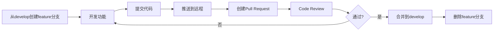
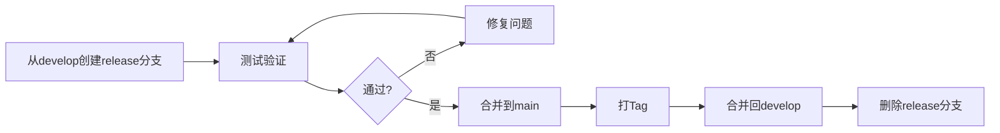

# Git 工作流规范 (Git Workflow)

**版本**: 1.0
**最后更新**: 2025-11-30

---

## 1. 分支策略

### 1.1 分支类型

| 分支 | 命名 | 用途 | 生命周期 |
|------|------|------|----------|
| **main** | main | 生产代码 | 永久 |
| **develop** | develop | 开发主干 | 永久 |
| **feature** | feature/xxx | 新功能开发 | 短期 |
| **bugfix** | bugfix/xxx | Bug修复 | 短期 |
| **release** | release/x.x.x | 发布准备 | 短期 |
| **hotfix** | hotfix/xxx | 紧急修复 | 短期 |

### 1.2 分支命名规范

```
feature/ECP-123-user-login        # 功能分支
bugfix/ECP-456-fix-payment-error  # 修复分支
release/1.2.0                     # 发布分支
hotfix/ECP-789-critical-fix       # 热修复分支
```

---

## 2. 提交规范

### 2.1 提交消息格式

```
<type>(<scope>): <subject>

<body>

<footer>
```

### 2.2 Type 类型

| Type | 说明 | 示例 |
|------|------|------|
| **feat** | 新功能 | `feat(user): 添加用户注册功能` |
| **fix** | Bug修复 | `fix(order): 修复订单金额计算错误` |
| **docs** | 文档更新 | `docs: 更新API文档` |
| **style** | 代码格式 | `style: 格式化代码` |
| **refactor** | 重构 | `refactor(payment): 重构支付逻辑` |
| **test** | 测试 | `test(user): 添加用户服务单元测试` |
| **chore** | 构建/工具 | `chore: 升级依赖版本` |

### 2.3 示例

```
feat(user): 添加用户注册功能

- 实现邮箱注册接口
- 添加密码加密处理
- 发送激活邮件

Closes #123
```

---

## 3. 工作流程

### 3.1 功能开发流程



### 3.2 发布流程



---

## 4. Pull Request 规范

### 4.1 PR 模板

```markdown
## 变更说明
<!-- 简要描述本次变更的内容 -->

## 变更类型
- [ ] 新功能
- [ ] Bug修复
- [ ] 重构
- [ ] 文档更新

## 相关Issue
Closes #xxx

## 测试说明
<!-- 描述如何测试这些变更 -->

## 检查清单
- [ ] 代码符合编码规范
- [ ] 添加了必要的测试
- [ ] 文档已更新
- [ ] 本地测试通过
```

### 4.2 Review 要求

- 至少 1 位 Reviewer 批准
- CI 检查全部通过
- 无冲突

---

## 5. 常用命令

```bash
# 创建功能分支
git checkout develop
git pull origin develop
git checkout -b feature/ECP-123-xxx

# 提交代码
git add .
git commit -m "feat(user): xxx"

# 推送分支
git push -u origin feature/ECP-123-xxx

# 更新分支（rebase方式）
git fetch origin
git rebase origin/develop

# 合并后清理
git branch -d feature/ECP-123-xxx
git push origin --delete feature/ECP-123-xxx
```

---

## 变更历史

| 版本 | 日期 | 变更内容 | 作者 |
|------|------|----------|------|
| 1.0 | 2025-11-30 | 初始版本 | @技术负责人 |
