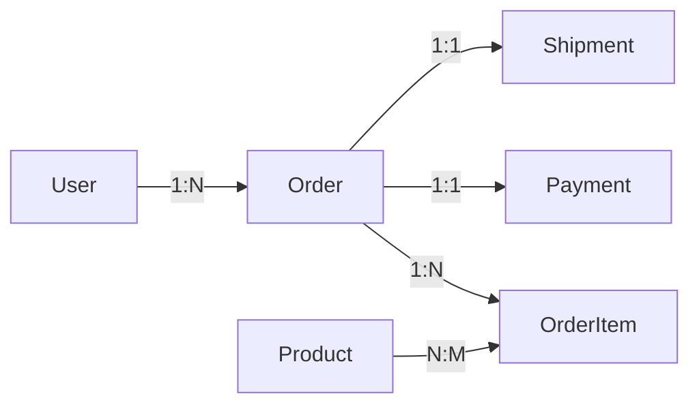

## AI Coding研发流程体系详细报告 v2.6

## 执行摘要

AI Coding研发流程体系（v2.6）是一套系统化的现代软件工程方法论，以**SDD（规范驱动开发）和TDD（测试驱动开发）为双核引擎，通过D-R-O（委派-审查-掌控）框架**实现人机协作的最优平衡，结合**三层知识空间架构**和**统一工具链**，推动研发模式从"人工编码"向"AI协同编码"的深度转型。

### 核心价值承诺

| 指标类别             | 目标值           | 验证方式                   |
| -------------------- | ---------------- | -------------------------- |
| **开发效率**   | 提升30%以上      | 需求交付周期对比           |
| **代码质量**   | 改善20%          | 静态分析分数、技术债务减少 |
| **Bug率**      | 下降25%          | 生产缺陷统计               |
| **测试覆盖率** | ≥80%            | 自动化测试报告             |
| **单需求成本** | ≤100元（Token） | AI服务费用跟踪             |
| **知识覆盖率** | >90%             | 代码模块文档覆盖度         |

### 关键成功要素

**技术层面**：

- 规范与测试的双重驱动确保质量
- 三层知识架构支撑AI理解
- 统一工具链降低认知负担
- 数据驱动的持续优化

**组织层面**：

- 循序渐进的实施路径
- 质量第一的文化建设
- 团队对AI协作的认同

**策略**

* AI不万能，能做的现做了。例如强化架构要求，强化质量和测试要求，强化约束要求。
* 保持跟随，社区的codebase等一直在演进中。

---

## 可视化图表

本章节提供三张核心可视化图表，帮助快速理解AI Coding研发流程体系的全貌。

### 全景思维导图

展示整个体系的核心构成，包括核心理念（SDD、TDD、D-R-O）、三层知识空间、统一工具链、质量保障体系和核心价值指标。


### 研发流程架构图

完整呈现从需求到知识沉淀的端到端流程，包括需求阶段、设计阶段（含九大原则合规检查）、开发阶段（TDD红绿重构循环）、Code Review双层审查机制，以及知识沉淀归档流程。


### D-R-O人机协作框架图

清晰展示人机职责边界：委派（AI独立完成）、审查（人类验证）、掌控（人类主导），以及任务分类的判断决策树（标准化？可逆？高风险？）。


---

## 一、体系概述

### 1.1 设计目标

本体系旨在建立一套完整的AI辅助开发框架，通过以下核心目标实现研发模式转型：

1. **规范先行**：通过SDD确保需求-设计-实现的一致性
2. **质量内建**：通过TDD将测试作为功能的真理来源
3. **知识沉淀**：通过三层架构建立可持续迭代的组织知识资产
4. **效能提升**：通过AI协同显著提升研发效率和代码质量
5. **风险可控**：通过多重门禁和人工监督确保交付质量

### 1.2 核心理念图谱

```plaintext
┌─────────────────────────────────────────────────────────────────┐
│                    AI Coding 研发流程体系                        │
├─────────────────────────────────────────────────────────────────┤
│                                                                 │
│   ┌─────────────┐    ┌─────────────┐    ┌─────────────┐        │
│   │  SDD驱动    │ ←→ │  TDD驱动    │ ←→ │  AI协同     │        │
│   │  规范先行   │    │  测试先行   │    │  人机结对   │        │
│   └─────────────┘    └─────────────┘    └─────────────┘        │
│          ↑                  ↑                  ↑                │
│          └──────────────────┼──────────────────┘                │
│                             │                                   │
│   ┌─────────────────────────┴─────────────────────────┐        │
│   │              多级知识空间 + 统一工具链              │        │
│   │         L0企业级 → L1项目级 → L2仓库级             │        │
│   └───────────────────────────────────────────────────┘        │
│                                                                 │
└─────────────────────────────────────────────────────────────────┘
```

### 1.3 五大核心原则

| 原则               | 具体内涵                                   | 实施路径                                       | 预期价值                               |
| ------------------ | ------------------------------------------ | ---------------------------------------------- | -------------------------------------- |
| **规范驱动** | 先有设计规范，后有代码实现，AI直接消费规范 | Speckit工作流：specify→plan→tasks→implement | 避免过度实现、功能蔓延、需求偏差       |
| **测试先行** | 先写测试定义行为，再由AI生成实现代码       | TDD三定律+红绿重构循环                         | 确保功能正确性、代码可测试性、质量内建 |
| **知识分层** | 企业→项目→仓库三层架构，自底向上聚合     | L0/L1/L2知识库+AI定期聚合                      | 支撑AI理解上下文、知识可复用传承       |
| **工具统一** | 统一的AI工具链和开发环境                   | Claude Code+Cursor+MCP集成                     | 降低认知负担、提升协作效率             |
| **持续改进** | 数据驱动的效能度量和流程优化               | Agent评测体系+效能指标看板                     | 实现可持续能力提升、正向反馈循环       |

---

## 二、D-R-O人机协作框架

### 2.1 框架概念模型

```plaintext
┌─────────────────────────────────────────────────────────────────┐
│           委派-审查-掌控 (Delegate-Review-Own) 框架              │
├─────────────────────────────────────────────────────────────────┤
│                                                                 │
│  委派 Delegate                                                  │
│  ───────────────                                                │
│  AI 可独立完成的任务：                                           │
│  • 样板代码生成（CRUD、配置文件）                                │
│  • 文档初稿（API文档、README、注释）                             │
│  • 设计模式应用（工厂、单例、装饰器）                             │
│  • 单元测试用例生成                                              │
│  • 代码风格检查与自动修复                                         │
│                                                                 │
│  审查 Review                                                    │
│  ──────────                                                     │
│  人类验证 AI 产出：                                              │
│  • 准确性检查（业务逻辑正确、边界条件覆盖）                       │
│  • 完整性验证（功能完整、测试充分、文档齐全）                     │
│  • 合规性确认（架构对齐、安全规范、性能标准）                     │
│  • 可维护性评估（代码可读性、模块化程度）                         │
│                                                                 │
│  掌控 Own                                                       │
│  ────────                                                       │
│  人类必须负责的决策：                                            │
│  • 战略方向（产品路线、技术选型）                                │
│  • 架构决策（系统设计、模块划分、ADR编写）                       │
│  • 最终审批（代码合并、生产部署、安全签署）                       │
│  • 异常处理（生产事故、安全漏洞、架构调整）                       │
│                                                                 │
└─────────────────────────────────────────────────────────────────┘
```

### 2.2 原则与判断标准

**核心原则**：

- 机械性工作→委派；创造性决策→掌控
- 可逆操作→委派；不可逆操作→掌控
- 标准化流程→委派；定制化场景→掌控
- 低风险变更→委派；高风险变更→掌控

**判断决策树**：

```plaintext
任务分类 → 是否标准化？
           ├─是 → 是否可逆？
           │      ├─是 → 【委派】AI独立完成
           │      └─否 → 【审查】AI执行+人类验证
           └─否 → 是否高风险？
                  ├─是 → 【掌控】人类主导
                  └─否 → 【审查】AI辅助+人类决策
```

### 2.3 SDLC各阶段职责矩阵

| 阶段                  | 委派（AI独立）               | 审查（人类验证）             | 掌控（人类主导）           |
| --------------------- | ---------------------------- | ---------------------------- | -------------------------- |
| **需求分析**    | Issue自动分类、用户故事初稿  | 需求完整性验证、业务价值评估 | 需求优先级排序、路线图规划 |
| **架构设计**    | 技术选型调研、设计模式建议   | 架构方案评审、技术债务评估   | 架构原则制定、ADR最终决策  |
| **详细设计**    | API规格生成、数据模型草稿    | 接口一致性检查、模型合理性   | 核心接口设计、安全边界定义 |
| **编码实现**    | 样板代码、单元测试、文档注释 | 代码逻辑审查、测试覆盖验证   | 核心算法、安全敏感代码     |
| **测试验证**    | 测试用例生成、自动化测试     | 测试充分性、边缘场景补充     | 测试策略、验收标准定义     |
| **Code Review** | 风格检查、常见Bug检测        | 架构对齐、业务逻辑正确性     | 最终合并决策、发布审批     |
| **部署发布**    | 部署脚本生成、配置文件       | 部署计划验证、回滚预案       | 生产发布审批、事故响应     |
| **运维监控**    | 日志分析、告警分类           | 根因确认、影响评估           | 热修复决策、架构调整       |

---

## 三、流程重塑：SDD规范驱动开发

### 3.1 Speckit完整工作流

#### 3.1.1 核心命令体系

| 命令                   | 功能定位     | 输入                     | 输出                                             | 适用场景     |
| ---------------------- | ------------ | ------------------------ | ------------------------------------------------ | ------------ |
| `/speckit.specify`   | 创建功能规格 | 自然语言需求描述         | [spec.md](http://spec.md)（规格文档）               | 需求明确阶段 |
| `/speckit.plan`      | 生成实施计划 | [spec.md](http://spec.md)   | [plan.md](http://plan.md)（实施计划）+ 架构合规报告 | 设计决策阶段 |
| `/speckit.tasks`     | 生成任务列表 | [plan.md](http://plan.md)   | [tasks.md](http://tasks.md)（任务清单）             | 开发排期阶段 |
| `/speckit.implement` | 执行代码实现 | [tasks.md](http://tasks.md) | 代码文件 + 测试                                  | 编码实现阶段 |
| `/speckit.archive`   | 知识沉淀归档 | 已实现功能               | registry.json + ADR-*.md                         | 功能交付后   |
| `/speckit.analyze`   | 跨产物分析   | spec/plan/tasks          | 一致性报告 + 风险提示                            | 质量检查     |
| `/speckit.clarify`   | 需求澄清     | [spec.md](http://spec.md)   | 澄清问题列表                                     | 需求模糊时   |

#### 3.1.2 工作流可视化

```plaintext
┌──────────────────────────────────────────────────────────────┐
│                    SDD 完整工作流                             │
├──────────────────────────────────────────────────────────────┤
│                                                              │
│  ┌──────────────┐                                           │
│  │  /specify    │  输入：用户故事、验收条件                  │
│  │  功能规格    │  输出：spec.md（技术规格、接口定义）       │
│  └──────┬───────┘                                           │
│         │                                                    │
│         ▼                                                    │
│  ┌──────────────┐  ★ 知识库查询：L0企业级、L1项目级         │
│  │  /plan       │  ★ 架构合规检查：九大原则强制验证          │
│  │  实施计划    │  ★ 历史特性感知：Feature Registry查询     │
│  └──────┬───────┘  输出：plan.md + 合规报告                 │
│         │                                                    │
│         ▼                                                    │
│  ┌──────────────┐                                           │
│  │  /tasks      │  输入：plan.md                            │
│  │  任务列表    │  输出：tasks.md（按优先级排序的任务）     │
│  └──────┬───────┘                                           │
│         │                                                    │
│         ▼                                                    │
│  ┌──────────────┐                                           │
│  │  /implement  │  输入：tasks.md                           │
│  │  代码实现    │  输出：源代码 + 单元测试 + 文档注释       │
│  └──────┬───────┘                                           │
│         │                                                    │
│         ▼                                                    │
│  ┌──────────────┐  ★ 功能摘要提取                           │
│  │  /archive    │  ★ 技术决策识别                           │
│  │  知识沉淀    │  ★ 关联关系建立                           │
│  └──────┬───────┘  输出：registry.json + ADR-*.md          │
│         │                                                    │
│         └─────────→  知识库更新：.knowledge/features/        │
│                                                              │
└──────────────────────────────────────────────────────────────┘
```

### 3.2 架构合规检查机制

#### 3.2.1 九大架构原则

在 `/speckit.plan`执行时，系统强制检查以下九大原则：

| 序号 | 原则名称                      | 检查维度                                              | 严重级别 | 典型违规场景                 |
| ---- | ----------------------------- | ----------------------------------------------------- | -------- | ---------------------------- |
| I    | **测试驱动开发（TDD）** | 测试策略、覆盖率目标（≥80%）、测试金字塔结构         | CRITICAL | 未制定测试计划、覆盖率<80%   |
| II   | **领域驱动设计（DDD）** | 领域模型、聚合根、限界上下文                          | HIGH     | 贫血模型、聚合根职责不清     |
| III  | **微服务架构**          | 分层结构（Controller-Service-Repository）、技术栈合规 | CRITICAL | 跨层调用、技术栈不符企业标准 |
| IV   | **安全优先**            | 输入校验、SQL注入防护、XSS防护、审计日志              | CRITICAL | 缺少输入校验、敏感操作无日志 |
| V    | **RESTful API设计**     | URL规范、HTTP方法正确性、状态码标准化                 | HIGH     | 非RESTful URL、状态码滥用    |
| VI   | **生产就绪**            | 错误处理、事务管理、幂等性、超时配置                  | HIGH     | 缺少异常处理、事务边界不清   |
| VII  | **可观测性**            | 日志记录、指标暴露、链路追踪                          | MEDIUM   | 关键路径无日志、缺少Metrics  |
| VIII | **数据一致性**          | 事务策略、分布式事务处理、最终一致性                  | HIGH     | 跨服务事务未考虑一致性       |
| IX   | **性能优化**            | 查询优化、缓存策略、异步处理                          | MEDIUM   | N+1查询、缺少缓存设计        |

#### 3.2.2 合规检查流程

```plaintext
┌────────────────────────────────────────────────────────────┐
│              架构合规检查流程                               │
├────────────────────────────────────────────────────────────┤
│                                                            │
│  /speckit.plan 启动                                        │
│          ↓                                                 │
│  ┌──────────────────────────────────────────┐             │
│  │  Step 1: 读取 L0 企业级架构原则          │             │
│  │  • constitution/architecture-principles.md│             │
│  │  • 九大原则详细定义                       │             │
│  └──────────────┬───────────────────────────┘             │
│                 ▼                                          │
│  ┌──────────────────────────────────────────┐             │
│  │  Step 2: 分析 plan.md 实施计划           │             │
│  │  • 提取技术栈、分层设计、测试策略         │             │
│  │  • 识别敏感操作、外部调用、数据访问       │             │
│  └──────────────┬───────────────────────────┘             │
│                 ▼                                          │
│  ┌──────────────────────────────────────────┐             │
│  │  Step 3: 逐条检查九大原则                │             │
│  │  • 生成合规性评分（0-100）                │             │
│  │  • 标注违规项及严重级别                   │             │
│  └──────────────┬───────────────────────────┘             │
│                 ▼                                          │
│  ┌──────────────────────────────────────────┐             │
│  │  Step 4: 生成合规报告                    │             │
│  │  ✅ 全部合规 → 继续                      │             │
│  │  ⚠️  需调整 → 提示修改建议后可继续       │             │
│  │  ❌ 严重违规 → 阻止流程，必须修复         │             │
│  └──────────────────────────────────────────┘             │
│                                                            │
└────────────────────────────────────────────────────────────┘
```

#### 3.2.3 合规报告示例

```markdown
# 架构合规检查报告

## 总体评分：75/100（需调整）

### ✅ 完全合规（5项）

| 原则 | 评分 | 说明 |
|------|------|------|
| III. 微服务架构 | 100 | 严格遵循三层架构，技术栈符合企业标准 |
| V. RESTful API | 100 | URL设计规范，HTTP方法使用正确 |
| VII. 可观测性 | 100 | 关键路径已添加日志和Metrics |
| VIII. 数据一致性 | 95 | 事务边界清晰，考虑最终一致性 |
| IX. 性能优化 | 90 | 已设计缓存策略，查询已优化 |

### ⚠️ 需要调整（3项）

| 原则 | 评分 | 问题描述 | 修改建议 |
|------|------|---------|---------|
| I. TDD | 60 | 测试策略不完整，未明确覆盖率目标 | 在plan.md中补充：单元测试覆盖率≥80%，集成测试策略 |
| IV. 安全优先 | 70 | 缺少输入校验和审计日志 | 在UserService中添加参数校验，敏感操作添加审计日志 |
| VI. 生产就绪 | 65 | 部分接口缺少超时配置 | 为外部API调用添加超时时间（建议5s） |

### ❌ 严重违规（1项）

| 原则 | 评分 | 问题描述 | 必须修复 |
|------|------|---------|---------|
| II. DDD | 40 | 领域模型设计不合理，User实体为贫血模型 | 将验证逻辑从UserService迁移到User实体内部 |

## 处理建议

1. **立即修复**：原则II的领域模型问题（阻止流程）
2. **优先调整**：原则I、IV、VI的问题（建议修改后继续）
3. **持续改进**：在Code Review阶段再次验证合规性
```

### 3.3 知识生命周期管理

#### 3.3.1 Feature Registry（特性注册表）

**文件位置**：`.knowledge/features/registry.json`

**数据结构**：

```json
{
  "version": "1.0",
  "last_updated": "2025-12-01T12:00:00Z",
  "features": [
    {
      "id": "user-authentication",
      "status": "implemented",
      "created_at": "2025-11-01",
      "completed_at": "2025-11-15",
      "summary": {
        "business_goal": "实现安全的用户登录和会话管理",
        "technical_approach": "JWT + OAuth2.0 + Redis Session",
        "key_decisions": [
          "使用JWT而非传统Session（原因：支持分布式、无状态）",
          "Token有效期24小时，Refresh Token 7天",
          "密码使用bcrypt加密，cost=12"
        ]
      },
      "impact": {
        "modules_created": ["auth-service", "token-service"],
        "modules_modified": ["user-service"],
        "apis_added": [
          "/api/v1/auth/login",
          "/api/v1/auth/refresh",
          "/api/v1/auth/logout"
        ],
        "database_changes": ["users表增加last_login_at字段", "新增tokens表"]
      },
      "related_features": ["user-registration", "password-reset"],
      "adr_refs": ["ADR-001-jwt-token-strategy", "ADR-002-session-storage"],
      "spec_path": ".knowledge/features/user-authentication/spec.md",
      "plan_path": ".knowledge/features/user-authentication/plan.md"
    }
  ]
}
```

#### 3.3.2 查询接口

| 查询方法                        | 输入                  | 输出                   | 使用场景                   |
| ------------------------------- | --------------------- | ---------------------- | -------------------------- |
| `find_by_module(module_name)` | "auth-service"        | 相关特性列表及摘要     | 修改模块前了解历史决策     |
| `find_by_domain(entity)`      | "User"                | 涉及User实体的所有特性 | 领域模型重构时评估影响     |
| `find_related(feature_id)`    | "user-authentication" | 关联特性及关联原因     | 需求分析时发现依赖         |
| `find_conflicts(new_spec)`    | 新特性描述            | 潜在冲突的历史决策     | /speckit.specify时冲突检测 |

#### 3.3.3 /speckit.archive 归档流程

```plaintext
┌────────────────────────────────────────────────────────────┐
│              /speckit.archive 知识归档流程                  │
├────────────────────────────────────────────────────────────┤
│                                                            │
│  触发条件：功能实现完成并通过CR                             │
│          ↓                                                 │
│  ┌──────────────────────────────────────────┐             │
│  │  Step 1: 提取功能摘要                    │             │
│  │  • 从spec.md提取业务目标                 │             │
│  │  • 从plan.md提取技术方案                 │             │
│  │  • 从代码变更提取影响范围                 │             │
│  └──────────────┬───────────────────────────┘             │
│                 ▼                                          │
│  ┌──────────────────────────────────────────┐             │
│  │  Step 2: 识别关键决策                    │             │
│  │  • 扫描plan.md中的"决策"、"选择"关键词    │             │
│  │  • 提取技术选型理由                       │             │
│  │  • 识别架构权衡（trade-off）              │             │
│  └──────────────┬───────────────────────────┘             │
│                 ▼                                          │
│  ┌──────────────────────────────────────────┐             │
│  │  Step 3: 建立关联关系                    │             │
│  │  • 分析代码依赖识别相关模块               │             │
│  │  • 查询历史特性找出前置/后续需求          │             │
│  │  • 识别领域实体关联                       │             │
│  └──────────────┬───────────────────────────┘             │
│                 ▼                                          │
│  ┌──────────────────────────────────────────┐             │
│  │  Step 4: 生成ADR（如有重要架构决策）      │             │
│  │  • 创建ADR-{num}-{title}.md              │             │
│  │  • 记录决策背景、选项、结果、后果         │             │
│  └──────────────┬───────────────────────────┘             │
│                 ▼                                          │
│  ┌──────────────────────────────────────────┐             │
│  │  Step 5: 更新registry.json               │             │
│  │  • 添加新特性条目                         │             │
│  │  • 更新相关特性的关联列表                 │             │
│  └──────────────────────────────────────────┘             │
│                                                            │
└────────────────────────────────────────────────────────────┘
```

#### 3.3.4 历史感知的/speckit.specify和/speckit.plan

**增强能力**：

1. **/speckit.specify阶段**：

   - 自动查询 `find_conflicts(new_spec)`检测潜在冲突
   - 如发现冲突，提示历史决策并建议澄清
   - 在spec.md中自动添加"历史上下文"章节
2. **/speckit.plan阶段**：

   - 查询 `find_by_module()`了解目标模块的历史修改
   - 查询 `find_related()`发现相关特性的技术方案
   - 在plan.md中引用相关ADR，保持决策一致性

**冲突检测示例**：

```plaintext
⚠️  冲突检测告警

当前需求：实现用户密码找回功能，计划发送验证码到邮箱

历史冲突：
• 特性ID: user-authentication
• 冲突点: 已在 ADR-003-mfa-strategy 中决定使用短信验证码作为主要MFA方式
• 建议: 是否复用短信验证码机制？或需澄清邮箱验证码与短信验证码的使用场景区分

请在 spec.md 中补充说明，或更新 ADR-003。
```

---

## 四、流程重塑：TDD测试驱动开发

### 4.1 TDD三定律

| 定律             | 规则内容                                       | 执行要求             |
| ---------------- | ---------------------------------------------- | -------------------- |
| **定律一** | 在编写不能通过的单元测试前，不可编写生产代码   | 必须先有失败的测试   |
| **定律二** | 只可编写刚好无法通过的单元测试（编译失败也算） | 测试应该精确、最小化 |
| **定律三** | 只可编写刚好足以通过当前失败测试的生产代码     | 避免过度实现         |

### 4.2 红灯-绿灯-重构循环

```plaintext
┌────────────────────────────────────────────────────────────┐
│              TDD 红绿重构循环                               │
├────────────────────────────────────────────────────────────┤
│                                                            │
│   🔴 红灯 (RED)                                            │
│   ─────────────                                            │
│   1. 编写一个失败的测试                                     │
│   2. 测试必须明确功能预期行为                               │
│   3. 测试应该简洁、可读、可维护                             │
│        ↓                                                   │
│   ✅ 绿灯 (GREEN)                                          │
│   ──────────────                                           │
│   1. 编写刚好能通过测试的代码                               │
│   2. 不追求完美，只求通过测试                               │
│   3. 允许"脏代码"，快速达到绿灯                             │
│        ↓                                                   │
│   🔧 重构 (REFACTOR)                                       │
│   ──────────────────                                       │
│   1. 优化代码结构，消除重复                                 │
│   2. 提升可读性和可维护性                                   │
│   3. 确保测试保持绿灯状态                                   │
│        ↓                                                   │
│   回到 🔴 红灯（下一个测试用例）                            │
│                                                            │
└────────────────────────────────────────────────────────────┘
```

### 4.3 AI优先TDD流程

#### 4.3.1 四步工作法

| 步骤             | 负责人 | 具体工作                     | 产出                       | 时间占比 |
| ---------------- | ------ | ---------------------------- | -------------------------- | -------- |
| **Step 1** | 人类   | 编写测试签名和意图注释       | 测试框架代码               | 20%      |
| **Step 2** | AI     | 根据意图生成完整测试用例     | 完整测试代码（含边界用例） | 30%      |
| **Step 3** | AI     | 编写刚好通过测试的实现代码   | 生产代码                   | 40%      |
| **Step 4** | 人类   | 审查逻辑正确性、补充边缘用例 | 最终确认                   | 10%      |

#### 4.3.2 代码示例

**Step 1：人类编写测试意图**

```typescript
describe('UserService', () => {
  describe('createUser', () => {
    it('should create a user with valid email and password', () => {
      // TODO: AI补全
      // 测试意图：
      // 1. 调用createUser方法，传入有效的email和password
      // 2. 验证返回的user对象包含正确的id、email
      // 3. 验证密码已被加密存储（不等于明文密码）
    });

    it('should throw error when email is invalid', () => {
      // TODO: AI补全
      // 测试意图：验证无效邮箱格式抛出ValidationError
    });

    it('should throw error when email already exists', () => {
      // TODO: AI补全
      // 测试意图：验证重复邮箱抛出ConflictError
    });
  });
});
```

**Step 2：AI生成完整测试用例**

```typescript
describe('UserService', () => {
  let userService: UserService;
  let mockUserRepository: jest.Mocked<userrepository>;

  beforeEach(() => {
    mockUserRepository = {
      findByEmail: jest.fn(),
      save: jest.fn(),
    } as any;
    userService = new UserService(mockUserRepository);
  });

  describe('createUser', () => {
    it('should create a user with valid email and password', async () => {
      // Arrange
      const email = 'test@example.com';
      const password = 'SecurePass123!';
      const mockUser = { id: '1', email, password: 'hashed_password' };
      mockUserRepository.findByEmail.mockResolvedValue(null);
      mockUserRepository.save.mockResolvedValue(mockUser);

      // Act
      const result = await userService.createUser(email, password);

      // Assert
      expect(result).toHaveProperty('id', '1');
      expect(result).toHaveProperty('email', email);
      expect(result.password).not.toBe(password); // 密码已加密
      expect(mockUserRepository.findByEmail).toHaveBeenCalledWith(email);
      expect(mockUserRepository.save).toHaveBeenCalled();
    });

    it('should throw error when email is invalid', async () => {
      // Arrange
      const invalidEmails = ['invalid', '@example.com', 'test@', 'test'];

      // Act & Assert
      for (const email of invalidEmails) {
        await expect(
          userService.createUser(email, 'ValidPass123!')
        ).rejects.toThrow(ValidationError);
      }
    });

    it('should throw error when email already exists', async () => {
      // Arrange
      const email = 'existing@example.com';
      mockUserRepository.findByEmail.mockResolvedValue({
        id: '1',
        email,
        password: 'hash',
      });

      // Act & Assert
      await expect(
        userService.createUser(email, 'ValidPass123!')
      ).rejects.toThrow(ConflictError);
    });
  });
});
</userrepository>
```

**Step 3：AI生成实现代码**

```typescript
export class UserService {
  constructor(private userRepository: UserRepository) {}

  async createUser(email: string, password: string): Promise<user> {
    // 验证邮箱格式
    if (!this.isValidEmail(email)) {
      throw new ValidationError('Invalid email format');
    }

    // 检查邮箱是否已存在
    const existingUser = await this.userRepository.findByEmail(email);
    if (existingUser) {
      throw new ConflictError('Email already exists');
    }

    // 加密密码
    const hashedPassword = await bcrypt.hash(password, 12);

    // 保存用户
    const user = await this.userRepository.save({
      email,
      password: hashedPassword,
    });

    return user;
  }

  private isValidEmail(email: string): boolean {
    const emailRegex = /^[^\s@]+@[^\s@]+\.[^\s@]+$/;
    return emailRegex.test(email);
  }
}
</user>
```

### 4.4 测试金字塔

```plaintext
                    ┌─────────────┐
                    │   E2E测试   │  10%  手工/自动化
                    │  端到端测试  │       Playwright, Cypress
                ┌───┴─────────────┴───┐
                │    集成测试          │  30%  测试模块间交互
                │  Integration Tests  │       Supertest, TestContainers
            ┌───┴─────────────────────┴───┐
            │        单元测试              │  60%  快速、独立、大量
            │      Unit Tests             │       Jest, Vitest, Pytest
            └─────────────────────────────┘
```

**各层级测试策略**：

| 测试层级           | 覆盖范围           | 执行速度 | 数量占比 | 主要工具                  | AI生成难度             |
| ------------------ | ------------------ | -------- | -------- | ------------------------- | ---------------------- |
| **单元测试** | 单个函数/类        | 毫秒级   | 60%      | Jest, Vitest, Pytest      | 容易（AI高度自动化）   |
| **集成测试** | 模块间交互、数据库 | 秒级     | 30%      | Supertest, TestContainers | 中等（需人工设计场景） |
| **E2E测试**  | 完整业务流程       | 分钟级   | 10%      | Playwright, Cypress       | 困难（需结合UI/业务）  |

### 4.5 测试覆盖率要求

**目标**：整体覆盖率 ≥ 80%

**分层要求**：

| 代码层级               | 覆盖率目标 | 检查方式      | 不达标处理 |
| ---------------------- | ---------- | ------------- | ---------- |
| **核心业务逻辑** | ≥ 90%     | 单元测试      | 阻止合并   |
| **Service层**    | ≥ 85%     | 单元+集成测试 | 阻止合并   |
| **Controller层** | ≥ 75%     | 集成测试      | 警告       |
| **工具类/Util**  | ≥ 95%     | 单元测试      | 阻止合并   |
| **配置/常量**    | ≥ 50%     | 可选          | 不强制     |

---

## 五、双层Code Review机制

### 5.1 机制架构

```plaintext
┌─────────────────────────────────────────────────────────────┐
│              双层 Code Review 机制                           │
├─────────────────────────────────────────────────────────────┤
│                                                             │
│  第一层: AI 自动化 Review（快速筛查）                        │
│  ──────────────────────────────────────                     │
│  ┌──────────────────────────────────────────┐              │
│  │ • 代码风格检查（ESLint, Prettier）       │              │
│  │ • 潜在Bug检测（DeepCode, AI Linter）     │              │
│  │ • 安全漏洞扫描（Snyk, CodeQL）           │              │
│  │ • 最佳实践建议（复杂度、命名、注释）      │              │
│  │ • 测试覆盖率验证（≥80%）                 │              │
│  └──────────────┬───────────────────────────┘              │
│                 │                                           │
│                 ▼ 通过自动化检查                             │
│                 │                                           │
│  第二层: 人类 Reviewer（深度审查）                           │
│  ─────────────────────────────────                          │
│  ┌──────────────────────────────────────────┐              │
│  │ • 架构一致性（是否符合系统设计）          │              │
│  │ • 业务逻辑正确性（需求理解是否准确）      │              │
│  │ • 系统可扩展性（未来演进方向）            │              │
│  │ • 领域建模正确性（DDD原则）              │              │
│  │ • 性能影响评估（是否引入性能瓶颈）        │              │
│  │ • 技术债务评估（是否增加维护成本）        │              │
│  └──────────────┬───────────────────────────┘              │
│                 │                                           │
│                 ▼ 人类Approve                                │
│                 │                                           │
│           最终合并决策                                       │
│                                                             │
└─────────────────────────────────────────────────────────────┘
```

### 5.2 D-R-O职责分工

| 层级           | AI职责（委派）                                                                           | 人类职责（审查/掌控）                                             | 输出                    |
| -------------- | ---------------------------------------------------------------------------------------- | ----------------------------------------------------------------- | ----------------------- |
| **委派** | • 代码风格检查`<br>`• 常见反模式识别`<br>`• 安全漏洞扫描`<br>`• 测试覆盖率验证 | -                                                                 | 自动化检查报告          |
| **审查** | • 生成Review摘要`<br>`• 标注可疑代码段`<br>`• 提供修改建议                        | • 验证架构对齐`<br>`• 确认业务逻辑正确`<br>`• 评估性能影响 | Review评论              |
| **掌控** | -                                                                                        | • 最终合并决策`<br>`• 冲突解决`<br>`• 发布审批             | Approve/Request Changes |

### 5.3 AI自动化Review清单

**静态分析检查**：

```yaml
# .github/workflows/ai-code-review.yml
name: AI Code Review

on:
  pull_request:
    types: [opened, synchronize]

jobs:
  ai-review:
    runs-on: ubuntu-latest
    steps:
      - uses: actions/checkout@v4

      - name: Code Style Check
        run: |
          npm run lint
          npm run format:check

      - name: Complexity Analysis
        uses: actions/ai-inference@v1
        with:
          model: gpt-4o-mini
          prompt: |
            分析以下代码的圈复杂度，标注超过10的函数：
            {{代码diff}}

      - name: Security Scan
        uses: snyk/actions/node@master
        with:
          command: test

      - name: Test Coverage
        run: |
          npm run coverage
          if [ $(cat coverage/coverage-summary.json | jq '.total.lines.pct') -lt 80 ]; then
            echo "Coverage below 80%"
            exit 1
          fi

      - name: AI Review Summary
        uses: actions/ai-inference@v1
        with:
          model: gpt-4o-mini
          prompt: |
            作为资深代码审查员，对以下PR进行审查：

            变更摘要: {{PR描述}}
            代码diff: {{代码diff}}

            请从以下维度评审：
            1. 代码可读性（1-5分）
            2. 潜在Bug（列出可疑代码）
            3. 性能问题（是否存在性能隐患）
            4. 最佳实践（是否违反常见原则）
            5. 建议改进点（具体建议）

            输出格式：Markdown
```

### 5.4 人类Reviewer检查清单

**架构与设计**：

- [ ] 代码变更是否符合系统架构设计？
- [ ] 模块划分是否合理，职责是否单一？
- [ ] 是否引入了不必要的依赖？
- [ ] 是否违反了SOLID原则？

**业务逻辑**：

- [ ] 业务逻辑是否正确实现需求？
- [ ] 边界条件是否考虑周全？
- [ ] 异常场景是否有合理处理？
- [ ] 是否考虑了幂等性（如有必要）？

**性能与安全**：

- [ ] 是否存在N+1查询问题？
- [ ] 是否存在内存泄漏风险？
- [ ] 是否有输入校验和SQL注入防护？
- [ ] 敏感信息是否加密存储？

**可维护性**：

- [ ] 代码是否易于理解？
- [ ] 命名是否清晰表意？
- [ ] 是否有必要的注释？
- [ ] 是否引入了技术债务？

**测试质量**：

- [ ] 测试用例是否覆盖核心逻辑？
- [ ] 测试是否包含边界用例？
- [ ] 集成测试是否验证了关键流程？

---

## 六、代码设计规范

### 6.1 三阶段编程

```plaintext
┌─────────────────────────────────────────────────────────────┐
│                    三阶段编程法                              │
├─────────────────────────────────────────────────────────────┤
│                                                             │
│  阶段一：分析（Analyze）                                     │
│  ─────────────────────                                      │
│  • 理解需求和约束条件                                        │
│  • 识别关键问题和边界条件                                    │
│  • 确定数据结构和算法思路                                    │
│  • 思考时间：占比40%                                        │
│                                                             │
│         ↓                                                   │
│                                                             │
│  阶段二：设计（Design）                                      │
│  ────────────────────                                       │
│  • 绘制伪代码或流程图                                        │
│  • 定义接口和数据模型                                        │
│  • 模块化拆解，单一职责                                      │
│  • 设计时间：占比30%                                        │
│                                                             │
│         ↓                                                   │
│                                                             │
│  阶段三：打磨（Polish）                                      │
│  ────────────────────                                       │
│  • 快速实现核心逻辑（追求通过测试）                          │
│  • 重构优化（消除重复、提升可读性）                          │
│  • 添加注释和文档                                            │
│  • 编码时间：占比30%                                        │
│                                                             │
└─────────────────────────────────────────────────────────────┘
```

**关键原则**：

- **先思考后编码**：避免边写边想导致返工
- **设计先行**：伪代码和接口定义有助于AI理解意图
- **快速迭代**：先实现核心逻辑，再优化细节

### 6.2 SOLID原则

| 原则        | 英文全称              | 核心要义                         | 违反后果                       | 示例场景                         |
| ----------- | --------------------- | -------------------------------- | ------------------------------ | -------------------------------- |
| **S** | Single Responsibility | 单一职责：一个类只做一件事       | 类膨胀、难以维护、变更影响大   | User类不应包含发送邮件的逻辑     |
| **O** | Open-Closed           | 开放封闭：对扩展开放，对修改封闭 | 修改旧代码易引入Bug            | 使用策略模式扩展支付方式         |
| **L** | Liskov Substitution   | 里氏替换：子类可替换父类         | 继承关系混乱、多态失效         | 正方形不应继承长方形             |
| **I** | Interface Segregation | 接口隔离：接口应小而专           | 强迫实现不需要的方法           | 拆分IWorker为IWorkable和IEatable |
| **D** | Dependency Inversion  | 依赖倒置：依赖抽象而非具体       | 高层模块依赖底层模块，难以替换 | 依赖ILogger接口而非ConsoleLogger |

### 6.3 常用设计模式

**创建型模式**：

| 模式                 | 适用场景                           | 优点                     | 注意事项               |
| -------------------- | ---------------------------------- | ------------------------ | ---------------------- |
| **工厂模式**   | 对象创建逻辑复杂、需要隐藏创建细节 | 解耦创建与使用、支持多态 | 避免工厂类膨胀         |
| **单例模式**   | 全局唯一实例（配置、连接池）       | 节省资源、全局访问       | 注意线程安全、避免滥用 |
| **构建器模式** | 对象属性多、需要分步构建           | 链式调用、可读性强       | 适用于不可变对象       |

**结构型模式**：

| 模式                 | 适用场景                 | 优点                   | 注意事项     |
| -------------------- | ------------------------ | ---------------------- | ------------ |
| **适配器模式** | 接口不兼容需要转换       | 复用现有类、解耦       | 不要过度使用 |
| **装饰器模式** | 动态扩展对象功能         | 符合开闭原则、灵活组合 | 注意装饰顺序 |
| **代理模式**   | 控制访问、延迟加载、缓存 | 保护原对象、附加功能   | 注意性能开销 |

**行为型模式**：

| 模式                 | 适用场景                   | 优点                     | 注意事项           |
| -------------------- | -------------------------- | ------------------------ | ------------------ |
| **策略模式**   | 多种算法可互换             | 消除条件语句、易于扩展   | 策略类数量可能很多 |
| **观察者模式** | 一对多依赖关系、事件驱动   | 解耦、支持广播           | 注意循环依赖       |
| **模板方法**   | 定义算法骨架、子类实现细节 | 复用公共逻辑、控制扩展点 | 继承关系固定       |

### 6.4 空值处理

**问题**：频繁的判空操作影响代码美观和可读性，增加Bug几率。

**解决方案1：Null对象模式**

```typescript
// 不推荐：频繁判空
function getUserName(user: User | null): string {
  if (user === null) {
    return 'Guest';
  }
  if (user.name === null) {
    return 'Unknown';
  }
  return user.name;
}

// 推荐：Null对象
class NullUser implements User {
  name = 'Guest';
  email = '';
  // ... 提供默认安全行为
}

const user = userRepository.findById(id) || new NullUser();
console.log(user.name); // 无需判空
```

**解决方案2：Optional模式**

```typescript
import { Optional } from 'ts-optional';

function getUserName(userId: string): string {
  return Optional.ofNullable(userRepository.findById(userId))
    .map(user => user.name)
    .orElse('Guest');
}
```

### 6.5 并发编程规范

| 规范                                 | 说明                                | 示例                                        |
| ------------------------------------ | ----------------------------------- | ------------------------------------------- |
| **涉及线程间可见性加volatile** | 保证变量在多线程间的可见性          | `private volatile boolean running;`       |
| **减小锁使用范围**             | 只给必要的代码加锁，在finally中释放 | `synchronized(lock) { // 最小范围 }`      |
| **分布式锁规范**               | 必须设置过期时间和获取锁的超时时间  | `redisLock.tryLock(10, TimeUnit.SECONDS)` |
| **避免死锁**                   | 固定锁顺序、使用tryLock、设置超时   | 按资源ID排序后加锁                          |

### 6.6 性能优化技巧

| 技巧                              | 说明                          | 示例                                             |
| --------------------------------- | ----------------------------- | ------------------------------------------------ |
| **集合指定初始化大小**      | 避免扩容消耗性能              | `new ArrayList<>(100)`                         |
| **不使用BeanUtils拷贝属性** | 基于反射性能差，使用MapStruct | `@Mapper interface UserMapper`                 |
| **StringBuilder拼接字符串** | 减少对象创建                  | `StringBuilder sb = new StringBuilder()`       |
| **不循环调用数据库**        | 批量查询+Map匹配              | `userMap = users.stream().collect(toMap(...))` |
| **用业务代码代替多表join**  | 应用层关联数据                | 分别查询User和Order，内存中关联                  |
| **远程接口调用设置超时**    | 防止线程卡死                  | `httpClient.timeout(5000)`                     |

---

## 七、三层知识空间详解

### 7.1 架构全景

```plaintext
┌─────────────────────────────────────────────────────────────────┐
│                    三层知识空间架构                              │
├─────────────────────────────────────────────────────────────────┤
│                                                                 │
│  ┌────────────────────────────────────────────────────────┐    │
│  │  L0 企业级 (Enterprise Standards)                       │    │
│  │  ──────────────────────────────────────                │    │
│  │  • 技术宪法：架构原则、安全基线、合规要求                │    │
│  │  • 编码规范：Java/TS/Python规范、API设计指南            │    │
│  │  • 技术雷达：adopt/trial/assess/hold技术分类            │    │
│  │                                                         │    │
│  │  维护方式：架构委员会统一维护                            │    │
│  └────────────────────────────────────────────────────────┘    │
│                          ↓ 继承                                │
│  ┌────────────────────────────────────────────────────────┐    │
│  │  L1 项目级 (Project Knowledge)                          │    │
│  │  ─────────────────────────────                         │    │
│  │  • 业务领域：领域模型、术语词典、业务流程                │    │
│  │  • 架构决策：服务目录、仓库地图、数据流图、ADR           │    │
│  │  • AI聚合区：repo-summaries、service-topology           │    │
│  │                                                         │    │
│  │  维护方式：AI定期聚合 + 人工审核                         │    │
│  └────────────────────────────────────────────────────────┘    │
│                          ↑ 聚合                                │
│  ┌────────────────────────────────────────────────────────┐    │
│  │  L2 仓库级 (Repository Context)                         │    │
│  │  ──────────────────────────────                        │    │
│  │  • context.md：仓库上下文（人工维护）                   │    │
│  │  • code-derived/：代码衍生文档（AI自动生成）            │    │
│  │  • features/：特性注册表（/speckit.archive维护）        │    │
│  │                                                         │    │
│  │  维护方式：开发者维护context + AI自动生成code-derived    │    │
│  └────────────────────────────────────────────────────────┘    │
│                                                                 │
└─────────────────────────────────────────────────────────────────┘
```

### 7.2 L0企业级知识库

**职责定位**：企业级强制规范、跨项目统一标准

**目录结构**：

```plaintext
enterprise-standards/
├── README.md                      # 企业知识库总览
│
├── constitution/                  # 技术宪法
│   ├── architecture-principles.md # 九大架构原则
│   ├── security-baseline.md       # 安全基线要求
│   └── compliance-requirements.md # 合规要求（GDPR等）
│
├── standards/                     # 编码规范
│   ├── coding-standards/
│   │   ├── java.md               # Java编码规范
│   │   ├── typescript.md         # TypeScript编码规范
│   │   └── python.md             # Python编码规范
│   ├── api-design-guide.md       # API设计指南
│   ├── database-standards.md     # 数据库设计规范
│   └── testing-standards.md      # 测试标准
│
└── technology-radar/              # 技术雷达
    ├── adopt.md                  # 推荐采用
    ├── trial.md                  # 试用阶段
    ├── assess.md                 # 评估阶段
    └── hold.md                   # 暂缓使用
```

**技术雷达示例**：

```markdown
# Technology Radar - Adopt（推荐采用）

## 语言与框架

| 技术 | 说明 | 适用场景 | 不适用场景 |
|------|------|---------|-----------|
| **TypeScript** | JavaScript超集，静态类型 | 所有前端/Node.js项目 | 小型脚本 |
| **Spring Boot 3** | Java微服务框架 | 后端微服务 | 非Java项目 |
| **React 18** | 前端UI框架 | 中大型前端应用 | 简单页面 |

## 数据库

| 技术 | 说明 | 适用场景 | 不适用场景 |
|------|------|---------|-----------|
| **PostgreSQL 14+** | 关系型数据库 | 事务型业务 | 海量非结构化数据 |
| **Redis 7** | 内存数据库 | 缓存、会话存储 | 持久化存储 |
| **MongoDB 6** | 文档数据库 | 非结构化数据 | 强事务需求 |
```

### 7.3 L1项目级知识库

**职责定位**：跨仓库业务知识、项目级架构决策、AI定期聚合

**目录结构**：

```plaintext
project-knowledge/
├── README.md                      # 项目总览
├── BUSINESS.md                    # 业务知识入口
├── ARCHITECTURE.md                # 架构知识入口
│
├── business/                      # 业务领域知识
│   ├── domain-model.md           # 领域模型（DDD核心）
│   ├── glossary.md               # 术语词典
│   ├── workflows/                # 业务流程
│   │   ├── user-registration.md
│   │   └── order-lifecycle.md
│   └── rules.md                  # 业务规则
│
├── architecture/                  # 架构知识
│   ├── service-catalog.md        # 服务目录
│   ├── repo-map.md               # 仓库地图
│   ├── data-flow.md              # 数据流图
│   ├── tech-stack.md             # 技术栈
│   └── decisions/                # 架构决策记录
│       ├── ADR-001-microservices.md
│       └── ADR-002-event-driven.md
│
├── standards/                     # 项目规范（继承L0）
│   ├── coding.md
│   ├── api.md
│   └── testing.md
│
└── aggregated/                    # AI聚合区（自动生成）
    ├── last-updated.json
    ├── repo-summaries/           # 各仓库摘要
    ├── service-topology.md       # 服务拓扑
    ├── cross-repo-patterns.md    # 跨仓库模式
    └── improvement-suggestions.md
```

**领域模型示例**（business/domain-model.md）：

```markdown
# 电商平台领域模型

## 核心聚合根

### 用户聚合 (User Aggregate)

**聚合根**：User

**实体**：
- User（用户）
- Address（地址）
- PaymentMethod（支付方式）

**值对象**：
- Email
- Password（加密存储）
- Phone

**领域服务**：
- UserAuthenticationService（用户认证）
- UserProfileService（用户资料管理）

**仓库**：
- UserRepository

---

### 订单聚合 (Order Aggregate)

**聚合根**：Order

**实体**：
- Order（订单）
- OrderItem（订单项）
- Payment（支付）
- Shipment（发货）

**值对象**：
- OrderStatus（待支付/已支付/已发货/已完成）
- Money（金额）
- ShippingAddress（收货地址）

**领域服务**：
- OrderPricingService（订单定价）
- OrderFulfillmentService（订单履约）

**仓库**：
- OrderRepository

---

## 聚合关系



## 限界上下文

| 上下文               | 负责团队 | 核心聚合            | 对外接口            |
| -------------------- | -------- | ------------------- | ------------------- |
| **用户上下文** | 用户团队 | User                | UserService API     |
| **订单上下文** | 订单团队 | Order, Payment      | OrderService API    |
| **商品上下文** | 商品团队 | Product, Inventory  | ProductService API  |
| **物流上下文** | 物流团队 | Shipment, Logistics | ShipmentService API |

```plaintext

### 7.4 L2仓库级知识库

**设计原则**：
- **极简原则**：只保留仓库特有信息
- **继承原则**：通用规范从上层继承
- **自动化原则**：code-derived由AI自动生成

**目录结构**：
```

{repo}/
├── [CLAUDE.md](http://CLAUDE.md)                      # AI入口（必须）
└── .knowledge/
├── [context.md](http://context.md)                 # 仓库上下文（必须，人工维护）
├── [decisions.md](http://decisions.md)               # 重要决策记录（可选）
├── features/                  # 特性知识沉淀
│   ├── registry.json          # Feature Registry
│   └── {feature-id}/          # 各功能归档目录
│       ├── [spec.md](http://spec.md)
│       ├── [plan.md](http://plan.md)
│       └── ADR-*.md
└── code-derived/              # 代码衍生文档（AI自动生成）
├── metadata.json          # 生成元信息
├── [overview.md](http://overview.md)            # 仓库概览
├── module_tree.json       # 模块依赖树
└── {module-name}.md       # 各模块详细文档

```plaintext

**context.md模板**：

```markdown
# 仓库上下文: user-service

## 1. 仓库定位
- **职责**：用户注册、登录、资料管理、权限控制
- **所属项目**：电商平台
- **上游依赖**：无
- **下游消费者**：order-service, product-service

## 2. 技术栈
- **语言**：Java 17
- **框架**：Spring Boot 3.2
- **数据库**：PostgreSQL 14
- **缓存**：Redis 7
- **消息队列**：RabbitMQ 3.12

## 3. 核心模块

| 模块 | 职责 | 主要类 |
|------|------|--------|
| user-api | 用户接口层 | UserController, AuthController |
| user-service | 业务逻辑层 | UserService, AuthService |
| user-repository | 数据访问层 | UserRepository, TokenRepository |

## 4. 本仓库特有规则
- 用户ID必须使用雪花算法生成
- 密码必须加密存储，使用bcrypt (cost=12)
- 所有接口需要支持幂等性（使用请求ID去重）
- 敏感操作（密码修改、权限变更）需要记录审计日志

## 5. 快速链接
- 项目知识库：[链接](../project-knowledge/)
- API文档：[Swagger UI](http://localhost:8080/swagger-ui.html)
- 数据库ER图：[链接](./docs/database-schema.png)
```

### 7.5 CodeWiki自动文档生成

#### 7.5.1 工具定位

CodeWiki是端到端的AI驱动文档生成平台，自动分析代码仓库的结构、依赖关系与模块层次，为每个模块生成高质量技术文档。

#### 7.5.2 核心能力

| 能力                   | 说明                               | 技术实现               |
| ---------------------- | ---------------------------------- | ---------------------- |
| **多语言分析**   | 支持Python、JS/TS、Java、C#、C/C++ | AST + Tree-sitter      |
| **依赖图构建**   | 识别调用关系、构建模块依赖树       | DependencyGraphBuilder |
| **渐进式生成**   | 叶子模块→父模块→仓库概览         | 动态规划+拓扑排序      |
| **缓存增量更新** | 避免重复分析，支持秒级返回         | 文件哈希+变更检测      |

#### 7.5.3 生成流程

```plaintext
┌─────────────────────────────────────────────────────────────────┐
│                  CodeWiki 文档生成流程                            │
├─────────────────────────────────────────────────────────────────┤
│                                                                 │
│  ┌─────────────┐   ┌─────────────┐   ┌─────────────┐           │
│  │  代码分析   │ → │  依赖图构建  │ → │  模块聚类   │           │
│  │  AST解析    │   │  调用关系    │   │  层次结构   │           │
│  └─────────────┘   └─────────────┘   └─────────────┘           │
│                                              ↓                  │
│  ┌─────────────┐   ┌─────────────┐   ┌─────────────┐           │
│  │  仓库概览   │ ← │  父模块文档  │ ← │  叶子模块   │           │
│  │ overview.md │   │ {parent}.md │   │ {leaf}.md  │           │
│  └─────────────┘   └─────────────┘   └─────────────┘           │
│                                                                 │
└─────────────────────────────────────────────────────────────────┘
```

#### 7.5.4 CLI命令

```bash
# 安装
pip install codewiki

# 配置AI服务
codewiki config set --api-key <key> --base-url <url>

# 一键生成文档
codewiki generate https://github.com/org/repo \
  --output .knowledge/code-derived/

# 高级选项
codewiki generate /path/to/repo \
  --create-branch              # 创建文档分支
  --github-pages               # 输出为静态站点
  --model gpt-4                # 指定模型
  --incremental                # 增量更新
</url></key>
```

#### 7.5.5 输出文件结构

```plaintext
.knowledge/code-derived/
├── metadata.json              # 生成元信息（时间、模型、统计）
├── module_tree.json           # 完整模块依赖树
├── first_module_tree.json     # 初始模块树（用于增量对比）
├── overview.md                # 仓库概览（端到端架构图）
├── user-service.md            # 模块详细文档
│   ├── 简介
│   ├── 核心功能
│   ├── 架构设计（类图、系统图）
│   ├── 数据流与处理流程
│   ├── 关键算法
│   ├── 配置与依赖
│   └── 使用示例
└── auth-service.md
```

### 7.6 信息流向机制

#### 7.6.1 自底向上聚合（Upward Aggregation）

**目标**：仓库级（L2）知识自动聚合到项目级（L1），最终汇总到企业级（L0）

**触发方式**：定时任务（如每周一凌晨2点）+ 手动触发

**聚合流程**：

```plaintext
1. 收集阶段
   ├── 克隆/拉取各子仓库
   ├── 读取 .knowledge/context.md（上次快照对比）
   ├── 读取 .knowledge/code-derived/（检测新增/修改）
   ├── 读取 .knowledge/features/registry.json（特性变更）
   └── 生成变更列表

2. 分析阶段（AI驱动）
   ├── 变更分类：API变更、领域模型变更、架构调整、配置变更
   ├── 影响分析：哪些项目文档需更新（如service-catalog.md）
   ├── 冲突检测：多仓库修改同一概念（如User实体定义不一致）
   └── 生成分析报告

3. 更新阶段（AI驱动）
   ├── 根据分析结果更新项目文档
   ├── 保持文档风格一致
   ├── 标注变更来源（如"来源：user-service commit abc123"）
   └── 验证交叉引用（如ADR引用是否有效）

4. 审核阶段
   ├── 自动创建PR到project-knowledge仓库
   ├── 低风险变更自动合并（仅新增内容、置信度≥0.9）
   ├── 高风险变更人工审核（架构文档、ADR变更）
   └── 发送通知（Slack/邮件）
```

**聚合配置示例**（aggregation/config.yaml）：

```yaml
version: "2.0"

schedule:
  type: weekly
  day: monday
  time: "02:00"

repositories:
  github_org:
    org: "your-org"
    repos:
      - name: "user-service"
        knowledge_path: ".knowledge/context.md"
        code_derived_path: ".knowledge/code-derived/"
      - name: "order-service"
        knowledge_path: ".knowledge/context.md"
        code_derived_path: ".knowledge/code-derived/"

knowledge_sources:
  context:
    path: ".knowledge/context.md"
    type: "manual"
    required: true
  code_derived:
    path: ".knowledge/code-derived/"
    type: "auto-generated"
    required: false
  features:
    path: ".knowledge/features/registry.json"
    type: "auto-maintained"
    required: false

tasks:
  collect_context:
    description: "收集各仓库context.md的变更"
  analyze_impact:
    description: "分析变更对项目文档的影响"
  update_docs:
    description: "更新项目级文档"
    mode: "suggest"

review:
  auto_merge:
    enabled: true
    conditions:
      - "only_additions"
      - "confidence_score >= 0.9"
  manual_review:
    reviewers: ["@architect", "@tech-lead"]
    required_for:
      - "architecture/*"
      - "business/domain-*.md"
```

#### 7.6.2 自顶向下继承（Downward Inheritance）

**目标**：企业级（L0）规范传递到项目级（L1），再传递到仓库级（L2）

**实现方式**：

- 编码规范：通过 `.specify/knowledge-config.yaml`引用L0规范路径
- 技术选型：通过technology-radar.md约束可选技术
- 安全基线：在架构合规检查中强制验证

**配置示例**（.specify/knowledge-config.yaml）：

```yaml
knowledge_sources:
  enterprise:
    enabled: true
    path: "../docs-knowledge/enterprise-standards"
  project:
    enabled: true
    path: "../docs-knowledge/project-xxx"
  repository:
    context: ".knowledge/context.md"
    code_derived: ".knowledge/code-derived/"

architecture_compliance:
  enabled: true
  strict_mode: true          # 违规阻止流程
  skip_principles: []        # 可跳过的原则（需理由）
```

---

## 八、统一工具链详解

### 8.1 AI编码工具矩阵

| 工具                      | 定位       | 核心能力                       | 使用场景     | 成本        |
| ------------------------- | ---------- | ------------------------------ | ------------ | ----------- |
| **Claude Code CLI** | Base Agent | 子Agent调度、MCP集成、通用开发 | 主力开发工具 | 按Token计费 |
| **Cursor**          | AI编辑器   | 代码补全、Chat、Agent Mode     | 日常编码     | $20/月      |
| **GitHub Copilot**  | 代码补全   | 智能补全、Chat、测试生成       | 辅助编码     | $10-39/月   |

### 8.2 MCP（Model Context Protocol）集成

**设计目标**：将分散的工具通过MCP协议集成，为AI Agent提供统一的能力接口

**MCP Server列表**：

| MCP Server           | 功能                   | 触发场景                 | 集成难度 |
| -------------------- | ---------------------- | ------------------------ | -------- |
| **Context7**   | 官方文档查询           | 查询框架API、库使用方法  | 低       |
| **Sequential** | 复杂推理（Claude模型） | 系统设计、调试复杂Bug    | 中       |
| **Serena**     | 语义理解（符号操作）   | 项目导航、代码搜索       | 中       |
| **Playwright** | 浏览器自动化测试       | E2E测试、UI验证          | 高       |
| **Figma MCP**  | 实时访问Figma设计稿    | 前端开发（设计稿转代码） | 中       |

**MCP配置示例**（.mcp/config.json）：

```json
{
  "mcpServers": {
    "context7": {
      "command": "npx",
      "args": ["-y", "@context7/mcp-server"],
      "env": {
        "CONTEXT7_API_KEY": "${CONTEXT7_API_KEY}"
      }
    },
    "sequential": {
      "command": "npx",
      "args": ["-y", "@anthropic/mcp-server-sequential"]
    },
    "playwright": {
      "command": "node",
      "args": ["./mcp-servers/playwright/index.js"]
    }
  }
}
```

### 8.3 三层代码理解架构

```plaintext
┌─────────────────────────────────────────────────────────────────┐
│                    三层代码理解架构                              │
├─────────────────────────────────────────────────────────────────┤
│                                                                 │
│  第一层：目标仓库定位（知识库RAG）                               │
│  ────────────────────────────────────                           │
│  • 输入：自然语言查询（"用户登录在哪个服务？"）                  │
│  • 技术：向量检索（Embedding + ChromaDB/Weaviate）             │
│  • 输出：相关仓库列表（user
```
