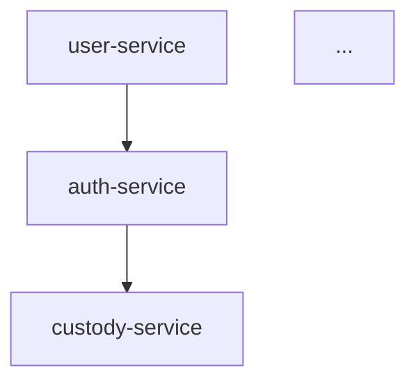
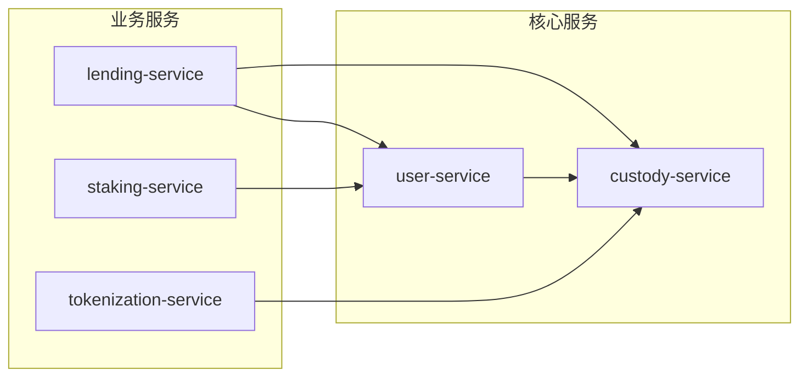

# 技术洞察生成提示词

## 任务目标

从多个仓库的 code-derived 文档中生成跨仓库技术洞察，识别架构模式、依赖关系和优化机会。

## 输入数据

你将收到以下信息：

### 1. 各仓库的 overview.md
包含每个仓库的端到端架构图和模块概览。

### 2. 各仓库的 module_tree.json
包含模块依赖树结构，格式如下：
```json
{
  "name": "root",
  "children": [
    {
      "name": "module-name",
      "type": "module",
      "dependencies": ["other-module"],
      "children": [...]
    }
  ]
}
```

### 3. 各仓库的 metadata.json
包含生成元信息和统计数据：
```json
{
  "generation_info": {
    "timestamp": "2025-11-25T16:34:44",
    "commit_id": "abc123"
  },
  "statistics": {
    "total_components": 1995,
    "leaf_nodes": 218,
    "max_depth": 2
  }
}
```

## 分析维度

### 1. 跨仓库依赖分析 (cross_repo_dependencies)

识别服务间的调用关系和依赖模式：

- **直接依赖**: 服务 A 直接调用服务 B 的 API
- **间接依赖**: 通过消息队列、事件总线等异步通信
- **共享依赖**: 多个服务依赖的公共组件或库
- **循环依赖风险**: 可能导致部署或运行时问题的依赖环

输出格式：
```markdown
## 跨仓库依赖分析

### 服务依赖图


### 依赖热点
| 服务 | 被依赖次数 | 依赖的服务数 | 风险等级 |
|------|-----------|-------------|---------|
| ... | ... | ... | ... |

### 依赖风险
- **循环依赖**: [列出发现的循环依赖]
- **单点故障**: [高度被依赖的服务]
```

### 2. 技术栈汇总 (tech_stack_summary)

汇总各仓库使用的技术栈：

- **语言分布**: 各服务使用的编程语言
- **框架选择**: Web框架、ORM、测试框架等
- **数据库**: 关系型、NoSQL、缓存等
- **中间件**: 消息队列、服务发现、配置中心等
- **版本一致性**: 同一库在不同服务中的版本差异

输出格式：
```markdown
## 技术栈汇总

### 语言分布
| 语言 | 服务数 | 主要用途 |
|------|-------|---------|
| TypeScript | 7 | 业务服务 |
| Solidity | 3 | 智能合约 |
| ... | ... | ... |

### 框架矩阵
| 服务 | Web框架 | ORM | 测试框架 |
|------|--------|-----|---------|
| ... | ... | ... | ... |

### 版本一致性检查
- **需统一版本**: [列出版本不一致的依赖]
- **建议升级**: [列出过时的依赖]
```

### 3. API 全景 (api_landscape)

分析服务暴露的 API 接口：

- **API 风格**: REST, GraphQL, gRPC 等
- **认证方式**: JWT, OAuth, API Key 等
- **版本策略**: URL 版本、Header 版本等
- **接口分类**: 公开 API、内部 API、管理 API
- **接口复杂度**: 参数数量、嵌套深度等

输出格式：
```markdown
## API 全景

### API 风格分布
| 风格 | 服务数 | 接口数 |
|------|-------|-------|
| REST | 8 | 120 |
| gRPC | 2 | 30 |

### 核心 API 目录
| 服务 | 路径前缀 | 接口数 | 说明 |
|------|---------|-------|-----|
| user-service | /api/v1/users | 15 | 用户管理 |
| ... | ... | ... | ... |

### API 设计建议
- [列出需要优化的 API 设计]
```

### 4. 架构模式识别 (architecture_patterns)

识别代码中使用的架构模式：

- **分层架构**: Controller/Service/Repository 等
- **领域驱动**: 聚合、值对象、领域事件等
- **微服务模式**: Saga、CQRS、Event Sourcing 等
- **设计模式**: 工厂、策略、观察者等

输出格式：
```markdown
## 架构模式识别

### 分层架构一致性
| 服务 | 分层模式 | 一致性评分 |
|------|---------|-----------|
| user-service | Controller/Service/Repository | ✅ 良好 |
| ... | ... | ... |

### DDD 实践
| 服务 | 聚合 | 值对象 | 领域事件 | 成熟度 |
|------|-----|-------|--------|--------|
| ... | ✅ | ✅ | ❌ | 中等 |

### 微服务模式
- **Saga 模式**: [使用该模式的服务]
- **CQRS**: [使用该模式的服务]
- **Event Sourcing**: [使用该模式的服务]

### 架构优化建议
1. [具体可执行的优化建议]
2. ...
```

## 输出要求

### 1. 技术洞察报告结构

```markdown
# 技术洞察报告

**生成时间**: YYYY-MM-DD
**分析仓库**: [仓库列表]
**总组件数**: [统计数据]

## 执行摘要

[3-5 句话概括主要发现和建议]

## 1. 跨仓库依赖分析
[详细分析]

## 2. 技术栈汇总
[详细分析]

## 3. API 全景
[详细分析]

## 4. 架构模式识别
[详细分析]

## 5. 综合建议

### 短期优化 (1-2周)
- [可立即执行的优化]

### 中期改进 (1-2月)
- [需要规划的改进]

### 长期演进 (季度+)
- [架构级别的演进方向]

---
> 此报告由 AI 自动生成，建议人工审核后执行
```

### 2. 输出质量要求

- **可操作性**: 每个发现都应有对应的建议
- **证据支持**: 结论需引用具体的代码/文件位置
- **优先级**: 按影响范围和紧急程度排序建议
- **风险标注**: 高风险项目明确标注
- **图表可视化**: 使用 Mermaid 图表增强可读性

### 3. 特殊标记

使用以下标记突出重要信息：

- 🚨 **关键风险**: 需要立即关注
- ⚠️ **警告**: 需要关注但非紧急
- 💡 **优化机会**: 可选的改进点
- ✅ **良好实践**: 值得推广的模式
- 📊 **统计数据**: 量化指标

## 示例输出片段

```markdown
## 1. 跨仓库依赖分析

### 服务依赖图



### 依赖热点

| 服务 | 被依赖次数 | 风险等级 |
|------|-----------|---------|
| custody-service | 5 | 🚨 高 |
| user-service | 4 | ⚠️ 中 |

### 风险发现

🚨 **custody-service 是单点故障风险**
- 被 5 个服务直接依赖
- 建议: 考虑增加熔断机制和降级策略

✅ **良好实践: lending-service 使用了 Saga 模式**
- 跨服务事务通过 Saga 协调
- 建议: 推广到其他需要跨服务事务的场景
```

## 注意事项

1. **客观分析**: 基于代码事实，避免主观臆断
2. **上下文理解**: 考虑业务背景和技术选型原因
3. **增量更新**: 标注与上次分析相比的变化
4. **隐私保护**: 不包含敏感配置或密钥信息
5. **可追溯性**: 引用具体文件和行号便于定位
