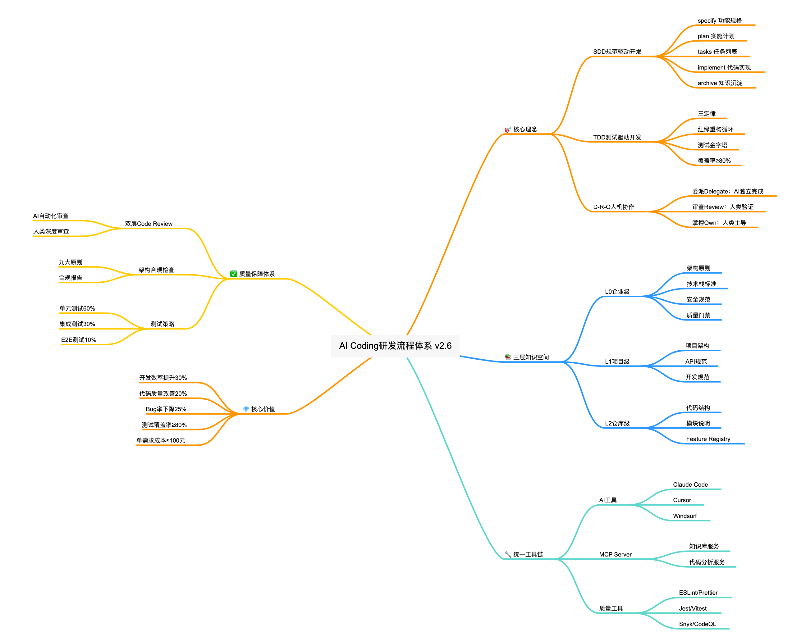
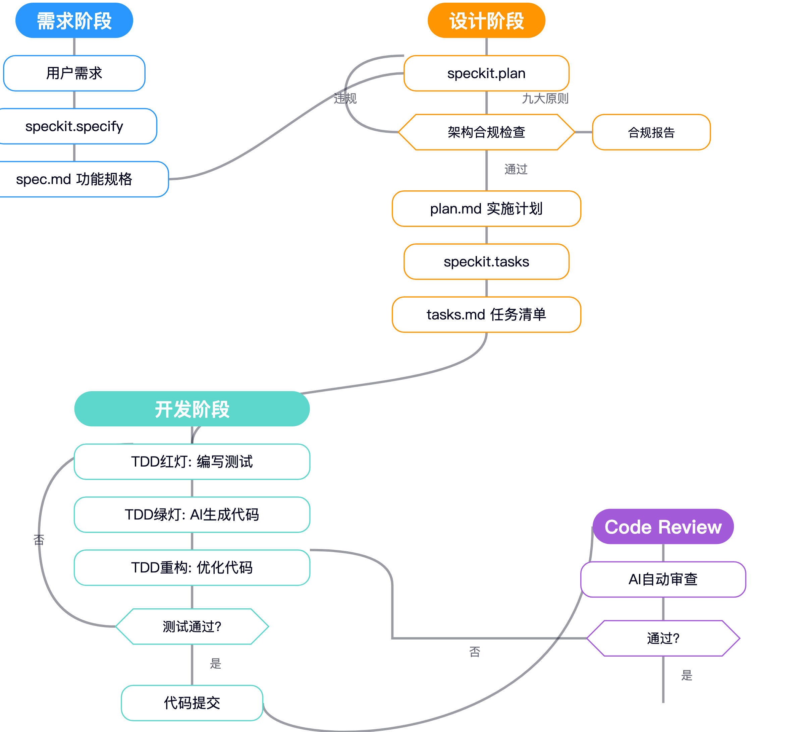
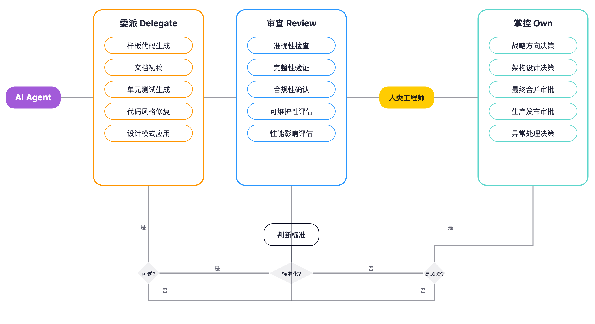

# AI Coding 研发流程体系

**版本**: 2.6
**创建日期**: 2025-12-01
**更新日期**: 2025-12-01
**作者**: 架构团队
**状态**: 设计中

---

## 1. 概述

### 1.1 设计目标

本文档定义了一套以 **SDD（规范驱动开发）** 和 **TDD（测试驱动开发）** 为核心驱动力的 AI Coding 研发流程体系，结合多级知识空间架构和统一工具链基础设施，实现从"人工编码"到"AI协同编码"的研发模式转型。


### 关键成功要素

**技术层面**：

- 规范与测试的双重驱动确保质量
- 三层知识架构支撑AI理解，对于开发接触的仓库级知识库尽量AI自动化
- 统一工具链降低认知负担
- 数据驱动的持续优化

**组织层面**：

- 循序渐进的实施路径
- 质量第一的文化建设
- 团队对AI协作的认同

**策略**

* AI不是万能的，我们能做的先做了。例如强化架构要求，强化质量和测试要求，强化个级别的约束要求。
* 保持跟随，例如社区的codebase，其他领域的subagent模式等一直在演进中。







### 1.2 核心理念 {}

```
┌─────────────────────────────────────────────────────────────────┐
│                    AI Coding 研发流程体系                        │
├─────────────────────────────────────────────────────────────────┤
│                                                                 │
│   ┌─────────────┐    ┌─────────────┐    ┌─────────────┐        │
│   │  SDD驱动    │ ←→ │  TDD驱动    │ ←→ │  AI协同     │        │
│   │  规范先行   │    │  测试先行   │    │  人机结对   │        │
│   └─────────────┘    └─────────────┘    └─────────────┘        │
│          ↑                  ↑                  ↑                │
│          └──────────────────┼──────────────────┘                │
│                             │                                   │
│   ┌─────────────────────────┴─────────────────────────┐        │
│   │              多级知识空间 + 统一工具链              │        │
│   │         L0企业级 → L1项目级 → L2仓库级             │        │
│   └───────────────────────────────────────────────────┘        │
│                                                                 │
└─────────────────────────────────────────────────────────────────┘
```

### 1.3 核心原则

| 原则               | 说明                                           |
| ------------------ | ---------------------------------------------- |
| **规范驱动** | 先有设计规范，后有代码实现，AI直接消费设计规范 |
| **测试先行** | 先写测试定义行为，再由AI生成实现代码           |
| **知识分层** | 企业→项目→仓库三层知识架构，自底向上聚合     |
| **工具统一** | 统一的AI工具链和开发环境，降低认知负担         |
| **持续改进** | 数据驱动的效能度量和流程优化                   |

### 1.4 委派-审查-掌控框架 (Delegate-Review-Own)

AI 协同开发的核心是明确人机职责边界。在 SDLC 每个阶段，采用 **D-R-O 框架**定义 AI 与人类的分工：

```
┌─────────────────────────────────────────────────────────────────┐
│                委派-审查-掌控 (D-R-O) 框架                        │
├─────────────────────────────────────────────────────────────────┤
│                                                                 │
│  ┌─────────────────┐                                            │
│  │   委派 Delegate │  → AI 可独立完成的任务                      │
│  │   (交给 AI)     │    样板代码、初稿生成、模式应用              │
│  └────────┬────────┘                                            │
│           │                                                     │
│           ▼                                                     │
│  ┌─────────────────┐                                            │
│  │   审查 Review   │  → 人类验证 AI 产出                         │
│  │   (人类把关)    │    准确性、完整性、合规性检查                │
│  └────────┬────────┘                                            │
│           │                                                     │
│           ▼                                                     │
│  ┌─────────────────┐                                            │
│  │   掌控 Own      │  → 人类必须负责的决策                       │
│  │   (人类主导)    │    战略方向、架构决策、最终审批              │
│  └─────────────────┘                                            │
│                                                                 │
└─────────────────────────────────────────────────────────────────┘
```

**各阶段 D-R-O 职责总览**：

| SDLC 阶段      | 委派 (AI)                              | 审查 (人类)                | 掌控 (人类)                      |
| -------------- | -------------------------------------- | -------------------------- | -------------------------------- |
| **规划** | 可行性分析初稿、依赖识别、工时估算建议 | 验证估算准确性、评估完整性 | 优先级决策、长期方向、资源分配   |
| **设计** | 原型搭建、样板代码、设计稿转代码       | 组件规范合规、质量标准验证 | 设计系统、UX模式、架构决策       |
| **构建** | 功能实现初稿、CRUD逻辑、测试生成       | 设计选择、性能、安全评估   | 新抽象、跨切面架构、可维护性权衡 |
| **测试** | 测试用例生成、边缘情况识别             | 防止桩测试、验证断言有效性 | 测试策略、覆盖率与业务对齐       |
| **审查** | 代码风格检查、潜在Bug检测、安全扫描    | 架构一致性、业务逻辑正确性 | 最终合并决策、部署审批           |
| **文档** | 模块摘要、API描述、Release Notes初稿   | 准确性验证、关键变更确认   | 文档策略、面向客户/安全关键文档  |
| **运维** | 日志分析、异常识别、修复建议           | 根因确认、修复方案评估     | 敏感操作签署、事故最终判断       |

**核心原则**：

- **AI 是第一轮实施者**，人类是审阅者、编辑者和方向来源
- **机械性工作委派**，创造性决策掌控
- **可逆操作委派**，不可逆操作掌控

---

## 2. 流程重塑

### 2.1 SDD 规范驱动开发【核心】

#### 2.1.1 设计先行原则

SDD的核心理念是"**设计即约束**"——通过清晰的功能规格文档约束AI的代码生成行为，避免过度实现和功能蔓延。

**功能规格文档结构**：

```markdown
# 功能规格: [功能名称]

## 1. 需求详细说明
- 业务背景
- 用户故事
- 验收标准

## 2. 技术设计文档
- 架构设计
- 数据模型
- 接口定义

## 3. 接口契约
- API规范 (OpenAPI/GraphQL)
- 请求/响应示例
- 错误码定义

## 4. 约束条件
- 技术栈限定
- 代码行数控制
- 排除功能清单
```

#### 2.1.2 SDD 工作流程

基于 Speckit 的标准化工作流：

```
┌──────────────────────────────────────────────────────────────┐
│                    SDD 工作流程                               │
├──────────────────────────────────────────────────────────────┤
│                                                              │
│  ┌─────────────┐   ┌─────────────┐   ┌─────────────┐        │
│  │   specify   │ → │    plan     │ → │    tasks    │        │
│  │  自然语言   │   │  实施计划   │   │  可执行任务  │        │
│  │  →功能规格  │   │  →设计文档  │   │  →任务列表   │        │
│  └─────────────┘   └─────────────┘   └─────────────┘        │
│                                              ↓               │
│                                      ┌─────────────┐        │
│                                      │  implement  │        │
│                                      │  任务→代码  │        │
│                                      └─────────────┘        │
│                                                              │
└──────────────────────────────────────────────────────────────┘
```

**工作流命令**：

| 命令                   | 功能         | 输入            | 输出               |
| ---------------------- | ------------ | --------------- | ------------------ |
| `/speckit.specify`   | 创建功能规格 | 自然语言描述    | spec.md            |
| `/speckit.plan`      | 生成实施计划 | spec.md         | plan.md            |
| `/speckit.tasks`     | 生成任务列表 | plan.md         | tasks.md           |
| `/speckit.implement` | 执行代码实现 | tasks.md        | 代码文件           |
| `/speckit.analyze`   | 跨产物分析   | spec/plan/tasks | 一致性报告         |
| `/speckit.clarify`   | 需求澄清     | spec.md         | 澄清问题           |
| `/speckit.archive`   | 知识沉淀归档 | 已实现功能      | registry.json, ADR |

#### 2.1.3 知识库集成增强

**各阶段知识库读取**：

| 阶段                | 知识库层级 | 读取内容                      | 用途                |
| ------------------- | ---------- | ----------------------------- | ------------------- |
| **specify**   | L1 项目级  | glossary.md, domain-model.md  | 术语规范、实体识别  |
| **specify**   | L2 仓库级  | context.md, overview.md       | 模块边界、避免重复  |
| **plan**      | L0 企业级  | architecture-principles.md    | 架构合规检查        |
| **plan**      | L1 项目级  | tech-stack.md, ADR-*.md       | 技术选型、ADR一致性 |
| **plan**      | L2 仓库级  | module_tree.json, {module}.md | 路径规范、组件复用  |
| **tasks**     | L2 仓库级  | module_tree.json              | 文件路径验证        |
| **implement** | L2 仓库级  | {module}.md                   | 代码模式参考        |

#### 2.1.4 架构合规检查

在 `/speckit.plan` 的 Phase 0 和 Phase 1 之间强制执行架构合规检查：

**九大原则检查矩阵**：

| 原则            | 检查项               | 严重级别 |
| --------------- | -------------------- | -------- |
| I. TDD          | 测试策略、覆盖率目标 | CRITICAL |
| III. 微服务架构 | 分层结构、技术栈合规 | CRITICAL |
| IV. 安全优先    | 输入校验、审计日志   | CRITICAL |
| V. RESTful      | API设计规范          | HIGH     |
| VI. 生产就绪    | 错误处理、事务管理   | HIGH     |
| VIII. 简洁性    | YAGNI、依赖管理      | MEDIUM   |
| IX. 事件驱动    | 事件监听、幂等性     | HIGH     |

**合规检查输出**：

```markdown
## Architecture Compliance Check

| 原则 | 适用性 | 检查结果 | 说明 |
|------|--------|----------|------|
| I. TDD | ✓ | ✅ | 已规划单元测试和集成测试 |
| III. 微服务 | ✓ | ⚠️ | 技术栈合规，分层需调整 |
| IV. 安全 | ✓ | ✅ | 已规划输入校验和审计日志 |

**处理规则**: ✅全部合规→继续 | ⚠️需调整→修改后继续 | ❌违规→阻止流程
```

#### 2.1.5 AI 协同 SDD 实践

**Prompt 模板化**：

```markdown
## 任务
根据以下规格文档实现 [功能名称]

## 约束条件
- 技术栈: [具体技术栈]
- 代码行数: 不超过 [N] 行
- 排除功能: [明确排除列表]

## 输入规格
[粘贴 spec.md 相关内容]

## 输出要求
- 遵循项目编码规范
- 包含单元测试
- 提供使用示例
```

**防止 AI 过度联想**：

| 策略                 | 说明                 | 示例                                 |
| -------------------- | -------------------- | ------------------------------------ |
| **负向提示**   | 明确列出不需要的功能 | "不需要：密码重置、邮箱验证、OAuth"  |
| **领域边界**   | 定义功能边界         | "仅限用户基础信息CRUD，不涉及权限"   |
| **单一事实源** | 限制输入输出         | "输入：用户名+密码，输出：JWT token" |

**渐进式迭代**：

```
第1轮: 核心数据模型
    ↓
第2轮: 基础CRUD接口
    ↓
第3轮: 业务逻辑层
    ↓
第4轮: 验证和错误处理
    ↓
第5轮: 测试用例补充
```

#### 2.1.6 知识生命周期管理【增强】

SpecKit 生成的文档（spec.md, plan.md, tasks.md）存在"一次性使用"的问题，导致历史决策丢失、跨需求信息孤岛。本节定义知识沉淀与复用机制。

##### 2.1.6.1 问题陈述

**当前知识断层**：

```
┌─────────────────────────────────────────────────────────────────┐
│                    当前文档生命周期                              │
├─────────────────────────────────────────────────────────────────┤
│                                                                 │
│  需求A                                                          │
│    ↓                                                            │
│  /speckit.specify → spec.md ─┐                                  │
│    ↓                         │                                  │
│  /speckit.plan → plan.md ────┼──→ features/feature-a/ (归档)    │
│    ↓                         │                                  │
│  /speckit.tasks → tasks.md ──┘                                  │
│    ↓                                                            │
│  /speckit.implement → 代码实现                                   │
│    ↓                                                            │
│  ══════════════════════════════════════════════════════════════ │
│                     知识断层 (Knowledge Gap)                     │
│  ══════════════════════════════════════════════════════════════ │
│    ↓                                                            │
│  需求B (新需求)                                                  │
│    ↓                                                            │
│  /speckit.specify → 无法访问需求A的决策历史                       │
│    ↓                                                            │
│  可能产生：重复设计 | 决策冲突 | 架构不一致                        │
│                                                                 │
└─────────────────────────────────────────────────────────────────┘
```

**核心问题**：

| 问题           | 影响                   | 严重程度 |
| -------------- | ---------------------- | -------- |
| 文档一次性使用 | 历史决策丢失，无法复用 | 🔴 高    |
| 无跨需求关联   | 相关需求间信息孤岛     | 🔴 高    |
| 知识未沉淀     | 架构决策散落各处       | 🟡 中    |
| 缺乏版本演进   | 设计演变历史不可追溯   | 🟡 中    |

##### 2.1.6.2 Feature Registry（特性注册表）

**数据结构**：

```json
// features/registry.json
{
  "version": "1.0",
  "last_updated": "2025-01-15T10:30:00Z",
  "features": [
    {
      "id": "user-authentication",
      "name": "用户认证系统",
      "status": "implemented",
      "created_at": "2025-01-10",
      "completed_at": "2025-01-15",
      "artifacts": {
        "spec": "features/user-authentication/spec.md",
        "plan": "features/user-authentication/plan.md",
        "tasks": "features/user-authentication/tasks.md"
      },
      "summary": {
        "business_goal": "实现安全的用户登录和会话管理",
        "technical_approach": "JWT + OAuth2.0",
        "key_decisions": [
          "使用 JWT 而非 Session 存储",
          "Token 有效期 24 小时",
          "支持 OAuth2.0 第三方登录"
        ]
      },
      "impact": {
        "modules_created": ["auth-service"],
        "modules_modified": ["user-gateway", "common-utils"],
        "apis_added": ["/api/v1/auth/login", "/api/v1/auth/refresh"],
        "domain_entities": ["User", "Session", "Token"]
      },
      "tags": ["authentication", "security", "user-management"],
      "related_features": ["user-registration", "role-based-access"],
      "adr_refs": ["ADR-001-jwt-token-strategy"]
    }
  ],
  "index": {
    "by_module": {
      "auth-service": ["user-authentication", "role-based-access"]
    },
    "by_tag": {
      "security": ["user-authentication", "role-based-access"]
    },
    "by_domain": {
      "User": ["user-authentication", "user-registration"]
    }
  }
}
```

**查询接口**：

| 查询方式                     | 输入       | 输出                 |
| ---------------------------- | ---------- | -------------------- |
| `find_by_module`           | 模块名     | 相关特性列表及摘要   |
| `find_by_domain`           | 实体名     | 涉及该实体的特性列表 |
| `find_related`             | 特性ID     | 关联特性及关联原因   |
| `find_conflicts`           | 新特性描述 | 潜在冲突的历史决策   |
| `get_decisions_for_module` | 模块名     | 影响该模块的所有 ADR |

##### 2.1.6.3 知识沉淀命令：/speckit.archive

**触发时机**：`/speckit.implement` 所有任务完成后自动执行

**三阶段流程**：

```
┌─────────────────────────────────────────────────────────────────┐
│                  /speckit.archive 执行流程                       │
├─────────────────────────────────────────────────────────────────┤
│                                                                 │
│  Phase 1: 知识提取                                               │
│  ─────────────────                                              │
│  • 解析 spec.md → business_goal, acceptance_criteria            │
│  • 解析 plan.md → technical_approach, architecture_decisions    │
│  • 解析代码变更 → modules_affected, apis_added, domain_entities │
│                                                                 │
│  Phase 2: 知识沉淀                                               │
│  ─────────────────                                              │
│  • 更新 Feature Registry (features/registry.json)              │
│  • 提取架构决策 → 生成 ADR (如有重要决策)                         │
│  • 更新领域模型 (domain-model.md)                                │
│  • 触发 CodeWiki 更新                                            │
│                                                                 │
│  Phase 3: 关联建立                                               │
│  ─────────────────                                              │
│  • 基于模块、标签、领域实体识别相关特性                           │
│  • 更新 Registry 索引 (by_module, by_tag, by_domain)            │
│                                                                 │
└─────────────────────────────────────────────────────────────────┘
```

**ADR 自动生成模板**：

```markdown
# ADR-{number}: {title}

## 状态
{Proposed | Accepted | Deprecated | Superseded}

## 上下文
来源特性: {feature_id}
决策日期: {date}

{从 plan.md 提取的背景描述}

## 决策
{从 plan.md 提取的技术方案}

## 理由
{从 spec.md 和 plan.md 提取的决策依据}

## 影响
- 受影响模块: {modules}
- 依赖关系: {dependencies}
- 后续约束: {constraints}

## 相关
- 特性: {feature_link}
- 相关 ADR: {related_adrs}
```

##### 2.1.6.4 历史感知增强

**增强 /speckit.specify**：

在 Phase 1 之前新增 Phase 0，自动加载相关历史上下文：

```yaml
phase_0_context:
  name: "历史上下文加载"
  actions:
    - action: "加载 Feature Registry"
      source: "features/registry.json"
    - action: "分析需求关键词"
      extract: ["模块名", "领域实体", "业务标签"]
    - action: "查询相关历史特性"
      query:
        by_module: "{涉及的模块}"
        by_domain: "{涉及的领域实体}"
        by_tag: "{相关标签}"
    - action: "生成历史上下文摘要"
```

**输出示例**：

```markdown
## 📚 相关历史需求

### 直接相关
| 特性 | 状态 | 关键决策 | 影响模块 |
|------|------|---------|---------|
| user-authentication | 已实现 | JWT + OAuth2.0 | auth-service |

### ⚠️ 设计约束
- 必须兼容现有 JWT Token 结构
- 考虑与 OAuth2.0 流程的集成点

### 可复用设计
- Token 刷新机制可复用
- 用户会话管理模式
```

**增强 /speckit.plan**：

在 Phase 1 之前新增 Phase 0，加载历史决策约束：

```yaml
phase_0_history:
  name: "历史决策加载"
  actions:
    - action: "加载相关 ADR"
      source: "docs-knowledge/L1-project/architecture/decisions/"
      filter: "与当前需求涉及模块相关"
    - action: "生成决策约束清单"
    - action: "冲突检测"
```

**冲突检测输出**：

```markdown
## ⚠️ 决策冲突警告

| 历史决策 | 新需求 | 冲突类型 |
|---------|--------|---------|
| ADR-001: 使用 JWT 无状态认证 | 改用 Redis Session | 架构冲突 |

### 需要明确
- 是否废弃 ADR-001？
- 是否共存两种方案？
- 迁移策略是什么？
```

##### 2.1.6.5 知识驱动的 SDD 工作流

```
┌─────────────────────────────────────────────────────────────────────┐
│                    知识驱动的 SDD 工作流                             │
├─────────────────────────────────────────────────────────────────────┤
│                                                                     │
│  ┌─────────────┐                                                    │
│  │ 新需求输入   │                                                    │
│  └──────┬──────┘                                                    │
│         ↓                                                           │
│  ┌─────────────────────────────────────────────────────────┐       │
│  │ /speckit.specify                                         │       │
│  │  ├─ Phase 0: 查询 Registry → 加载相关历史               │       │
│  │  ├─ Phase 1: 需求分析 (带历史上下文)                     │       │
│  │  └─ Output: spec.md (包含历史关联说明)                   │       │
│  └──────┬──────────────────────────────────────────────────┘       │
│         ↓                                                           │
│  ┌─────────────────────────────────────────────────────────┐       │
│  │ /speckit.plan                                            │       │
│  │  ├─ Phase 0: 加载相关 ADR → 识别约束                    │       │
│  │  ├─ Phase 1: 技术设计 (遵循历史决策)                     │       │
│  │  └─ Output: plan.md (标注决策延续/变更)                  │       │
│  └──────┬──────────────────────────────────────────────────┘       │
│         ↓                                                           │
│  ┌─────────────────────────────────────────────────────────┐       │
│  │ /speckit.tasks → /speckit.implement                      │       │
│  │  └─ 实现代码                                             │       │
│  └──────┬──────────────────────────────────────────────────┘       │
│         ↓                                                           │
│  ┌─────────────────────────────────────────────────────────┐       │
│  │ /speckit.archive (自动触发)                              │       │
│  │  ├─ 提取知识 → 更新 Registry                            │       │
│  │  ├─ 生成 ADR (如需要)                                   │       │
│  │  ├─ 更新领域模型                                         │       │
│  │  ├─ 建立特性关联                                         │       │
│  │  └─ 触发 CodeWiki 更新                                   │       │
│  └──────┬──────────────────────────────────────────────────┘       │
│         ↓                                                           │
│  ┌─────────────┐                                                    │
│  │ 知识库更新   │ ←── 下一个需求可以访问                            │
│  └─────────────┘                                                    │
│                                                                     │
└─────────────────────────────────────────────────────────────────────┘
```

##### 2.1.6.6 查询场景示例

**场景1：新需求涉及已有模块**

```
用户: "为 auth-service 添加双因素认证"

/speckit.specify 执行:
1. 关键词提取: "auth-service", "认证", "安全"
2. Registry 查询:
   - by_module("auth-service") → ["user-authentication", "role-based-access"]
   - by_tag("security") → ["user-authentication", ...]
3. 输出历史上下文:

   ## 📚 相关历史需求

   ### user-authentication (已实现)
   - **技术方案**: JWT + OAuth2.0
   - **关键决策**: Token 有效期 24h, 支持第三方登录
   - **相关 ADR**: ADR-001-jwt-token-strategy

   ### ⚠️ 设计约束
   - 必须兼容现有 JWT Token 结构
   - 考虑与 OAuth2.0 流程的集成点
```

**场景2：检测潜在冲突**

```
用户: "将用户会话改为 Redis Session 存储"

/speckit.plan 执行:
1. 加载相关 ADR: ADR-001-jwt-token-strategy
2. 冲突检测:

   ## ⚠️ 决策冲突警告

   | 历史决策 | 新需求 | 冲突类型 |
   |---------|--------|---------|
   | ADR-001: 使用 JWT 无状态认证 | 改用 Redis Session | 架构冲突 |

   ### 需要明确
   - 是否废弃 ADR-001？
   - 是否共存两种方案？
   - 迁移策略是什么？
```

### 2.2 TDD 测试驱动开发【核心】

#### 2.2.1 TDD 三定律

1. **先写失败测试**：在编写任何生产代码之前，先编写一个失败的单元测试
2. **仅写足够代码**：只编写刚好能让测试通过的生产代码
3. **重构保持测试**：重构代码时确保所有测试仍然通过

#### 2.2.2 红灯-绿灯-重构循环

```
┌─────────────────────────────────────────────────────┐
│              TDD 循环                                │
├─────────────────────────────────────────────────────┤
│                                                     │
│      ┌─────────┐                                    │
│      │  红灯   │ ← 编写失败测试                      │
│      │  RED    │                                    │
│      └────┬────┘                                    │
│           │                                         │
│           ▼                                         │
│      ┌─────────┐                                    │
│      │  绿灯   │ ← 最小代码通过测试                  │
│      │  GREEN  │                                    │
│      └────┬────┘                                    │
│           │                                         │
│           ▼                                         │
│      ┌─────────┐                                    │
│      │  重构   │ ← 优化设计保持绿灯                  │
│      │ REFACTOR│                                    │
│      └────┬────┘                                    │
│           │                                         │
│           └─────────→ 回到红灯                       │
│                                                     │
└─────────────────────────────────────────────────────┘
```

#### 2.2.3 AI 优先 TDD 流程

将 AI 深度集成到 TDD 流程中：

```
┌─────────────────────────────────────────────────────────────┐
│                AI 优先 TDD 流程                              │
├─────────────────────────────────────────────────────────────┤
│                                                             │
│  Step 1: 人工编写测试签名和意图                              │
│  ┌─────────────────────────────────────────────────────┐   │
│  │ describe('用户注册', () => {                         │   │
│  │   it('应该成功注册新用户', () => {                    │   │
│  │     // 意图: 验证邮箱+密码注册流程                    │   │
│  │   });                                                │   │
│  │ });                                                  │   │
│  └─────────────────────────────────────────────────────┘   │
│                          ↓                                  │
│  Step 2: AI 生成完整测试用例                                │
│  ┌─────────────────────────────────────────────────────┐   │
│  │ it('应该成功注册新用户', async () => {               │   │
│  │   const user = { email: 'test@example.com', ... };   │   │
│  │   const result = await registerUser(user);           │   │
│  │   expect(result.success).toBe(true);                 │   │
│  │   expect(result.user.id).toBeDefined();              │   │
│  │ });                                                  │   │
│  └─────────────────────────────────────────────────────┘   │
│                          ↓                                  │
│  Step 3: AI 编写通过测试的实现代码                          │
│  ┌─────────────────────────────────────────────────────┐   │
│  │ async function registerUser(userData) {              │   │
│  │   // AI生成的实现代码                                │   │
│  │   const user = await User.create(userData);          │   │
│  │   return { success: true, user };                    │   │
│  │ }                                                    │   │
│  └─────────────────────────────────────────────────────┘   │
│                          ↓                                  │
│  Step 4: 人工审查和验证                                     │
│                                                             │
└─────────────────────────────────────────────────────────────┘
```

#### 2.2.4 测试金字塔

```
                    ┌─────────┐
                    │  E2E    │  10%
                    │  测试   │
                ┌───┴─────────┴───┐
                │   集成测试       │  30%
            ┌───┴─────────────────┴───┐
            │       单元测试           │  60%
            └─────────────────────────┘
```

**测试覆盖率要求**：≥80%

#### 2.2.5 测试阶段 D-R-O 职责分工

| 层级           | 内容                                                                                |
| -------------- | ----------------------------------------------------------------------------------- |
| **委派** | 基于功能规范生成测试用例、识别边缘情况和故障模式、第一轮测试代码生成                |
| **审查** | 防止 AI 走捷径或实施桩测试（stubbed tests）、验证断言有效性、确保测试可由智能体运行 |
| **掌控** | 测试覆盖率与功能规范对齐、测试策略制定、边缘情况的创造性映射、测试意图的最终确认    |

**AI 测试生成最佳实践**：

| 实践                     | 说明                                         |
| ------------------------ | -------------------------------------------- |
| **分离生成**       | 在独立会话中生成测试，避免测试与实现循环依赖 |
| **先验证失败**     | 确保生成的测试在实现前失败（红灯阶段）       |
| **边缘情况发现**   | 提示 AI 识别开发者可能忽略的边缘情况         |
| **覆盖率工具集成** | 在 AGENTS.md 中配置覆盖率工具调用方式        |

### 2.3 AI 协同开发流程

#### 2.3.1 需求阶段

| 活动     | 负责人     | AI参与方式              | 产出         |
| -------- | ---------- | ----------------------- | ------------ |
| 需求分析 | 产品经理   | LLM分析原始需求         | 用户故事草稿 |
| 任务拆解 | 技术负责人 | AI辅助拆解              | 任务列表     |
| 技术方案 | 架构师     | Vibe-Driven Development | 技术规格     |

**D-R-O 职责分工**：

| 层级           | 内容                                                                          |
| -------------- | ----------------------------------------------------------------------------- |
| **委派** | AI 进行可行性分析第一轮、读取规范映射代码库、识别依赖和歧义、生成工时估算建议 |
| **审查** | 验证估算准确性、评估分析完整性、确认技术约束反映真实情况                      |
| **掌控** | 优先级决策、长期方向规划、排序权衡、资源分配                                  |

**Vibe-Driven Development**：

```
高阶概念 (Vibe)
    ↓ AI对话迭代
技术规格 (Spec)
    ↓ AI对话迭代
实现路径 (Path)
```

#### 2.3.2 开发阶段

**人机结对编程规范**：

| 角色         | 职责                                              |
| ------------ | ------------------------------------------------- |
| **AI** | 样板代码生成、API调用实现、单元测试生成、文档生成 |
| **人** | 业务逻辑设计、架构决策、代码审查、最终验收        |

**D-R-O 职责分工**：

| 层级           | 内容                                                                         |
| -------------- | ---------------------------------------------------------------------------- |
| **委派** | 功能实现初稿、CRUD逻辑、脚手架搭建、重构、样板代码生成、测试编写             |
| **审查** | 评估设计选择、性能影响、安全风险、迁移风险、领域对齐，纠正 AI 遗漏的细微问题 |
| **掌控** | 新抽象设计、跨切面架构变更、模糊产品需求澄清、长期可维护性权衡               |

**从规格生成代码**：

```
OpenAPI/Swagger  →  API客户端 + 服务器路由
GraphQL Schema   →  类型定义 + Resolver骨架
数据库DDL       →  ORM模型 + Repository层
```

#### 2.3.3 Code Review 阶段

**Code Review 的核心目的**：

1. **让代码更加统一、规范、易维护**：通过统一的代码风格和规范，降低维护成本
2. **方便开发人员互相学习经验，达到知识共享**：促进团队整体技术水平提升
3. **帮助开发人员跳出固定思维，得出最优解决思路**：多人Review从不同角度审视代码
4. **从可运行到可重用**：使代码不仅能完成功能，还具备良好的可重用性和扩展性

**双层 CR 机制**：

```
┌─────────────────────────────────────────────────────────────┐
│                    双层 CR 机制                              │
├─────────────────────────────────────────────────────────────┤
│                                                             │
│  第一层: AI 自动化 Review                                   │
│  ┌─────────────────────────────────────────────────────┐   │
│  │ • 代码风格检查                                       │   │
│  │ • 潜在 Bug 检测                                      │   │
│  │ • 最佳实践建议                                       │   │
│  │ • 安全漏洞扫描                                       │   │
│  │ • 性能问题识别                                       │   │
│  └─────────────────────────────────────────────────────┘   │
│                          ↓                                  │
│  第二层: 人类 Reviewer                                      │
│  ┌─────────────────────────────────────────────────────┐   │
│  │ • 架构一致性                                         │   │
│  │ • 业务逻辑正确性                                     │   │
│  │ • 系统可扩展性                                       │   │
│  │ • 设计模式合理性                                     │   │
│  │ • 领域建模正确性                                     │   │
│  └─────────────────────────────────────────────────────┘   │
│                                                             │
└─────────────────────────────────────────────────────────────┘
```

**Code Review 完整流程**：

```
1. 开发者提交代码
       ↓
2. 自我 Review（开发者自查基本规范）
       ↓
3. AI 自动化 Review（CI触发）
       ↓
4. 同行 Review（团队成员审查）
       ↓
5. 讨论与修改（针对意见修改）
       ↓
6. 二次 Review（重大问题修改后）
       ↓
7. 合并代码
```

**Code Review 检查清单**：

| 检查维度           | 检查项                                           |
| ------------------ | ------------------------------------------------ |
| **功能性**   | 代码是否实现需求功能、边界条件处理、逻辑错误检查 |
| **设计性**   | 是否符合SOLID原则、职责划分合理性、避免过度设计  |
| **代码质量** | 可读性、命名清晰度、注释充分性                   |
| **性能安全** | 性能瓶颈、资源释放、安全漏洞                     |

**D-R-O 职责分工**：

| 层级           | 内容                                                                            |
| -------------- | ------------------------------------------------------------------------------- |
| **委派** | 初始代码审查（可多次）、代码风格检查、潜在 Bug 检测、安全漏洞扫描、最佳实践建议 |
| **审查** | 架构对齐验证、可组合模式评估、惯例使用正确性、功能符合需求确认                  |
| **掌控** | 最终合并决策、部署到生产环境的代码质量负责、运行可靠性和需求满足的最终确认      |

---

## 3. 代码设计规范

### 3.1 三阶段编程方法论

优秀的代码设计需要经历三个阶段：**分析 → 设计 → 打磨**

```
┌─────────────────────────────────────────────────────────────┐
│                    三阶段编程                                │
├─────────────────────────────────────────────────────────────┤
│                                                             │
│  ┌─────────────┐   ┌─────────────┐   ┌─────────────┐       │
│  │   分析阶段   │ → │   设计阶段   │ → │   打磨阶段   │       │
│  │             │   │             │   │             │       │
│  │ • 分析需求   │   │ • 分配职责   │   │ • 选择模式   │       │
│  │ • 识别实体   │   │ • GRASP原则  │   │ • 提高可读   │       │
│  │ • 找核心概念 │   │ • 确保清晰   │   │ • 优化维护   │       │
│  └─────────────┘   └─────────────┘   └─────────────┘       │
│                                                             │
└─────────────────────────────────────────────────────────────┘
```

**分析阶段**：

- 不要急于实现功能，避免陷入事务脚本模式（面向过程）
- 分析需求的本质目的
- 识别完成功能需要的核心实体
- 核心是"**找实体**"

**设计阶段**：

- 将职责合理分配到各个实体上
- 运用 GRASP 原则指导设计
- 确保职责分配的合理性和清晰性

**打磨阶段**：

- 选择合适的设计模式实现
- 提高代码的可读性和可维护性
- 使用模板模式处理通用业务流程

### 3.2 SOLID 设计原则

SOLID 是面向对象设计的五大基本原则，是编写高质量代码的基石：

#### 3.2.1 单一职责原则 (SRP)

**定义**：一个类只负责完成一个职责或功能，不应存在多于一种导致类变更的原因。

**优势**：

- 提高类的内聚性
- 降低代码耦合性
- 使代码更易于理解和维护

**注意**：不要过度拆分，否则会降低内聚性，影响可维护性

#### 3.2.2 开放-关闭原则 (OCP)

**定义**：对扩展开放，对修改关闭。添加新功能应通过扩展代码而非修改已有代码。

**实现方式**：

- 使用多态
- 依赖注入
- 基于接口而非实现编程
- 应用设计模式（装饰、策略、模板、职责链、状态等）

#### 3.2.3 里氏替换原则 (LSP)

**定义**：子类对象能够替换程序中父类对象出现的任何地方，并保证原有程序逻辑行为不变。

**核心要求**：

- 子类可以扩展父类功能
- 子类不能改变父类原有功能
- 父类已实现的方法是规范和契约

#### 3.2.4 接口隔离原则 (ISP)

**定义**：调用方不应该依赖它不需要的接口；一个类对另一个类的依赖应该建立在最小的接口上。

**判断标准**：如果调用者只使用部分接口或接口的部分功能，说明接口设计不够职责单一。

#### 3.2.5 依赖反转原则 (DIP)

**定义**：

- 高层模块不应该依赖低层模块，二者都应该依赖其抽象
- 抽象不应该依赖细节，细节应该依赖抽象

**实践**：面向接口编程，而不是面向实现编程

#### 3.2.6 其他重要原则

| 原则                   | 说明                                             |
| ---------------------- | ------------------------------------------------ |
| **迪米特法则**   | 一个对象应该对其他对象保持最少的了解，降低耦合度 |
| **合成复用原则** | 尽量使用组合/聚合方式，而不是使用继承            |

### 3.3 设计模式应用指南

设计模式是经过验证的问题解决方案，核心思想是"**找到变化，封装变化**"。

#### 创建型模式

| 模式             | 说明                                 | 适用场景                     |
| ---------------- | ------------------------------------ | ---------------------------- |
| **单例**   | 一个类只允许创建一个实例             | 无状态/全局唯一/控制资源访问 |
| **工厂**   | 创建相关对象，使用者不关心具体实现类 | 分离对象创建和使用           |
| **建造者** | 创建复杂对象，通过设置可选参数定制化 | 构造参数较多且多数可选       |
| **原型**   | 通过复制已有对象创建新对象           | 对象创建成本大且差别不大     |

#### 结构型模式

| 模式             | 说明                                     | 适用场景                    |
| ---------------- | ---------------------------------------- | --------------------------- |
| **代理**   | 不改变原始类情况下，通过代理类附加功能   | 监控、缓存、限流、事务、RPC |
| **装饰者** | 不改变原始类情况下，通过组合动态扩展功能 | 动态扩展类的功能            |
| **适配器** | 不改变原始类情况下，使其适配新接口       | 复用现有类，但接口不适配    |
| **桥接**   | 多个独立变化维度时，通过组合独立扩展     | 存在多维度继承体系          |
| **门面**   | 为子系统定义更高层接口，使其更易使用     | 解决接口复用性与易用性矛盾  |
| **组合**   | 将对象组合成树形结构，统一处理           | 满足部分-整体树形结构       |
| **享元**   | 运用共享技术支持大量细粒度对象           | 大量对象且字段取值范围固定  |

#### 行为型模式

| 模式             | 说明                               | 适用场景                            |
| ---------------- | ---------------------------------- | ----------------------------------- |
| **观察者** | 主题对象状态变化时通知所有观察者   | 解耦事件创建者与接收者              |
| **模板**   | 定义算法骨架，延迟某些步骤到子类   | 解决复用与扩展问题                  |
| **策略**   | 封装一组算法，使其可互相替换       | 消除if-else，解耦策略定义/创建/使用 |
| **状态**   | 对象内部状态改变时改变其行为       | 分离对象状态与行为                  |
| **职责链** | 对象连成链，请求沿链传递直到被处理 | 解耦请求发送者与接收者              |
| **迭代器** | 顺序访问集合元素，不暴露内部表示   | 解耦集合内部表示与遍历访问          |
| **命令**   | 将请求封装成命令对象，控制执行过程 | 异步、延迟、排队、撤销、存储命令    |

---

## 4. 编码技巧规范

### 4.1 方法级优化技巧

#### 4.1.1 提炼方法与意图导向编程

**适用场景**：

- 多个方法代码重复
- 方法中代码过长（一般不超过80行）
- 方法中语句不在同一抽象层级

**意图导向编程原则**：

- 将处理流程和具体实现分离
- 把问题分解为一系列功能性步骤
- 假定功能步骤已实现，先组织整体流程
- 最后再实现各个具体方法

```
示例 - 交易处理流程：
1. 解析交易字符串
2. 转换为词汇元素数组
3. 标准化每个词汇
4. 根据规模选择提交算法
5. 返回提交结果
```

#### 4.1.2 其他方法级技巧

| 技巧                                | 说明                                           |
| ----------------------------------- | ---------------------------------------------- |
| **以函数对象取代函数**        | 将大型函数放进单独对象中，局部变量变成对象字段 |
| **引入参数对象**              | 方法参数较多时，将参数封装为参数对象           |
| **移除对参数的赋值**          | 有返回值的方法不应有副作用，避免修改参数值     |
| **引入解释性变量**            | 将复杂表达式结果放入临时变量，用变量名解释用途 |
| **try-catch内部代码抽成方法** | 保持核心逻辑清晰                               |

### 4.2 条件判断优化

#### 4.2.1 使用卫语句替代嵌套条件

**原则**：把复杂的条件表达式拆分成多个条件表达式，减少嵌套。

```
// 反例：多层嵌套
if (condition1) {
    if (condition2) {
        if (condition3) {
            // 核心逻辑
        }
    }
}

// 正例：卫语句
if (!condition1) return;
if (!condition2) return;
if (!condition3) return;
// 核心逻辑
```

**优势**：降低复杂度、提高可读性、核心逻辑更清晰

#### 4.2.2 使用多态替代条件判断

**适用场景**：当存在根据对象类型选择不同行为的条件表达式时

**实现方式**：

- 将每个分支放进子类内的覆写方法
- 将原始函数声明为抽象函数
- 利用多态机制自动选择正确的实现

### 4.3 异常处理规范

#### 4.3.1 使用异常替代返回错误码

**原则**：非正常业务状态使用抛出异常方式，而不是返回错误码。

**实施要点**：

- 通过最上层统一处理异常，转换成标准返回码
- 不要使用异常处理正常的业务流程控制
- 尽量使用标准异常
- 避免在 finally 语句块中抛出异常
- finally 块中只做关闭资源类操作

**典型模式**：

```
1. 业务逻辑层抛出业务异常
       ↓
2. 服务层简单调用，不处理异常
       ↓
3. 控制层（Controller/Filter）统一拦截处理异常
```

#### 4.3.2 引入断言

**使用原则**：

- 只用于检查"一定必须为真"的条件
- 不用于检查"应该为真"的条件
- 如果断言条件不满足，代码仍能正常运行，则去掉断言

### 4.4 空值处理

#### 4.4.1 引入 Null 对象或特殊对象

**问题**：频繁的判空操作影响代码美观和可读性，增加 Bug 几率

**解决方案**：

- 创建一个特殊的空对象类
- 空对象提供默认的安全行为
- 使用 Optional 优雅处理

**空指针产生原因**：

- 数据库查询结果为 null
- 集合/数组访问越界
- 对象方法调用时对象为 null

### 4.5 类设计优化

#### 4.5.1 提炼类

**适用场景**：

- 类包含大量数据和函数
- 逻辑复杂不易理解
- 职责不断增加

**判断依据**：

- 某些数据和方法总是一起出现
- 某些数据经常同时变化
- 子类化只影响类的部分特性

**原则**：高内聚低耦合

#### 4.5.2 组合优先于继承

**继承的局限性**：

- 打破封装性
- 子类依赖父类实现细节
- 父类变化可能破坏子类

**组合的优势**：

- 通过私有域引用现有类实例
- 不依赖现有类实现细节
- 更加稳固和灵活

**使用场景判断**：

- 仅当存在真正的"is-a"关系时使用继承
- 包内部使用继承是安全的
- 其他情况优先考虑组合

#### 4.5.3 接口优于抽象类

**接口优势**：

- 现有类可以轻松实现新接口
- 是定义混合类型的理想选择
- 允许构造非层次结构的类型框架

**最佳实践**：接口 + 骨架实现类（模板方法设计模式）

### 4.6 泛型使用规范

| 规范                         | 说明                                    |
| ---------------------------- | --------------------------------------- |
| **优先考虑泛型**       | 编译时类型安全、避免类型转换            |
| **不要使用原生态类型** | 使用原生态类型会失去泛型优势            |
| **消除非受检警告**     | 每条警告都表示可能的 ClassCastException |
| **PECS 原则**          | Producer-Extends, Consumer-Super        |

### 4.7 代码质量提升技巧

| 技巧                                 | 说明                               |
| ------------------------------------ | ---------------------------------- |
| **优先使用模板/工具类**        | 减少重复代码，专注业务逻辑         |
| **分离对象的创建与使用**       | 工厂模式、构建器模式、依赖注入     |
| **可访问性最小化**             | 尽可能使每个类和成员不被外界访问   |
| **可变性最小化**               | 不可变类简单、线程安全、可自由共享 |
| **静态成员类优于非静态成员类** | 非静态成员类会隐式持有外部类引用   |

### 4.8 参数校验与返回规范

#### 4.8.1 优雅地参数校验

**格式校验**：

- 使用 hibernate-validator 框架
- 在实体类上使用 @NotBlank、@NotNull 等注解
- Controller 方法上使用 @Valid 注解

**业务校验**：

- 自定义校验注解
- 实现 ConstraintValidator 接口

#### 4.8.2 统一返回值

**原则**：

- 所有接口使用统一的返回值结构
- 包含状态码、消息、数据等标准字段
- 便于接口调用方统一解析

#### 4.8.3 统一异常处理

**实现方式**：

- 使用 @ControllerAdvice
- 使用 @ExceptionHandler
- 统一转换异常为标准返回格式

### 4.9 并发编程规范

| 规范                                  | 说明                                        |
| ------------------------------------- | ------------------------------------------- |
| **涉及线程间可见性加 volatile** | 保证线程间的可见性                          |
| **减小锁使用范围**              | 只给需要加锁的代码加锁，在 finally 中释放锁 |
| **分布式锁规范**                | 必须设置过期时间和获取锁的超时时间          |

### 4.10 性能优化技巧

| 技巧                                    | 说明                             |
| --------------------------------------- | -------------------------------- |
| **集合指定初始化大小**            | 避免扩容消耗性能                 |
| **不要使用 BeanUtils 拷贝属性**   | 基于反射性能较差，使用 MapStruct |
| **使用 StringBuilder 拼接字符串** | 减少对象创建                     |
| **不循环调用数据库**              | 批量查询 + 转换为 Map + 内存匹配 |
| **用业务代码代替多表 join**       | 在应用层进行数据关联             |
| **远程接口调用设置超时时间**      | 防止线程"卡死"                   |

### 4.11 其他最佳实践

| 实践                             | 说明                                    |
| -------------------------------- | --------------------------------------- |
| **尽量使用工具类**         | CollectionUtils、StringUtils、Hutool 等 |
| **面向接口编程**           | 引用父类或抽象，而非实现                |
| **魔法值用常量表示**       | 提高可读性，便于维护                    |
| **有类型区分时定义好枚举** | 避免魔法数字，提供类型安全              |
| **写好代码注释**           | 解释为什么这样做，而不是怎么做          |

---

## 5. 多级知识空间

### 5.1 三层架构体系

```
┌─────────────────────────────────────────────────────────────┐
│                    企业级 (L0)                              │
│              (Enterprise Standards)                         │
│   ┌──────────────┐ ┌──────────────┐ ┌──────────────┐       │
│   │  技术宪法     │ │  编码规范     │ │  技术雷达     │       │
│   └──────────────┘ └──────────────┘ └──────────────┘       │
├─────────────────────────────────────────────────────────────┤
│                    项目级 (L1)                              │
│              (Project Knowledge)                            │
│   ┌──────────────┐ ┌──────────────┐ ┌──────────────┐       │
│   │  业务领域     │ │  服务目录     │ │  架构决策     │       │
│   │  领域模型     │ │  依赖拓扑     │ │  数据流图     │       │
│   └──────────────┘ └──────────────┘ └──────────────┘       │
├─────────────────────────────────────────────────────────────┤
│                    仓库级 (L2)                              │
│              (Repository Context)                           │
│   ┌──────────────┐ ┌──────────────┐ ┌──────────────┐       │
│   │  仓库A        │ │  仓库B        │ │  仓库C        │       │
│   │  context.md  │ │  context.md  │ │  context.md  │       │
│   └──────────────┘ └──────────────┘ └──────────────┘       │
└─────────────────────────────────────────────────────────────┘
```

### 5.2 L0 企业级知识库

**职责**：企业级强制规范、跨项目统一标准

**目录结构**：

```
enterprise-standards/
├── constitution/               # 技术宪法
│   ├── architecture-principles.md
│   ├── security-baseline.md
│   └── compliance-requirements.md
├── standards/                  # 编码规范
│   ├── coding-standards/
│   │   ├── java.md
│   │   ├── typescript.md
│   │   └── python.md
│   ├── api-design-guide.md
│   └── testing-standards.md
└── technology-radar/           # 技术雷达
    ├── adopt.md               # 推荐采用
    ├── trial.md               # 试用阶段
    ├── assess.md              # 评估阶段
    └── hold.md                # 暂缓使用
```

**维护方式**：架构委员会统一维护

### 5.3 L1 项目级知识库

**职责**：跨仓库业务知识、项目级架构决策、AI定期（其他方式待定)聚合

**目录结构**：

```
project-knowledge/
├── README.md                   # 项目总览
├── BUSINESS.md                 # 业务知识入口
├── ARCHITECTURE.md             # 架构知识入口
│
├── business/                   # 业务领域知识
│   ├── domain-model.md        # 领域模型
│   ├── glossary.md            # 术语词典
│   ├── workflows/             # 业务流程
│   │   ├── user-registration.md
│   │   └── order-lifecycle.md
│   └── rules.md               # 业务规则
│
├── architecture/               # 架构知识
│   ├── service-catalog.md     # 服务目录
│   ├── repo-map.md            # 仓库地图
│   ├── data-flow.md           # 数据流图
│   ├── tech-stack.md          # 技术栈
│   └── decisions/             # 架构决策记录
│       ├── ADR-001-microservices.md
│       └── ADR-002-event-driven.md
│
├── standards/                  # 项目规范（继承L0）
│   ├── coding.md
│   ├── api.md
│   └── testing.md
│
└── aggregated/                 # AI聚合区（自动生成）
    ├── last-updated.json
    ├── repo-summaries/        # 各仓库摘要
    ├── service-topology.md    # 服务拓扑
    ├── cross-repo-patterns.md # 跨仓库模式
    └── improvement-suggestions.md
```

**维护方式**：AI聚合 + 人工审核

### 5.4 L2 仓库级知识库

**设计原则**：

- **极简原则**：只保留仓库特有信息
- **继承原则**：通用规范从上层继承
- **自动化原则**：code-derived 由 AI 自动生成，尽量减轻人工维护成本。

**目录结构**：

```
{repo}/
├── CLAUDE.md                    # AI入口（必须）
└── .knowledge/
    ├── context.md               # 仓库上下文（必须，人工维护）
    ├── decisions.md             # 重要决策记录（可选）
    ├── features/                # 特性知识沉淀（/speckit.archive 自动维护）---可选项，前面实验效果不佳，暂时还没有使用
    │   ├── registry.json        # Feature Registry 特性注册表
    │   └── {feature-id}/        # 各功能归档目录
    │       ├── spec.md          # 功能规格
    │       ├── plan.md          # 实施计划
    │       └── ADR-*.md         # 架构决策记录
    |       └── summary-*.md     # 总结文档   ---- 先保留，希望以后能用上。
    └── code-derived/            # 代码衍生文档（AI自动生成）
        ├── metadata.json        # 生成元信息
        ├── overview.md          # 仓库概览
        ├── module_tree.json     # 模块依赖树
        └── {module-name}.md     # 各模块详细文档
```

**context.md 模板**：

```markdown
# 仓库上下文: {repo-name}

## 1. 仓库定位
- **职责**: [一句话描述核心职责]
- **所属项目**: [项目名]
- **上游依赖**: [依赖的仓库/服务]
- **下游消费者**: [谁调用我]

## 2. 技术栈
- 语言: Java 17
- 框架: Spring Boot 3.2
- 数据库: PostgreSQL 14
- 特殊依赖: Redis, RabbitMQ

## 3. 核心模块
| 模块 | 职责 | 主要类 |
|------|------|--------|
| user-api | 用户接口层 | UserController |
| user-service | 业务逻辑层 | UserService |
| user-repository | 数据访问层 | UserRepository |

## 4. 本仓库特有规则
- 用户ID必须使用雪花算法生成
- 密码必须加密存储，使用 bcrypt
- 所有接口需要支持幂等性

## 5. 快速链接
- 项目知识库: [链接]
- API文档: [链接]
- 数据库ER图: [链接]
```

**code-derived 代码衍生文档**：

| 文件                 | 说明                   | 生成方式                 |
| -------------------- | ---------------------- | ------------------------ |
| `metadata.json`    | 生成元信息             | AI扫描代码自动生成       |
| `overview.md`      | 仓库概览、端到端架构图 | AI分析代码结构生成       |
| `module_tree.json` | 模块依赖树             | AI分析import/require生成 |
| `{module}.md`      | 模块详细文档           | AI分析模块代码生成       |

#### 5.4.1 code-derived 自动生成工具（CodeWiki）

**工具定位**：CodeWiki 是端到端的 AI 驱动文档生成平台，自动分析代码仓库的结构、依赖关系与模块层次，为每个模块生成高质量技术文档。

**核心能力**：

| 能力                   | 说明                                | 技术实现               |
| ---------------------- | ----------------------------------- | ---------------------- |
| **多语言分析**   | 支持 Python、JS/TS、Java、C#、C/C++ | AST + Tree-sitter      |
| **依赖图构建**   | 识别调用关系、构建模块依赖树        | DependencyGraphBuilder |
| **渐进式生成**   | 叶子模块 → 父模块 → 仓库概览      | 动态规划 + 拓扑排序    |
| **缓存增量更新** | 避免重复分析，支持秒级返回          | 文件哈希 + 变更检测    |

**生成流程**：

```
┌─────────────────────────────────────────────────────────────────┐
│                  CodeWiki 文档生成流程                            │
├─────────────────────────────────────────────────────────────────┤
│                                                                 │
│  ┌─────────────┐   ┌─────────────┐   ┌─────────────┐           │
│  │  代码分析   │ → │  依赖图构建  │ → │  模块聚类   │           │
│  │  AST解析    │   │  调用关系    │   │  层次结构   │           │
│  └─────────────┘   └─────────────┘   └─────────────┘           │
│                                              ↓                  │
│  ┌─────────────┐   ┌─────────────┐   ┌─────────────┐           │
│  │  仓库概览   │ ← │  父模块文档  │ ← │  叶子模块   │           │
│  │ overview.md │   │ {parent}.md │   │ {leaf}.md  │           │
│  └─────────────┘   └─────────────┘   └─────────────┘           │
│                                                                 │
└─────────────────────────────────────────────────────────────────┘
```

**CLI 命令**：

```bash
# 安装
pip install codewiki

# 配置 AI 服务
codewiki config set --api-key <KEY> --base-url <URL>

# 一键生成文档
codewiki generate https://github.com/org/repo --output .knowledge/code-derived/

# 高级选项
codewiki generate /path/to/repo \
  --create-branch           # 创建文档分支
  --github-pages            # 输出为静态站点
  --model gpt-4             # 指定模型
```

**输出文件结构**：

```
.knowledge/code-derived/
├── metadata.json          # 生成元信息（时间、模型、统计）
├── module_tree.json       # 完整模块依赖树
├── first_module_tree.json # 初始模块树（用于增量对比）
├── overview.md            # 仓库概览（端到端架构图）
├── {module}.md            # 模块详细文档
│   ├── 简介
│   ├── 核心功能
│   ├── 架构设计（类图、系统图）
│   ├── 数据流与处理流程
│   ├── 关键算法
│   ├── 配置与依赖
│   └── 使用示例
└── ...
```

**与知识库集成**：

| 集成点                  | 说明                                                 |
| ----------------------- | ---------------------------------------------------- |
| **SDD/specify**   | 读取 overview.md 理解仓库全貌，避免重复设计          |
| **SDD/plan**      | 读取 module_tree.json 规划文件路径，参考现有模块结构 |
| **SDD/implement** | 读取 {module}.md 理解代码模式，保持风格一致          |
| **Code Review**   | 对比文档与代码变更，检测不一致                       |

### 5.5 信息流向机制

```
┌─────────────────────────────────────────────────────────────┐
│                    信息流向                                  │
├─────────────────────────────────────────────────────────────┤
│                                                             │
│  自底向上生成 (Upward Aggregation)                          │
│  ─────────────────────────────────                          │
│  仓库级 (L2)  ───AI定期聚合───→  项目级 (L1)  ───→  企业级  │
│                                                             │
│  • 收集 context.md 变更                                     │
│  • 收集 code-derived 文档                                   │
│  • 分析变更影响                                             │
│  • 生成聚合报告                                             │
│  • 更新项目文档                                             │
│                                                             │
│  自顶向下继承 (Downward Inheritance)                        │
│  ─────────────────────────────────                          │
│  企业级 (L0)  ───规范传递───→  项目级 (L1)  ───→  仓库级    │
│                                                             │
│  • 编码规范继承                                             │
│  • 技术选型约束                                             │
│  • 安全基线要求                                             │
│                                                             │
└─────────────────────────────────────────────────────────────┘
```

### 5.6 AI 聚合机制

**聚合配置** (`aggregation/config.yaml`)：

```yaml
version: "2.0"

schedule:
  type: weekly
  day: monday
  time: "02:00"

repositories:
  github_org:
    org: "your-org"
    repos:
      - name: "user-service"
        knowledge_path: ".knowledge/context.md"
        code_derived_path: ".knowledge/code-derived/"
      - name: "order-service"
        knowledge_path: ".knowledge/context.md"
        code_derived_path: ".knowledge/code-derived/"

knowledge_sources:
  context:
    path: ".knowledge/context.md"
    type: "manual"
    required: true
  code_derived:
    path: ".knowledge/code-derived/"
    type: "auto-generated"
    required: false

tasks:
  collect_context:
    description: "收集各仓库 context.md 的变更"
  analyze_impact:
    description: "分析变更对项目文档的影响"
  update_docs:
    description: "更新项目级文档"
    mode: "suggest"

review:
  auto_merge:
    enabled: true
    conditions:
      - "only_additions"
      - "confidence_score >= 0.9"
  manual_review:
    reviewers: ["@architect", "@tech-lead"]
    required_for:
      - "architecture/*"
      - "business/domain-*.md"
```

**聚合流程**：

```
1. 收集阶段
   ├── 克隆/拉取各子仓库
   ├── 读取 .knowledge/context.md
   ├── 读取 .knowledge/code-derived/
   ├── 与上次快照对比，识别变更
   └── 生成变更列表

2. 分析阶段 (AI驱动)
   ├── 变更分类 (API/领域模型/架构/配置)
   ├── 影响分析 (哪些项目文档需更新)
   ├── 冲突检测 (多仓库修改同一概念)
   └── 生成分析报告

3. 更新阶段 (AI驱动)
   ├── 根据分析结果更新项目文档
   ├── 保持文档风格一致
   ├── 标注变更来源
   └── 验证交叉引用

4. 审核阶段
   ├── 自动创建 PR
   ├── 低风险变更自动合并
   ├── 高风险变更人工审核
   └── 发送通知 (Slack/邮件)
```

### 5.7 SpecKit 知识库配置

**配置文件** (`.specify/knowledge-config.yaml`)：

```yaml
knowledge_sources:
  enterprise:
    enabled: true
    path: "../docs-knowledge/enterprise-standards"
  project:
    enabled: true
    path: "../docs-knowledge/project-xxx"
  repository:
    context: ".knowledge/context.md"
    code_derived: ".knowledge/code-derived/"

architecture_compliance:
  enabled: true
  strict_mode: true  # true: 违规阻止流程
  skip_principles: []  # 可跳过的原则（需理由）
```

**错误代码**：

| 代码     | 含义             | 处理     |
| -------- | ---------------- | -------- |
| ARCH-001 | 违反企业架构原则 | 阻止流程 |
| ARCH-002 | ADR 冲突         | 阻止流程 |
| ARCH-003 | 模块边界越界     | 警告     |
| KNOW-001 | 知识库不可访问   | 跳过检查 |

---

## 6. 统一工具链

### 6.1 AI 编码工具

#### 6.1.1 核心 IDE 和 Agent

| 工具                      | 定位       | 使用场景                  |
| ------------------------- | ---------- | ------------------------- |
| **Claude Code CLI** | Base Agent | 主力开发工具，支持MCP集成 |
| **Cursor**          | AI编辑器   | 日常编码，代码补全        |
| **GitHub Copilot**  | 代码补全   | 辅助编码，代码建议        |

#### 6.1.2 Agent 架构

```
┌─────────────────────────────────────────────────────────────┐
│                    Agent 架构                                │
├─────────────────────────────────────────────────────────────┤
│                                                             │
│  ┌─────────────────────────────────────────────────────┐   │
│  │                 Claude Code (Base Agent)             │   │
│  │  • 子Agent调度                                       │   │
│  │  • MCP集成                                           │   │
│  │  • 通用开发工具                                      │   │
│  │  • 上下文压缩                                        │   │
│  └─────────────────────────────────────────────────────┘   │
│                          │                                  │
│          ┌───────────────┼───────────────┐                 │
│          ▼               ▼               ▼                 │
│  ┌──────────────┐ ┌──────────────┐ ┌──────────────┐       │
│  │ Coding Agent │ │  Test Agent  │ │ Deploy Agent │       │
│  └──────────────┘ └──────────────┘ └──────────────┘       │
│                                                             │
└─────────────────────────────────────────────────────────────┘
```

### 6.2 开发工具集成 (MCP)

通过 MCP（Model Context Protocol）将分散的工具集成：

| MCP Server           | 功能         | 触发场景            |
| -------------------- | ------------ | ------------------- |
| **Context7**   | 官方文档查询 | 框架API、库使用方法 |
| **Sequential** | 复杂推理     | 调试、系统设计      |
| **Serena**     | 语义理解     | 符号操作、项目导航  |
| **Playwright** | 浏览器测试   | E2E测试、UI验证     |

### 6.3 代码理解能力

**三层代码理解**：

| 层级                     | 方案              | 目的             |
| ------------------------ | ----------------- | ---------------- |
| **目标仓库定位**   | 知识库RAG         | 快速定位目标仓库 |
| **跨仓库依赖召回** | RAG + Git增量更新 | 召回依赖代码     |
| **工作区代码理解** | 文本搜索 + AST    | 精确理解当前代码 |

#### 6.3.1 代码分析技术栈

为支撑代码衍生文档（code-derived）的自动生成，需要多语言代码分析能力：

**语言分析器选型**：

| 语言                 | 分析技术    | 分析器                     | 提取能力                         |
| -------------------- | ----------- | -------------------------- | -------------------------------- |
| **Python**     | 原生 AST    | `ast` 模块               | 类、函数、导入、装饰器、类型注解 |
| **JavaScript** | Tree-sitter | `tree-sitter-javascript` | 函数、类、模块导出、JSDoc        |
| **TypeScript** | Tree-sitter | `tree-sitter-typescript` | 类型定义、接口、泛型、装饰器     |
| **Java**       | Tree-sitter | `tree-sitter-java`       | 类、方法、注解、包结构           |
| **C#**         | Tree-sitter | `tree-sitter-c-sharp`    | 类、方法、属性、命名空间         |
| **C/C++**      | Tree-sitter | `tree-sitter-c/cpp`      | 函数、结构体、宏、头文件         |

**依赖图构建流程**：

```
┌─────────────────────────────────────────────────────────────────┐
│                    依赖图构建流程                                 │
├─────────────────────────────────────────────────────────────────┤
│                                                                 │
│  ┌─────────────┐   ┌─────────────┐   ┌─────────────┐           │
│  │  文件扫描   │ → │  AST解析    │ → │  节点提取   │           │
│  │  语言识别   │   │  语法树构建  │   │  类/函数/变量│           │
│  └─────────────┘   └─────────────┘   └─────────────┘           │
│                                              ↓                  │
│  ┌─────────────┐   ┌─────────────┐   ┌─────────────┐           │
│  │  模块聚类   │ ← │  图构建     │ ← │  调用分析   │           │
│  │  层次结构   │   │  依赖关系   │   │  导入解析   │           │
│  └─────────────┘   └─────────────┘   └─────────────┘           │
│                                                                 │
└─────────────────────────────────────────────────────────────────┘
```

**核心组件**：

| 组件                             | 职责               | 输出                 |
| -------------------------------- | ------------------ | -------------------- |
| **AnalysisService**        | 多语言代码分析入口 | 组件列表、调用关系   |
| **CallGraphAnalyzer**      | 调用图分析         | 调用链、依赖关系     |
| **DependencyGraphBuilder** | 依赖图构建         | 模块依赖树、叶子节点 |
| **cluster_modules**        | 模块聚类           | 层次化模块结构       |

**数据模型**：

```
Node {
  id: string           # 唯一标识
  name: string         # 名称
  type: enum           # class/function/module
  file_path: string    # 文件路径
  line_number: int     # 行号
  docstring: string    # 文档字符串
}

CallRelationship {
  caller: Node         # 调用者
  callee: Node         # 被调用者
  call_type: enum      # import/call/inherit
}

Repository {
  nodes: Node[]        # 所有节点
  relationships: CallRelationship[]  # 所有关系
}
```

### 6.4 长期记忆系统

```
┌─────────────────────────────────────────────────────────────┐
│                    长期记忆系统                              │
├─────────────────────────────────────────────────────────────┤
│                                                             │
│  ┌──────────┐   ┌──────────┐   ┌──────────┐   ┌──────────┐ │
│  │ 记忆提取 │ → │ 记忆存储 │ → │ 记忆召回 │ → │跨会话复用│ │
│  │          │   │          │   │          │   │          │ │
│  │ 开发者与 │   │ 结构化   │   │ 相似场景 │   │ 知识持续 │ │
│  │ Agent对话│   │ 索引存储 │   │ 匹配召回 │   │ 积累     │ │
│  └──────────┘   └──────────┘   └──────────┘   └──────────┘ │
│                                                             │
│  效果对比:                                                  │
│  • 未接入记忆: 5-10轮对话修正                               │
│  • 接入记忆: 1-3轮对话                                      │
│                                                             │
└─────────────────────────────────────────────────────────────┘
```

### 6.5 云端沙箱

**设计要点**：

| 特性                 | 说明                         |
| -------------------- | ---------------------------- |
| **标准化环境** | 每个Agent会话分配独立沙箱    |
| **无状态化**   | 会话与沙箱解耦，支持水平扩容 |
| **共享存储**   | 会话状态存储在共享存储中     |
| **统一网关**   | 解决安全和监管问题           |

### 6.6 质量工具链

```
┌─────────────────────────────────────────────────────────────┐
│                    质量工具链                                │
├─────────────────────────────────────────────────────────────┤
│                                                             │
│  静态分析          安全扫描           测试框架              │
│  ┌──────────┐     ┌──────────┐      ┌──────────┐           │
│  │ ESLint   │     │ Snyk     │      │ Jest     │           │
│  │ SonarQube│     │ AI SAST  │      │ Pytest   │           │
│  │ DeepCode │     │ 敏感信息 │      │Playwright│           │
│  └──────────┘     └──────────┘      └──────────┘           │
│                                                             │
└─────────────────────────────────────────────────────────────┘
```

### 6.7 CI/CD 集成

| 功能                    | 说明           | AI参与方式              |
| ----------------------- | -------------- | ----------------------- |
| **自动化部署**    | 持续集成部署   | AI生成部署脚本          |
| **Release Notes** | 版本发布说明   | AI根据PR/Commit自动生成 |
| **风险预测**      | 高风险变更预警 | AI分析代码变动预测风险  |
| **质量门禁**      | 代码质量检查   | AI辅助代码审查          |

### 6.8 前端 AI Coding 模式

前端开发采用 **Figma MCP 实时访问模式**，实现设计稿到代码的高效转换。

#### 6.8.1 推荐模式：Figma MCP 实时访问

**核心优势**：

| 维度         | Figma MCP      | 传统导出模式   | 效率提升              |
| ------------ | -------------- | -------------- | --------------------- |
| 单次代码生成 | 5分钟          | 20分钟         | **节省75%**     |
| 设计变更响应 | 即时刷新       | 重新导出流程   | **快4倍**       |
| 月度维护成本 | 1.5人天        | 11.5人天       | **省10人天/月** |
| 代码质量     | AI理解设计语义 | 固定尺寸硬编码 | **返工率低60%** |

**综合评分**：MCP模式 43/50 vs 导出模式 35/50

**ROI分析**（5人团队年度）：

- 年度节省：120人天 ≈ 0.5个全职开发产出
- 3年净收益：$152,750
- 首月即可回本，ROI达549%

#### 6.8.2 工作流程

```
┌─────────────────────────────────────────────────────────────┐
│                Figma MCP 前端开发流程                         │
├─────────────────────────────────────────────────────────────┤
│                                                             │
│  设计师                    AI Agent                开发者    │
│  ┌─────────┐              ┌─────────┐            ┌─────────┐│
│  │ Figma   │ ──MCP实时──→ │ 读取    │ ──生成──→ │ 审查    ││
│  │ 设计稿  │   访问       │ 设计稿  │   代码     │ 优化    ││
│  └─────────┘              └─────────┘            └─────────┘│
│       │                        │                      │     │
│       └────────────────────────┼──────────────────────┘     │
│                                │                            │
│                    设计变更即时同步，无需手工导出             │
│                                                             │
└─────────────────────────────────────────────────────────────┘
```

**实施步骤**（0.5人天启动）：

| 阶段       | 任务                    | 时间   | 产出      |
| ---------- | ----------------------- | ------ | --------- |
| Day 1 上午 | 获取Figma Access Token  | 5分钟  | Token配置 |
| Day 1 上午 | 配置AI工具MCP集成       | 10分钟 | 配置文件  |
| Day 1 上午 | 测试读取组件生成代码    | 15分钟 | 测试代码  |
| Day 1 下午 | 制定命名规范（3条规则） | 30分钟 | 规范文档  |
| Day 2      | 团队培训                | 30分钟 | 培训记录  |
| Week 2     | 试点2-3个页面           | -      | 最佳实践  |

#### 6.8.3 设计规范要求

**命名规范**（设计师必须遵循）：

| 层级 | 命名规则             | 示例                                   |
| ---- | -------------------- | -------------------------------------- |
| 页面 | `Page/功能模块`    | `Page/UserProfile`                   |
| 组件 | `Component/组件名` | `Component/Button`                   |
| 元素 | `语义化名称`       | `title`, `description`, `avatar` |

**设计系统要求**：

- 使用Auto Layout约束（AI生成响应式布局）
- 定义Design Token（颜色、字体、间距）
- 组件使用Variants标注状态

#### 6.8.4 质量保障

**代码质量对比**：

| 质量维度   | MCP模式                       | 导出模式        |
| ---------- | ----------------------------- | --------------- |
| 语义理解   | ⭐⭐⭐⭐⭐ AI理解组件关系     | ⭐⭐ 仅视觉表现 |
| 响应式     | ⭐⭐⭐⭐ 基于约束生成弹性布局 | ⭐ 固定尺寸     |
| 可维护性   | ⭐⭐⭐⭐ 清晰组件拆分         | ⭐⭐ 需大量重构 |
| TypeScript | ⭐⭐⭐⭐ 推断正确类型         | ⭐⭐ 类型缺失   |

**审查清单**：

- [ ] 组件拆分符合设计系统
- [ ] 样式使用CSS变量/主题系统
- [ ] 响应式断点正确
- [ ] 无绝对定位硬编码

#### 6.8.5 风险与应对

| 风险       | 概率 | 应对策略                     |
| ---------- | ---- | ---------------------------- |
| API故障    | 低   | 缓存常用设计稿；备用导出方案 |
| API限流    | 中   | 申请团队Token；分时段访问    |
| AI理解偏差 | 中   | 迭代优化提示词；人工复核     |
| Token泄露  | 低   | 使用只读Token；定期轮换      |

**特殊场景替代方案**：

| 场景                  | 推荐方案 | 理由         |
| --------------------- | -------- | ------------ |
| 离线环境（军工/政府） | 导出模式 | 数据安全优先 |
| 遗留项目重构          | 导出模式 | 需要版本追溯 |
| 日常开发迭代          | MCP模式  | 效率优先     |

---

## 7. 质量保障

### 7.1 SDD 质量门禁

| 检查项     | 标准             | 检查方式     |
| ---------- | ---------------- | ------------ |
| 规格完整性 | 必填字段100%覆盖 | 自动化校验   |
| 接口一致性 | 规格与实现一致   | Contract测试 |
| 设计评审   | 评审通过         | 人工评审     |

### 7.2 TDD 质量门禁

| 检查项       | 标准     | 检查方式   |
| ------------ | -------- | ---------- |
| 测试覆盖率   | ≥80%    | 自动化统计 |
| 测试用例评审 | 评审通过 | 人工评审   |
| 回归测试     | 100%通过 | CI自动运行 |

### 7.3 代码质量门禁

| 检查项   | 标准           | 检查方式         |
| -------- | -------------- | ---------------- |
| 静态检查 | 0 Error        | ESLint/SonarQube |
| 安全扫描 | 0 高危漏洞     | Snyk/AI SAST     |
| CR审批   | 至少1人Approve | GitHub PR        |

### 7.4 Agent 评测体系

#### 7.4.1 评测集构造

| 类型                | 来源     | 用途         |
| ------------------- | -------- | ------------ |
| **种子集**    | 人工标注 | 初始评测基准 |
| **Badcase集** | 用户反馈 | 问题修复验证 |
| **扩展集**    | LLM泛化  | 扩大评测覆盖 |
| **对抗集**    | 专门设计 | 边界场景测试 |

#### 7.4.2 评测指标

| 类别               | 指标       | 目标     |
| ------------------ | ---------- | -------- |
| **效果指标** | 任务完成率 | >90%     |
| **效果指标** | 准确率     | >85%     |
| **技术指标** | 响应时间   | <30s     |
| **技术指标** | Token消耗  | 合理范围 |
| **用户指标** | 满意度     | >80%     |
| **用户指标** | 使用频率   | 持续增长 |

### 7.5 AI 辅助文档生成

文档是知识传承的关键，但传统文档维护成本高、易过时。AI 辅助文档生成将文档嵌入交付流程，实现自动化生成和持续更新。

#### 7.5.1 文档生成能力

| 文档类型                | AI 能力                           | 触发时机     |
| ----------------------- | --------------------------------- | ------------ |
| **代码文档**      | 基于代码生成模块摘要、函数说明    | 代码变更时   |
| **API 文档**      | 生成接口描述、参数说明、示例      | API 变更时   |
| **架构图**        | 生成 Mermaid 语法的系统图、流程图 | 按需或定期   |
| **Release Notes** | 基于 Commit/PR 总结关键变更       | 发布时       |
| **Runbook**       | 生成运维操作手册初稿              | 新服务上线时 |

#### 7.5.2 D-R-O 职责分工

| 层级           | 内容                                                                    |
| -------------- | ----------------------------------------------------------------------- |
| **委派** | 模块摘要初稿、API 输入输出描述、依赖列表、PR 变更摘要、Runbook 模板填充 |
| **审查** | 核心服务概述、公共 API/SDK 文档、操作手册步骤验证、架构页面准确性       |
| **掌控** | 文档整体策略和结构、AI 遵循的模板和标准、面向外部/安全关键/法律合规文档 |

#### 7.5.3 自动化触发机制

```
┌─────────────────────────────────────────────────────────────────┐
│                    文档自动化流程                                 │
├─────────────────────────────────────────────────────────────────┤
│                                                                 │
│  触发事件                    AI 动作                  人类动作   │
│  ─────────────────────────────────────────────────────────────  │
│                                                                 │
│  PR 合并        ──→  更新受影响模块文档      ──→  审查变更      │
│                                                                 │
│  版本发布       ──→  生成 Release Notes     ──→  确认关键变更   │
│                                                                 │
│  新服务上线     ──→  生成 Runbook 初稿      ──→  验证操作步骤   │
│                                                                 │
│  定期任务       ──→  检测文档与代码一致性   ──→  处理不一致项   │
│                                                                 │
└─────────────────────────────────────────────────────────────────┘
```

#### 7.5.4 AGENTS.md 文档配置

在仓库的 `AGENTS.md` 中配置文档生成规则：

```markdown
## 文档配置

### 更新规则
- 代码变更时更新: docs/api/*.md, docs/modules/*.md
- Release 时生成: CHANGELOG.md, docs/release-notes/
- 新模块时创建: docs/modules/{module-name}.md

### 文档模板
- API 文档模板: .templates/api-doc.md
- 模块文档模板: .templates/module-doc.md
- Runbook 模板: .templates/runbook.md

### 质量要求
- 必须包含: 概述、使用示例、参数说明
- 格式规范: 使用 Markdown，代码块标注语言
- 图表语法: Mermaid
```

#### 7.5.5 文档质量门禁

| 检查项 | 标准                   | 检查方式           |
| ------ | ---------------------- | ------------------ |
| 覆盖率 | 公共 API 100% 有文档   | 自动化扫描         |
| 新鲜度 | 代码变更后文档同步更新 | CI 检查            |
| 一致性 | 文档与代码行为一致     | 示例代码可运行测试 |
| 完整性 | 必填字段无遗漏         | 模板校验           |

#### 7.5.6 渐进式文档生成策略

基于代码依赖关系的智能文档生成策略，采用动态规划方法从叶子模块逐步构建到仓库概览：

**生成策略**：

```
┌─────────────────────────────────────────────────────────────────┐
│                  渐进式文档生成策略                                │
├─────────────────────────────────────────────────────────────────┤
│                                                                 │
│  第一步：拓扑排序                                                │
│  ─────────────────                                              │
│  根据依赖关系确定处理顺序：被依赖的模块优先处理                    │
│                                                                 │
│  第二步：叶子模块处理                                             │
│  ─────────────────                                              │
│  为无子模块的叶子节点生成详细文档                                 │
│  • 类图、函数签名、使用示例                                       │
│                                                                 │
│  第三步：父模块聚合                                               │
│  ─────────────────                                              │
│  基于子模块文档生成父模块概述                                     │
│  • 子模块关系、数据流、接口摘要                                   │
│                                                                 │
│  第四步：仓库概览                                                 │
│  ─────────────────                                              │
│  基于所有模块文档生成端到端架构概览                               │
│  • 端到端架构图、模块职责矩阵、快速入口                           │
│                                                                 │
└─────────────────────────────────────────────────────────────────┘
```

**模块复杂度判断**：

| 复杂度             | 判断条件            | 生成策略           | Agent 工具                |
| ------------------ | ------------------- | ------------------ | ------------------------- |
| **简单模块** | 组件数 ≤ 3，单文件 | 一次性整体处理     | 文件读取 + LLM            |
| **复杂模块** | 组件数 > 3，多文件  | 拆分组件逐个处理   | 文件读取 + 依赖注入 + LLM |
| **叶子模块** | 无子模块            | 直接生成详细文档   | 完整 Agent 工具链         |
| **父模块**   | 有子模块            | 基于子模块文档聚合 | 子文档读取 + LLM          |

**处理顺序算法**（拓扑排序）：

```python
def get_processing_order(module_tree, parent_path=[]):
    """使用拓扑排序获取处理顺序（叶子模块优先）"""
    processing_order = []

    def collect_modules(tree, path):
        for module_name, module_info in tree.items():
            current_path = path + [module_name]

            # 如果有子模块，先递归处理子模块
            if module_info.get("children"):
                collect_modules(module_info["children"], current_path)
                # 子模块处理完后，添加父模块
                processing_order.append((current_path, module_name))
            else:
                # 叶子模块立即添加
                processing_order.append((current_path, module_name))

    collect_modules(module_tree, parent_path)
    return processing_order
```

**Agent 编排策略**：

| 模块类型           | Agent 模式 | 工具配置                                       |
| ------------------ | ---------- | ---------------------------------------------- |
| **简单叶子** | 单次调用   | `[view_file, dependency_context]`            |
| **复杂叶子** | 循环调用   | `[view_file, dependency_context, edit_file]` |
| **父模块**   | 单次调用   | `[view_file]`（读取子模块文档）              |

---

## 8. 实施路径

### 8.1 第一阶段：基础构建（1-2个月）

**目标**：建立基础设施和流程框架

| 任务           | 负责人     | 产出               |
| -------------- | ---------- | ------------------ |
| 建立知识库架构 | 架构师     | 三层知识库目录结构 |
| 编写SDD模板    | 架构师     | Speckit模板集      |
| 配置TDD流程    | 开发Leader | TDD工作流文档      |
| 选型AI工具链   | 技术负责人 | 工具选型报告       |
| 制定开发章程   | 技术负责人 | 开发规范文档       |

### 8.2 第二阶段：流程落地（2-3个月）

**目标**：试点验证并建立评测体系

| 任务            | 负责人     | 产出     |
| --------------- | ---------- | -------- |
| 试点项目验证    | 项目组     | 验证报告 |
| SDD/TDD流程推广 | 开发Leader | 培训材料 |
| AI工具培训      | AI专家     | 培训课程 |
| 质量门禁建立    | QA         | 门禁配置 |
| 评测体系搭建    | AI专家     | 评测平台 |

**试点选择标准**：

- 单职能单仓库
- 日常需求（非紧急）
- 团队积极性高

### 8.3 第三阶段：规模推广（3-6个月）

**目标**：全面推广和工具链整合

| 任务             | 负责人     | 产出       |
| ---------------- | ---------- | ---------- |
| 多职能多仓库需求 | 项目组     | 交付成果   |
| 知识库AI聚合上线 | DevOps     | 聚合系统   |
| 团队全员培训     | 技术负责人 | 培训记录   |
| 工具链整合       | DevOps     | 集成方案   |
| 最佳实践沉淀     | 架构师     | 最佳实践库 |

### 8.4 第四阶段：持续优化（持续进行）

**目标**：持续改进和能力提升

| 任务           | 负责人     | 产出         |
| -------------- | ---------- | ------------ |
| 项目级需求支持 | 项目组     | 交付成果     |
| 长期记忆优化   | AI专家     | 记忆系统升级 |
| 数据驱动改进   | 技术负责人 | 改进报告     |
| AI驱动模式探索 | 架构师     | 探索报告     |
| 效能持续提升   | 团队       | 效能报告     |

---

## 9. 度量与优化

### 9.1 SDD/TDD 效能指标

| 指标             | 定义                   | 目标 |
| ---------------- | ---------------------- | ---- |
| 规格到代码转化率 | 规格直接生成代码的比例 | >70% |
| 测试先行遵从率   | 先写测试的需求占比     | >90% |
| 设计复用率       | 复用已有设计的比例     | >50% |
| 缺陷逃逸率       | 未被测试发现的缺陷比例 | <5%  |

### 9.2 AI 协作指标

| 指标           | 定义                   | 目标 |
| -------------- | ---------------------- | ---- |
| AI代码采纳率   | AI生成代码被采纳的比例 | >60% |
| AI辅助时间节省 | 相比传统方式节省的时间 | >30% |
| AI生成准确率   | AI首次生成即正确的比例 | >70% |
| 监督对话轮次   | 完成任务所需对话轮次   | <5轮 |

### 9.3 知识库健康指标

| 指标         | 定义                       | 目标  |
| ------------ | -------------------------- | ----- |
| 知识覆盖率   | 代码模块被知识库覆盖的比例 | >90%  |
| 知识新鲜度   | 知识库最后更新时间         | <30天 |
| 聚合准确率   | AI聚合内容正确的比例       | >85%  |
| 开发者满意度 | 对知识库的满意度调研       | >80%  |

### 9.4 综合效能指标

| 指标           | 定义                   | 目标   |
| -------------- | ---------------------- | ------ |
| 开发效能提升率 | 相比传统方式的效率提升 | >30%   |
| 代码质量改善率 | 代码质量指标的改善     | >20%   |
| Bug率下降率    | Bug数量的下降比例      | >25%   |
| 单需求成本     | 每个需求的AI Token成本 | <100元 |

---

## 10. 风险与应对

### 10.1 技术风险

| 风险       | 影响               | 应对措施          |
| ---------- | ------------------ | ----------------- |
| AI不确定性 | 生成代码质量不稳定 | 评测体系+人工监督 |
| 代码安全   | 敏感信息泄露       | 代码脱敏处理      |
| 工具依赖   | 单一供应商风险     | 多工具备选方案    |

### 10.2 管理风险

| 风险     | 影响             | 应对措施         |
| -------- | ---------------- | ---------------- |
| 期望过高 | 落地效果不及预期 | 明确AI能力边界   |
| 成本失控 | Token费用超预算  | 成本监控+优化    |
| 质量下降 | 追求速度牺牲质量 | 质量门禁强制执行 |

### 10.3 组织风险

| 风险     | 影响           | 应对措施          |
| -------- | -------------- | ----------------- |
| 技能转型 | 开发者适应困难 | 系统培训+渐进推广 |
| 文化冲突 | 抵触AI协作模式 | 试点验证+成功案例 |
| 角色变化 | 工作方式不适应 | 明确新角色定位    |

---

## 11. GitHub 生态全栈方案

本章介绍基于 GitHub 生态的 AI Coding 研发流程完整技术栈，覆盖规划、开发、交付、安全全链路。

### 11.1 技术栈全景

```
┌─────────────────────────────────────────────────────────────────────┐
│                    GitHub 生态 AI Coding 全栈                        │
├─────────────────────────────────────────────────────────────────────┤
│                                                                     │
│  ┌─────────────┐   ┌─────────────┐   ┌─────────────┐               │
│  │  规划层     │   │  开发层     │   │  交付层     │               │
│  │             │   │             │   │             │               │
│  │ • Projects  │   │ • Copilot   │   │ • Actions   │               │
│  │ • Issues    │   │ • Workspace │   │ • Packages  │               │
│  │ • Milestones│   │ • Codespaces│   │ • Pages     │               │
│  └──────┬──────┘   └──────┬──────┘   └──────┬──────┘               │
│         │                 │                 │                       │
│         └─────────────────┼─────────────────┘                       │
│                           │                                         │
│  ┌────────────────────────┴────────────────────────┐               │
│  │                 安全与质量层                      │               │
│  │                                                  │               │
│  │  • Secret Protection  • Code Security           │               │
│  │  • Dependabot        • Code Scanning            │               │
│  │  • Push Protection   • Security Campaigns       │               │
│  └──────────────────────────────────────────────────┘               │
│                                                                     │
└─────────────────────────────────────────────────────────────────────┘
```

### 11.2 规划层：GitHub Projects + Issues

#### 11.2.1 核心能力

| 能力               | GitHub 工具         | AI 增强                        | 说明                       |
| ------------------ | ------------------- | ------------------------------ | -------------------------- |
| **需求管理** | Issues + Sub-issues | Copilot 自动拆解               | 支持父子层级，复杂项目分解 |
| **看板管理** | Projects (Board)    | 自动化规则                     | 支持 Scrum/Kanban 视图     |
| **路线图**   | Projects (Roadmap)  | -                              | 时间线规划，依赖关系可视化 |
| **任务分配** | Assignees + Copilot | **可直接分配给 Copilot** | Copilot 自主编码、创建 PR  |
| **里程碑**   | Milestones          | -                              | 版本规划，进度跟踪         |

#### 11.2.2 Issue 模板配置

```yaml
# .github/ISSUE_TEMPLATE/feature_request.yml
name: 功能需求
description: 提交新功能需求
title: "[Feature] "
labels: ["enhancement", "triage"]
body:
  - type: markdown
    attributes:
      value: |
        请按照 SDD 规范填写需求信息

  - type: textarea
    id: user-story
    attributes:
      label: 用户故事
      description: 作为[角色]，我希望[功能]，以便[价值]
      placeholder: "作为用户，我希望..."
    validations:
      required: true

  - type: textarea
    id: acceptance-criteria
    attributes:
      label: 验收标准
      description: 列出验收条件（Given-When-Then）
      placeholder: |
        - [ ] Given...When...Then...
    validations:
      required: true

  - type: dropdown
    id: priority
    attributes:
      label: 优先级
      options:
        - P0-紧急
        - P1-高
        - P2-中
        - P3-低
    validations:
      required: true

  - type: textarea
    id: technical-notes
    attributes:
      label: 技术备注
      description: 可选的技术实现建议
```

#### 11.2.3 Projects 自动化规则

```yaml
# Projects 自动化配置示例
automations:
  # Issue 创建时自动添加到 Backlog
  - trigger: issue_opened
    action: add_to_project
    column: Backlog

  # PR 创建时自动关联 Issue
  - trigger: pull_request_opened
    action: link_to_issue
    pattern: "closes #\\d+"

  # PR 合并时自动移动到 Done
  - trigger: pull_request_merged
    action: move_to_column
    column: Done

  # 分配给 Copilot 时自动添加标签
  - trigger: assigned_to_copilot
    action: add_label
    label: "ai-coding"
```

### 11.3 开发层：GitHub Copilot 家族

#### 11.3.1 Copilot 产品矩阵

| 产品                         | 定位                    | 适用场景         | 价格                |
| ---------------------------- | ----------------------- | ---------------- | ------------------- |
| **Copilot Free**       | 基础代码补全            | 个人学习、小项目 | 免费（2000补全/月） |
| **Copilot Pro**        | 完整 AI 编程助手        | 个人开发者       | $10/月              |
| **Copilot Pro+**       | 高级功能 + Coding Agent | 专业开发者       | $39/月              |
| **Copilot Business**   | 团队协作                | 中小团队         | $19/人/月           |
| **Copilot Enterprise** | 企业级 + 知识库         | 大型企业         | $39/人/月           |

#### 11.3.2 Copilot 核心能力

| 能力                     | 说明           | 触发方式              |
| ------------------------ | -------------- | --------------------- |
| **代码补全**       | 智能代码建议   | 自动触发              |
| **Chat**           | 对话式编程助手 | `Ctrl+I` 或侧边栏   |
| **Agent Mode**     | 自主多文件编辑 | Chat 中启用           |
| **Inline Chat**    | 行内代码修改   | 选中代码后 `Ctrl+I` |
| **Explain**        | 代码解释       | 右键菜单              |
| **Fix**            | 自动修复错误   | 错误提示处点击        |
| **Generate Tests** | 生成测试代码   | 右键菜单              |
| **Generate Docs**  | 生成文档注释   | 右键菜单              |

#### 11.3.3 Copilot Workspace 工作流

```
┌─────────────────────────────────────────────────────────────────────┐
│                  Copilot Workspace 工作流                            │
├─────────────────────────────────────────────────────────────────────┤
│                                                                     │
│  ┌─────────────┐   ┌─────────────┐   ┌─────────────┐               │
│  │  Issue      │ → │  Spec       │ → │  Plan       │               │
│  │  输入需求   │   │  生成规格   │   │  生成计划   │               │
│  └─────────────┘   └─────────────┘   └─────────────┘               │
│                                              ↓                      │
│  ┌─────────────┐   ┌─────────────┐   ┌─────────────┐               │
│  │  PR         │ ← │  Test       │ ← │  Code       │               │
│  │  提交审查   │   │  运行测试   │   │  生成代码   │               │
│  └─────────────┘   └─────────────┘   └─────────────┘               │
│                                                                     │
│  全程可人工介入编辑，保持完全控制                                    │
│                                                                     │
└─────────────────────────────────────────────────────────────────────┘
```

#### 11.3.4 Copilot Coding Agent

将 Issue 直接分配给 Copilot，AI 自主完成编码：

**工作机制**：

1. 开发者将 Issue 分配给 `@copilot`
2. Copilot 在云端启动开发环境（基于 Actions）
3. 自主分析代码库、编写代码、运行测试
4. 创建 Draft PR 并持续推送 commits
5. 开发者审查、反馈，Copilot 响应修改

**适用场景**：

| 场景       | 适合度     | 说明                   |
| ---------- | ---------- | ---------------------- |
| Bug 修复   | ⭐⭐⭐⭐⭐ | 明确的问题，有测试验证 |
| 小功能实现 | ⭐⭐⭐⭐   | 边界清晰的独立功能     |
| 重构任务   | ⭐⭐⭐     | 需要清晰的重构指令     |
| 复杂功能   | ⭐⭐       | 建议人工主导，AI 辅助  |
| 架构设计   | ⭐         | 不适合，需人类决策     |

#### 11.3.5 Agent HQ 多 Agent 编排

GitHub Agent HQ（Universe 2025 发布）支持多家 AI Agent 协作：

| Agent 提供商               | 特点                | 集成状态 |
| -------------------------- | ------------------- | -------- |
| **GitHub Copilot**   | 原生集成，深度优化  | ✅ 可用  |
| **Anthropic Claude** | 长上下文，复杂推理  | ✅ 可用  |
| **OpenAI**           | GPT-4o, o1, o3-mini | ✅ 可用  |
| **Google Gemini**    | Gemini 2.0 Flash    | ✅ 可用  |
| **Cognition Devin**  | 自主软件工程师      | 🔜 即将  |
| **xAI Grok**         | 实时信息            | 🔜 即将  |

### 11.4 交付层：GitHub Actions

#### 11.4.1 CI/CD 核心能力

| 能力                  | 说明                    | 配额（Team）   |
| --------------------- | ----------------------- | -------------- |
| **构建**        | 多语言构建支持          | 3000分钟/月    |
| **测试**        | 单元测试、集成测试、E2E | 包含在构建配额 |
| **部署**        | 支持所有主流云平台      | 包含在构建配额 |
| **Runners**     | GitHub 托管 / 自托管    | 无限（自托管） |
| **Marketplace** | 25000+ 预置 Actions     | 免费使用       |

#### 11.4.2 AI 增强的 Actions

**Issue 智能分类**：

```yaml
# .github/workflows/ai-issue-triage.yml
name: AI Issue Triage

on:
  issues:
    types: [opened]

jobs:
  triage:
    runs-on: ubuntu-latest
    steps:
      - name: AI 分析 Issue
        uses: actions/ai-inference@v1
        id: analysis
        with:
          model: gpt-4o-mini
          prompt: |
            分析以下 Issue，返回 JSON 格式：
            {
              "type": "bug|feature|question|docs",
              "priority": "P0|P1|P2|P3",
              "components": ["组件列表"],
              "is_complete": true/false,
              "missing_info": ["缺失信息列表"]
            }

            Issue 标题: ${{ github.event.issue.title }}
            Issue 内容: ${{ github.event.issue.body }}

      - name: 添加标签
        uses: actions/github-script@v7
        with:
          script: |
            const analysis = JSON.parse('${{ steps.analysis.outputs.result }}');
            await github.rest.issues.addLabels({
              owner: context.repo.owner,
              repo: context.repo.repo,
              issue_number: context.issue.number,
              labels: [analysis.type, analysis.priority]
            });

      - name: 请求补充信息
        if: steps.analysis.outputs.result.is_complete == 'false'
        uses: actions/github-script@v7
        with:
          script: |
            const analysis = JSON.parse('${{ steps.analysis.outputs.result }}');
            await github.rest.issues.createComment({
              owner: context.repo.owner,
              repo: context.repo.repo,
              issue_number: context.issue.number,
              body: `感谢提交！为了更好地处理，请补充以下信息：\n${analysis.missing_info.map(i => '- ' + i).join('\n')}`
            });
```

**PR 自动摘要**：

```yaml
# .github/workflows/pr-summary.yml
name: PR Summary

on:
  pull_request:
    types: [opened, synchronize]

jobs:
  summarize:
    runs-on: ubuntu-latest
    steps:
      - uses: actions/checkout@v4
        with:
          fetch-depth: 0

      - name: 获取变更
        id: diff
        run: |
          echo "diff<<EOF" >> $GITHUB_OUTPUT
          git diff ${{ github.event.pull_request.base.sha }}...${{ github.event.pull_request.head.sha }} --stat >> $GITHUB_OUTPUT
          echo "EOF" >> $GITHUB_OUTPUT

      - name: AI 生成摘要
        uses: actions/ai-inference@v1
        id: summary
        with:
          model: gpt-4o-mini
          prompt: |
            根据以下代码变更，生成 PR 摘要：

            变更统计:
            ${{ steps.diff.outputs.diff }}

            请生成：
            1. 变更概述（1-2句话）
            2. 主要改动点（bullet points）
            3. 潜在影响
            4. 建议的审查重点

      - name: 更新 PR 描述
        uses: actions/github-script@v7
        with:
          script: |
            const summary = `${{ steps.summary.outputs.result }}`;
            const currentBody = context.payload.pull_request.body || '';
            const newBody = currentBody + '\n\n---\n## AI 生成摘要\n' + summary;
            await github.rest.pulls.update({
              owner: context.repo.owner,
              repo: context.repo.repo,
              pull_number: context.payload.pull_request.number,
              body: newBody
            });
```

**每周 Issue 总结**：

```yaml
# .github/workflows/weekly-summary.yml
name: Weekly Issue Summary

on:
  schedule:
    - cron: '0 9 * * 1'  # 每周一早9点
  workflow_dispatch:

jobs:
  summary:
    runs-on: ubuntu-latest
    steps:
      - name: 获取本周 Issues
        uses: actions/github-script@v7
        id: issues
        with:
          script: |
            const lastWeek = new Date();
            lastWeek.setDate(lastWeek.getDate() - 7);
            const issues = await github.rest.issues.listForRepo({
              owner: context.repo.owner,
              repo: context.repo.repo,
              since: lastWeek.toISOString(),
              state: 'all'
            });
            return issues.data.map(i => ({
              title: i.title,
              state: i.state,
              labels: i.labels.map(l => l.name)
            }));

      - name: AI 生成周报
        uses: actions/ai-inference@v1
        id: report
        with:
          model: gpt-4o-mini
          prompt: |
            根据以下本周 Issues 数据生成周报：
            ${{ steps.issues.outputs.result }}

            包含：
            1. 本周新增 Issues 统计
            2. 已关闭 Issues 统计
            3. 按类型分类汇总
            4. 优先级分布
            5. 建议下周关注重点

      - name: 创建周报 Issue
        uses: actions/github-script@v7
        with:
          script: |
            await github.rest.issues.create({
              owner: context.repo.owner,
              repo: context.repo.repo,
              title: `📊 Weekly Summary - ${new Date().toISOString().split('T')[0]}`,
              body: `${{ steps.report.outputs.result }}`,
              labels: ['weekly-summary']
            });
```

### 11.5 安全与质量层

#### 11.5.1 GitHub Security 产品

| 产品                               | 价格      | 核心能力                                         |
| ---------------------------------- | --------- | ------------------------------------------------ |
| **GitHub Secret Protection** | $19/人/月 | 密钥泄露检测、Push 保护、AI 密码检测、自定义模式 |
| **GitHub Code Security**     | $30/人/月 | CodeQL 扫描、Copilot Autofix、安全战役、依赖审查 |
| **Dependabot**               | 免费      | 依赖漏洞告警、自动更新 PR、版本更新              |

#### 11.5.2 安全配置

```yaml
# .github/dependabot.yml
version: 2
updates:
  - package-ecosystem: "npm"
    directory: "/"
    schedule:
      interval: "weekly"
      day: "monday"
    open-pull-requests-limit: 10
    labels:
      - "dependencies"
      - "security"
    reviewers:
      - "security-team"
    commit-message:
      prefix: "chore(deps)"
    groups:
      production-dependencies:
        patterns:
          - "*"
        exclude-patterns:
          - "@types/*"
          - "*-types"
      development-dependencies:
        dependency-type: "development"
```

```yaml
# .github/workflows/security-scan.yml
name: Security Scan

on:
  push:
    branches: [main, develop]
  pull_request:
    branches: [main]
  schedule:
    - cron: '0 2 * * 1'  # 每周一凌晨2点

jobs:
  codeql:
    runs-on: ubuntu-latest
    permissions:
      security-events: write
    steps:
      - uses: actions/checkout@v4

      - name: Initialize CodeQL
        uses: github/codeql-action/init@v3
        with:
          languages: javascript, typescript
          queries: security-extended

      - name: Autobuild
        uses: github/codeql-action/autobuild@v3

      - name: Perform CodeQL Analysis
        uses: github/codeql-action/analyze@v3
        with:
          category: "/language:javascript"

  secret-scan:
    runs-on: ubuntu-latest
    steps:
      - uses: actions/checkout@v4
        with:
          fetch-depth: 0

      - name: Secret Scanning
        uses: trufflesecurity/trufflehog@main
        with:
          extra_args: --only-verified

  dependency-review:
    runs-on: ubuntu-latest
    if: github.event_name == 'pull_request'
    steps:
      - uses: actions/checkout@v4

      - name: Dependency Review
        uses: actions/dependency-review-action@v4
        with:
          fail-on-severity: high
          deny-licenses: GPL-3.0, AGPL-3.0
```

#### 11.5.3 安全门禁配置

```yaml
# Branch Protection Rules（通过 GitHub UI 或 API 配置）
branch_protection:
  required_status_checks:
    strict: true
    contexts:
      - "codeql"
      - "secret-scan"
      - "dependency-review"
      - "test"
      - "build"

  required_pull_request_reviews:
    required_approving_review_count: 2
    dismiss_stale_reviews: true
    require_code_owner_reviews: true
    require_last_push_approval: true

  restrictions:
    users: []
    teams: ["maintainers"]

  enforce_admins: true
  required_linear_history: true
  allow_force_pushes: false
  allow_deletions: false
```

### 11.6 项目级 AI 配置

#### 11.6.1 .copilot-instructions.md

```markdown
# Copilot Instructions

## 项目概述
这是一个 TypeScript + React 的前端项目，使用 Vite 构建。

## 编码规范

### 命名约定
- 组件: PascalCase (e.g., `UserProfile.tsx`)
- 函数: camelCase (e.g., `getUserData()`)
- 常量: UPPER_SNAKE_CASE (e.g., `MAX_RETRY_COUNT`)
- 类型/接口: PascalCase with prefix (e.g., `IUserProps`, `TUserState`)

### 代码风格
- 使用 TypeScript strict 模式
- 优先使用函数组件 + Hooks
- 使用 named exports 而非 default exports
- 每个文件不超过 300 行

### 测试要求
- 所有公共函数必须有单元测试
- 测试文件放在 `__tests__` 目录
- 使用 Vitest 测试框架
- 覆盖率目标: 80%

### 注释规范
- 公共 API 必须有 JSDoc 注释
- 复杂逻辑需要行内注释
- TODO 格式: `// TODO(username): description`

## 禁止事项
- 不要使用 `any` 类型
- 不要使用 `console.log`（使用 logger）
- 不要提交 `.env` 文件
- 不要使用已废弃的 API

## 依赖管理
- 新增依赖前先确认是否已有类似功能
- 优先使用项目已有依赖
- 大型依赖需要讨论后再添加
```

#### 11.6.2 AGENTS.md

```markdown
# AGENTS.md - AI Agent 协作配置

## 环境配置

### 构建命令
```bash
npm install      # 安装依赖
npm run build    # 构建项目
npm run dev      # 启动开发服务器
```

### 测试命令

```bash
npm test              # 运行所有测试
npm run test:unit     # 单元测试
npm run test:e2e      # E2E 测试
npm run coverage      # 生成覆盖率报告
```

### Linter 命令

```bash
npm run lint          # 运行 ESLint
npm run lint:fix      # 自动修复
npm run typecheck     # TypeScript 类型检查
```

## 质量门禁

### 必须通过

- [ ] `npm run lint` 无错误
- [ ] `npm run typecheck` 无错误
- [ ] `npm test` 全部通过
- [ ] 代码覆盖率 ≥ 80%

### 提交前检查

- [ ] 新代码有对应测试
- [ ] 更新相关文档
- [ ] 无敏感信息泄露

## 文件操作权限

### 可修改

- `src/**/*` - 源代码
- `tests/**/*` - 测试文件
- `docs/**/*` - 文档

### 禁止修改

- `.env*` - 环境变量
- `credentials.*` - 凭证文件
- `secrets/` - 密钥目录
- `.github/workflows/*` - CI/CD 配置（需人工审批）

### 禁止删除

- `tests/` - 测试目录
- `migrations/` - 数据库迁移
- `src/core/` - 核心模块

## 代码审查要点

### 安全检查

- 无硬编码密钥
- 输入已校验
- SQL 已参数化
- XSS 已防护

### 性能检查

- 无 N+1 查询
- 大循环已优化
- 内存泄漏已处理

### 架构检查

- 遵循分层架构
- 依赖方向正确
- 接口契约完整

```

### 11.7 与 AI Coding 流程体系集成

#### 11.7.1 流程映射

| AI Coding 流程阶段 | GitHub 工具 | 集成方式 |
|-------------------|-------------|----------|
| **SDD 规范驱动** | Issues + Projects | Issue 模板定义规格，Projects 管理工作流 |
| **TDD 测试驱动** | Actions + Copilot | Actions 运行测试，Copilot 生成测试代码 |
| **Code Review** | PR + Code Security | Copilot 自动审查，CodeQL 安全扫描 |
| **知识库 L2** | `.copilot-instructions.md` + `AGENTS.md` | 项目级 AI 指令配置 |
| **文档生成** | Actions + CodeWiki | PR 合并触发文档更新 |
| **安全保障** | Secret Protection + Dependabot | 自动检测密钥泄露和依赖漏洞 |

#### 11.7.2 SDD 工作流集成

```

┌─────────────────────────────────────────────────────────────────────┐
│              SDD + GitHub 集成工作流                                  │
├─────────────────────────────────────────────────────────────────────┤
│                                                                     │
│  ┌─────────────────────────────────────────────────────────────┐   │
│  │ Issue (需求)                                                 │   │
│  │ • 使用 Issue 模板填写需求                                    │   │
│  │ • AI 自动分类、添加标签                                      │   │
│  │ • 添加到 Projects Board                                      │   │
│  └──────────────────────────┬──────────────────────────────────┘   │
│                              ↓                                      │
│  ┌─────────────────────────────────────────────────────────────┐   │
│  │ Copilot Workspace / Speckit                                  │   │
│  │ • 从 Issue 生成 Spec (spec.md)                               │   │
│  │ • 生成实施计划 (plan.md)                                     │   │
│  │ • 生成任务列表 (tasks.md)                                    │   │
│  └──────────────────────────┬──────────────────────────────────┘   │
│                              ↓                                      │
│  ┌─────────────────────────────────────────────────────────────┐   │
│  │ Coding Agent / 人工开发                                      │   │
│  │ • 简单任务：分配给 @copilot 自主完成                         │   │
│  │ • 复杂任务：人工 + Copilot Agent Mode                        │   │
│  └──────────────────────────┬──────────────────────────────────┘   │
│                              ↓                                      │
│  ┌─────────────────────────────────────────────────────────────┐   │
│  │ Pull Request                                                 │   │
│  │ • Actions 自动运行测试、安全扫描                             │   │
│  │ • AI 生成 PR 摘要                                            │   │
│  │ • Copilot 辅助 Code Review                                   │   │
│  │ • 人工最终审批                                               │   │
│  └──────────────────────────┬──────────────────────────────────┘   │
│                              ↓                                      │
│  ┌─────────────────────────────────────────────────────────────┐   │
│  │ Merge & Deploy                                               │   │
│  │ • Actions 自动部署                                           │   │
│  │ • CodeWiki 更新知识库                                        │   │
│  │ • Issue 自动关闭                                             │   │
│  └─────────────────────────────────────────────────────────────┘   │
│                                                                     │
└─────────────────────────────────────────────────────────────────────┘

```

#### 11.7.3 D-R-O 职责映射

| SDLC 阶段 | 委派 (GitHub AI) | 审查 (人类 + GitHub) | 掌控 (人类) |
|-----------|------------------|---------------------|-------------|
| **规划** | Copilot 分解 Issue、估算工时 | Projects 看板审查 | 优先级决策、里程碑规划 |
| **设计** | Copilot Workspace 生成 Spec | PR Review 验证设计 | 架构决策、技术选型 |
| **构建** | Coding Agent 实现功能 | Actions 测试 + CodeQL 扫描 | 复杂逻辑、核心模块 |
| **测试** | Copilot 生成测试用例 | Actions 运行测试 + 覆盖率 | 测试策略、质量标准 |
| **审查** | Copilot Code Review | 人工审查 + 安全门禁 | 最终合并决策 |
| **文档** | CodeWiki 自动生成 | 人工验证准确性 | 对外文档、关键文档 |
| **运维** | Dependabot 自动更新 | 安全告警审查 | 生产事故处理 |

### 11.8 推荐方案

#### 11.8.1 按团队规模选型

**个人开发者 / 小团队（1-5人）**：

```

GitHub Free + Copilot Pro ($10/月)
├── Issues + Projects（基础看板）
├── Copilot 代码补全 + Chat
├── Actions（2000分钟/月）
├── Dependabot（免费）
├── Secret Scanning（公开仓库免费）
└── 月成本: ~$10/人

```

**中型团队（5-50人）**：

```

GitHub Team ($4/人/月) + Copilot Business ($19/人/月)
├── Projects 高级功能
├── Copilot Agent Mode
├── Actions（3000分钟/月）
├── Secret Protection（可选 $19/人/月）
├── Protected Branches + Required Reviews
├── CODEOWNERS
└── 月成本: ~$23-42/人

```

**大型团队 / 企业（50+人）**：

```

GitHub Enterprise + Copilot Enterprise ($39/人/月)
├── Copilot Workspace + Coding Agent
├── Agent HQ（多 Agent 编排）
├── GitHub Advanced Security（完整套件）
├── SAML SSO + SCIM
├── Audit Log API
├── 自托管 Runners
├── 专属支持
└── 月成本: ~$60-100/人（含 GHAS）

```

#### 11.8.2 实施路径

**第一阶段：基础能力（1-2周）**

- [ ] 配置 `.copilot-instructions.md`
- [ ] 配置 `AGENTS.md`
- [ ] 启用 Dependabot
- [ ] 配置 Issue 模板
- [ ] 建立 Projects 看板

**第二阶段：CI/CD 自动化（2-4周）**

- [ ] 配置 Actions 构建流程
- [ ] 集成测试自动化
- [ ] 启用 CodeQL 扫描
- [ ] 配置 Branch Protection

**第三阶段：AI 深度集成（4-8周）**

- [ ] 启用 Copilot Agent Mode
- [ ] 配置 AI Issue 分类
- [ ] 集成 CodeWiki 文档生成
- [ ] 尝试 Coding Agent 处理简单任务

**第四阶段：持续优化（持续）**

- [ ] 优化 Copilot 指令
- [ ] 完善 Actions 工作流
- [ ] 建立效能度量
- [ ] 迭代改进流程

---

## 12. 附录

### 12.1 术语表

| 术语 | 定义 |
|------|------|
| **SDD** | Specification-Driven Development，规范驱动开发 |
| **TDD** | Test-Driven Development，测试驱动开发 |
| **MCP** | Model Context Protocol，模型上下文协议 |
| **RAG** | Retrieval-Augmented Generation，检索增强生成 |
| **ADR** | Architecture Decision Record，架构决策记录 |
| **HITL** | Human-In-The-Loop，人工监督 |
| **GHAS** | GitHub Advanced Security，GitHub 高级安全 |
| **CodeQL** | GitHub 代码查询语言，用于安全扫描 |

### 12.2 参考资源

- [Speckit 工作流文档](./speckit/)
- [OpenSpec 变更管理](./openspec/)
- [知识库架构设计](./knowledge-design.md)
- [有赞 AI Coding 实践](../docs-example/youzan-ai-coding.md)
- [OpenAI: 构建 AI 原生工程团队](./openai-native-team.md)
- [GitHub Copilot 文档](https://docs.github.com/copilot)
- [GitHub Actions 文档](https://docs.github.com/actions)
- [GitHub Advanced Security](https://docs.github.com/code-security)

### 12.3 未来优化建议

以下为后续版本可考虑增强的方向，基于 OpenAI《构建 AI 原生工程团队》最佳实践：

#### 12.3.1 AI 辅助运维与事故响应

**能力范围**：

| 能力 | AI 可做 | 人类必做 |
|------|--------|---------|
| 日志分析 | 异常模式识别、根因推测、关联日志-提交-部署历史 | 确认根因、决定修复方案 |
| 事故分诊 | 浮现异常指标、识别可疑代码变更 | 最终判断、敏感操作签署 |
| 热修复 | 生成修复建议、提出补救步骤 | 审批修复、确保合规 |

**MCP 集成建议**：
- 日志聚合系统（ELK、Datadog、Splunk）
- 部署系统（ArgoCD、Jenkins、GitHub Actions）
- 告警系统（PagerDuty、OpsGenie）

#### 12.3.2 AGENTS.md 配置标准化

建议在 L2 仓库级知识库中标准化 `AGENTS.md` 配置：

```markdown
# AGENTS.md 模板

## 测试配置
- 运行命令: `npm test` / `pytest`
- 覆盖率工具: `npm run coverage`
- 最低覆盖率: 80%

## Linter 配置
- 运行命令: `npm run lint`
- 自动修复: `npm run lint:fix`

## 构建验证
- 构建命令: `npm run build`
- 类型检查: `npm run typecheck`

## 禁止操作
- 不得修改: .env*, credentials*, secrets/
- 不得删除: tests/, migrations/, core/
```

#### 12.3.3 持久项目记忆增强

**跨会话记忆能力**：

- 记住之前的设计选择和约束
- 跟踪功能从提案到部署的全过程
- 压缩技术保持长上下文窗口效率

**效果对比**：

- 未接入记忆：5-10轮对话修正
- 接入记忆：1-3轮对话

#### 12.3.4 各阶段入门清单模板

**规划阶段**：

- [ ] 确定需要特征和源代码对齐的常见流程
- [ ] 从基本工作流开始（如标记和去重问题）
- [ ] 考虑高级工作流（如根据功能描述添加子任务）

**设计阶段**：

- [ ] 使用多模态编程智能体（接受文本和图像）
- [ ] 通过 MCP 将设计工具与编程智能体集成
- [ ] 利用类型化语言定义有效的属性和子组件

**构建阶段**：

- [ ] 从明确指定的任务开始
- [ ] 让智能体通过 MCP 使用规划工具或编写 PLAN.md
- [ ] 迭代 AGENTS.md 解锁测试和 linter 反馈循环

**测试阶段**：

- [ ] 引导模型作为单独步骤实施测试
- [ ] 在 AGENTS.md 中设置测试覆盖率指南
- [ ] 给智能体具体的代码覆盖率工具示例

**审查阶段**：

- [ ] 整理黄金标准 PR 示例作为评估集
- [ ] 选择专门针对代码审查训练的模型
- [ ] 定义审查质量衡量方式（如 PR 评论反应）

#### 12.3.5 CodeWiki 知识库自动构建 CI/CD 集成

将 CodeWiki 集成到 CI/CD 流水线，实现代码变更时自动更新知识库：

**GitHub Actions 配置示例**：

```yaml
name: CodeWiki Documentation Update

on:
  push:
    branches: [main, develop]
    paths:
      - 'src/**'
      - 'lib/**'
  workflow_dispatch:

jobs:
  update-docs:
    runs-on: ubuntu-latest
    steps:
      - uses: actions/checkout@v4

      - name: Setup Python
        uses: actions/setup-python@v4
        with:
          python-version: '3.11'

      - name: Install CodeWiki
        run: pip install codewiki

      - name: Configure CodeWiki
        run: |
          codewiki config set --api-key ${{ secrets.LLM_API_KEY }}
          codewiki config set --base-url ${{ secrets.LLM_BASE_URL }}

      - name: Generate Documentation
        run: |
          codewiki generate . \
            --output .knowledge/code-derived/ \
            --model gpt-4

      - name: Commit and Push
        run: |
          git config user.name "CodeWiki Bot"
          git config user.email "codewiki@bot.local"
          git add .knowledge/code-derived/
          git diff --staged --quiet || git commit -m "docs: auto-update code-derived documentation"
          git push

      - name: Validate Documentation
        run: |
          # 检查关键文件存在
          test -f .knowledge/code-derived/overview.md
          test -f .knowledge/code-derived/module_tree.json
          test -f .knowledge/code-derived/metadata.json
```

**触发策略**：

| 触发条件           | 更新范围 | 说明                 |
| ------------------ | -------- | -------------------- |
| **代码推送** | 增量更新 | 仅更新变更模块的文档 |
| **版本发布** | 全量更新 | 重新生成完整文档     |
| **手动触发** | 可选     | 支持按需更新         |
| **定时任务** | 全量更新 | 周期性全量同步       |

**与现有流程集成**：

```
┌─────────────────────────────────────────────────────────────────┐
│                  CI/CD 集成流程                                   │
├─────────────────────────────────────────────────────────────────┤
│                                                                 │
│  代码推送 → 单元测试 → 构建 → CodeWiki生成 → 文档校验 → 部署     │
│                                    ↓                            │
│                              知识库更新                          │
│                                    ↓                            │
│                          AI Agent 可消费                         │
│                                                                 │
└─────────────────────────────────────────────────────────────────┘
```

#### 12.3.6 代码分析技术选型参考

**AST vs Tree-sitter 对比**：

| 维度                 | 原生 AST                | Tree-sitter                  |
| -------------------- | ----------------------- | ---------------------------- |
| **语言支持**   | 单语言（如 Python ast） | 多语言统一接口               |
| **解析精度**   | 高（语言原生）          | 高（增量解析）               |
| **错误容忍**   | 低（语法错误即失败）    | 高（支持部分解析）           |
| **性能**       | 快                      | 更快（增量解析）             |
| **维护成本**   | 高（每语言单独实现）    | 低（统一查询语法）           |
| **生态成熟度** | 语言相关                | 广泛（GitHub Linguist 使用） |

**选型建议**：

| 场景                        | 推荐方案          | 理由                         |
| --------------------------- | ----------------- | ---------------------------- |
| **Python 单语言项目** | 原生 `ast` 模块 | 原生支持，精度高，无额外依赖 |
| **多语言混合项目**    | Tree-sitter       | 统一接口，降低复杂度         |
| **大型代码库**        | Tree-sitter       | 增量解析，性能优势明显       |
| **语法不完整代码**    | Tree-sitter       | 错误容忍能力强               |
| **IDE 集成场景**      | Tree-sitter       | 实时解析，支持高亮、折叠     |

**Tree-sitter 查询示例**：

```scheme
; 查询 Python 类定义
(class_definition
  name: (identifier) @class.name
  body: (block) @class.body)

; 查询 JavaScript 函数
(function_declaration
  name: (identifier) @function.name
  parameters: (formal_parameters) @function.params)

; 查询 TypeScript 接口
(interface_declaration
  name: (type_identifier) @interface.name
  body: (object_type) @interface.body)
```

**语言分析器实现参考**：

| 分析器                       | 语言   | 核心类                          | 提取能力                   |
| ---------------------------- | ------ | ------------------------------- | -------------------------- |
| `PythonASTAnalyzer`        | Python | 基于 `ast.NodeVisitor`        | 类、函数、装饰器、类型注解 |
| `TreeSitterJSAnalyzer`     | JS     | 基于 `tree-sitter-javascript` | 函数、类、模块导出         |
| `TreeSitterTSAnalyzer`     | TS     | 基于 `tree-sitter-typescript` | 类型定义、接口、泛型       |
| `TreeSitterJavaAnalyzer`   | Java   | 基于 `tree-sitter-java`       | 类、方法、注解             |
| `TreeSitterCSharpAnalyzer` | C#     | 基于 `tree-sitter-c-sharp`    | 类、方法、属性             |
| `TreeSitterCAnalyzer`      | C      | 基于 `tree-sitter-c`          | 函数、结构体、宏           |
| `TreeSitterCppAnalyzer`    | C++    | 基于 `tree-sitter-cpp`        | 类、方法、模板             |

### 12.4 版本历史

| 版本 | 日期       | 作者     | 变更说明                                                                                                                                                                                                                                                                                            |
| ---- | ---------- | -------- | --------------------------------------------------------------------------------------------------------------------------------------------------------------------------------------------------------------------------------------------------------------------------------------------------- |
| 1.0  | 2025-12-01 | 架构团队 | 初始版本                                                                                                                                                                                                                                                                                            |
| 2.0  | 2025-12-01 | 架构团队 | 新增代码设计规范（SOLID原则、设计模式）、编码技巧规范；完善Code Review流程与检查清单                                                                                                                                                                                                                |
| 2.1  | 2025-12-01 | 架构团队 | 整合SpecKit知识库增强：SDD阶段知识库集成、架构合规检查机制、知识库配置                                                                                                                                                                                                                              |
| 2.2  | 2025-12-01 | 架构团队 | 新增前端AI Coding模式（6.8节）：Figma MCP实时访问方案、工作流程、设计规范、质量保障                                                                                                                                                                                                                 |
| 2.3  | 2025-12-01 | 架构团队 | 基于OpenAI最佳实践优化：新增D-R-O框架（1.4节）、AI文档生成（7.5节）、各阶段D-R-O职责、未来优化建议附录                                                                                                                                                                                              |
| 2.4  | 2025-12-01 | 架构团队 | 集成CodeWiki知识库自动构建：新增code-derived自动生成工具（5.4.1节）、代码分析技术栈（6.3.1节）、渐进式文档生成策略（7.5.6节）；附录新增CI/CD集成指南、代码分析技术选型参考                                                                                                                          |
| 2.5  | 2025-12-01 | 架构团队 | 新增第11章GitHub生态全栈方案：规划层（Projects+Issues）、开发层（Copilot家族+Workspace+Coding Agent+Agent HQ）、交付层（Actions+AI增强）、安全层（Secret Protection+Code Security+Dependabot）；项目级AI配置（.copilot-instructions.md+AGENTS.md）；与AI Coding流程体系集成映射；按团队规模推荐方案 |
| 2.6  | 2025-12-01 | 架构团队 | 集成知识生命周期管理增强（2.1.6节）：Feature Registry特性注册表、/speckit.archive知识沉淀命令、历史感知specify/plan增强、ADR自动生成、冲突检测机制；更新SDD工作流命令表（2.1.2节）；更新L2知识库目录结构（5.4节）新增features/目录                                                                  |

---

**文档结束**
