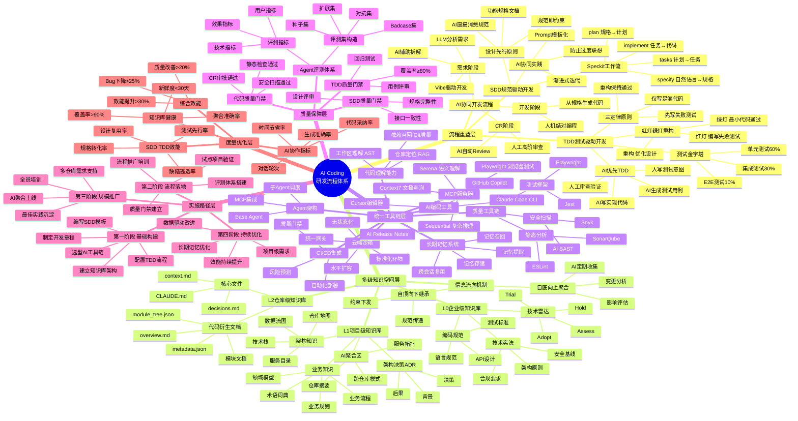
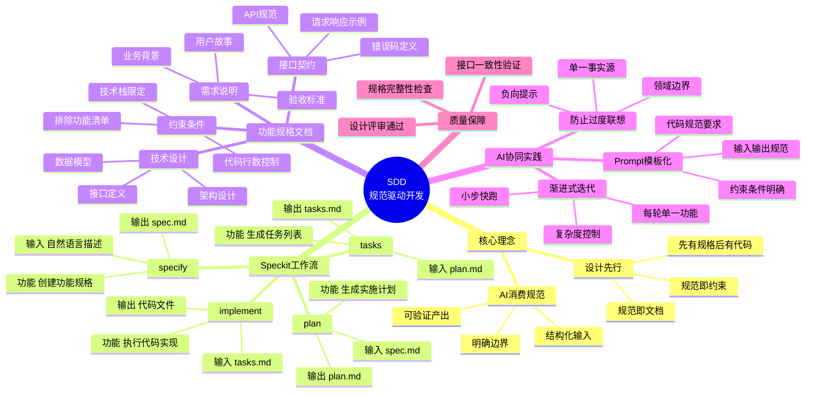
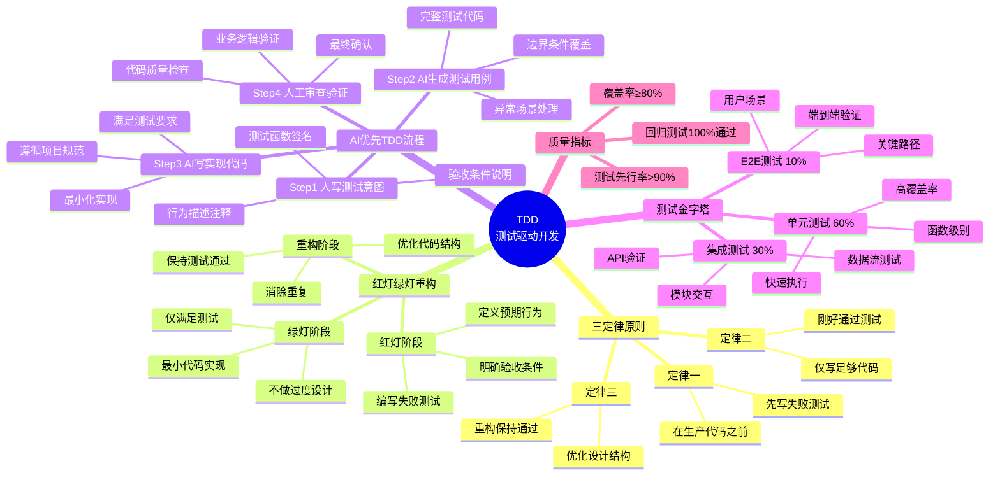
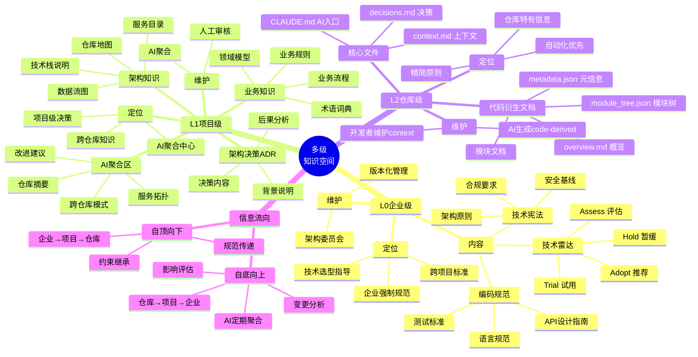
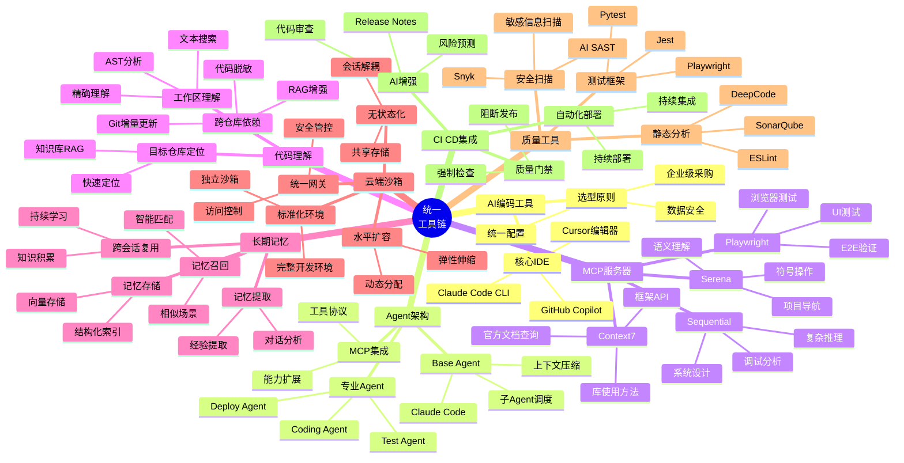
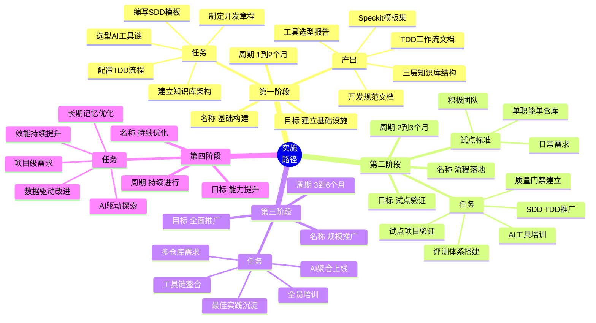
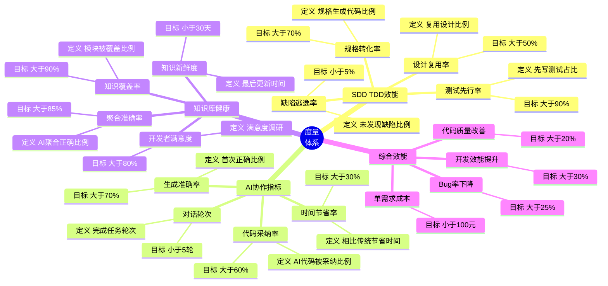
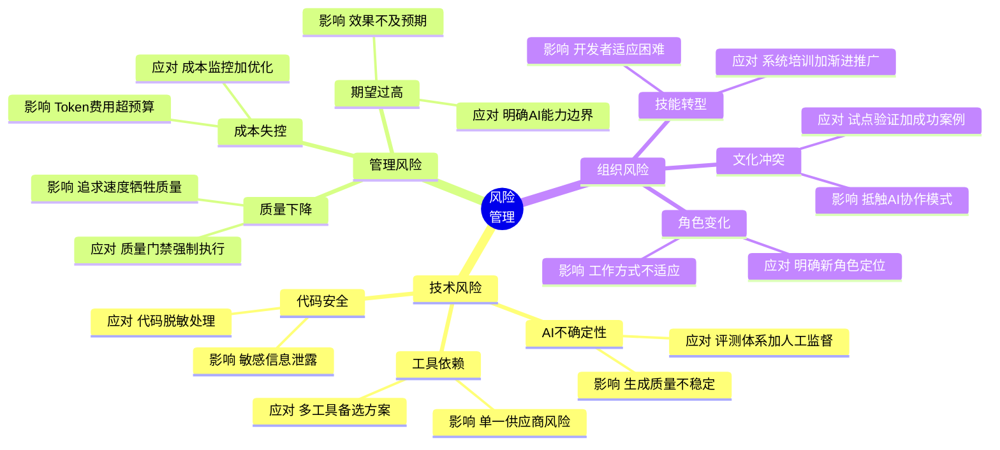

# AI Coding 研发流程体系 - 思维导图

**版本**: 1.0
**创建日期**: 2025-12-01

---

## 核心思维导图

---

## SDD 规范驱动开发详图

---

## TDD 测试驱动开发详图

---

## 多级知识空间详图

---

## 统一工具链详图

---

## 实施路径详图

---

## 度量体系详图

---

## 风险管理详图

---

## 使用说明

### 查看思维导图

1. **在线预览**：使用支持 Mermaid 的 Markdown 编辑器（如 VS Code + Mermaid 插件、Typora、Obsidian）
2. **导出图片**：使用 [Mermaid Live Editor](https://mermaid.live/) 在线编辑并导出

### 思维导图索引

| 思维导图 | 内容 |
|----------|------|
| 核心思维导图 | 完整的 AI Coding 研发流程体系总览 |
| SDD 详图 | 规范驱动开发的详细分解 |
| TDD 详图 | 测试驱动开发的详细分解 |
| 知识空间详图 | 三层知识架构的详细分解 |
| 工具链详图 | 统一工具链的详细分解 |
| 实施路径详图 | 四阶段实施计划的详细分解 |
| 度量体系详图 | 度量指标的详细分解 |
| 风险管理详图 | 风险与应对的详细分解 |

---

**文档结束**
