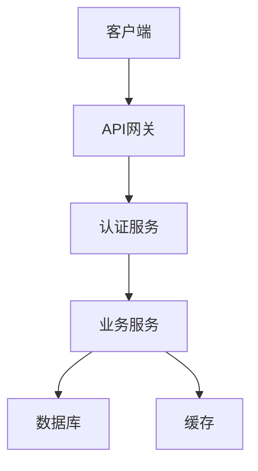
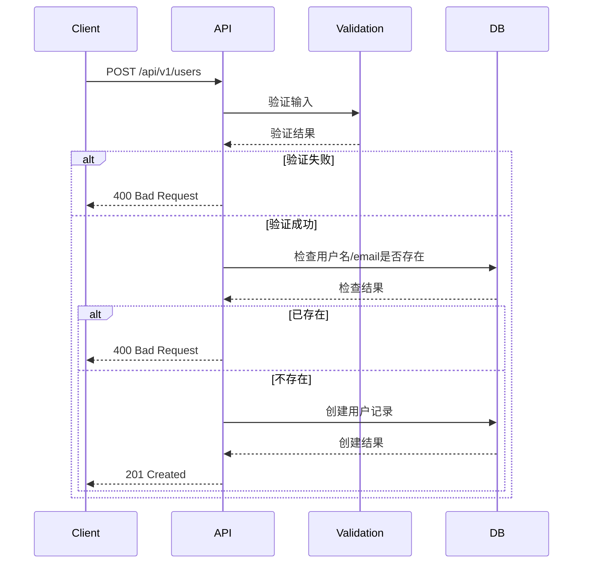

# SDD 软件设计规范模板

> SDD (Specification-Driven Development) 规范驱动开发模板

## 模板说明

本模板用于编写软件设计规范，作为 AI 生成代码的输入源。编写清晰的规范是获得高质量 AI 代码的关键。

## 文档头部

### 基本信息

| 项目 | 说明 |
|------|------|
| **功能名称** | [简短的功能名称] |
| **功能编号** | [如: FEAT-001] |
| **作者** | [编写人] |
| **创建日期** | [YYYY-MM-DD] |
| **最后更新** | [YYYY-MM-DD] |
| **状态** | [设计中/评审中/已实现/已废弃] |
| **相关用户故事** | [用户故事链接] |

---

## 1. 概述 (Overview)

### 1.1 目标 (Goal)

**一句话描述功能的核心目标**

示例: 实现用户注册功能，允许新用户通过邮箱创建账户。

### 1.2 背景 (Background)

**为什么要做这个功能？**

- 解决了什么问题？
- 带来了什么价值？
- 相关的产品或业务决策

### 1.3 范围 (Scope)

**包含**:
- [功能点 1]
- [功能点 2]

**不包含**:
- [明确不在本功能范围内的内容]

---

## 2. 需求详细说明 (Detailed Requirements)

### 2.1 功能需求 (Functional Requirements)

#### 2.1.1 [功能点 1]

**描述**: [详细的功能描述]

**输入**:
- [输入参数 1]: 类型, 是否必填, 说明
- [输入参数 2]: 类型, 是否必填, 说明

**处理逻辑**: [详细的业务逻辑]

**输出**:
- [输出字段 1]: 类型, 说明
- [输出字段 2]: 类型, 说明

**边界条件**:
- [条件 1]: [预期行为]
- [条件 2]: [预期行为]

**错误处理**:
- [错误 1]: [HTTP 状态码, 错误码, 错误消息]
- [错误 2]: [HTTP 状态码, 错误码, 错误消息]

#### 2.1.2 [功能点 2]

... (继续添加功能点)

### 2.2 非功能需求 (Non-Functional Requirements)

#### 2.2.1 性能要求

- **响应时间**:
  - 90% 的请求 < 100ms
  - 99% 的请求 < 500ms
- **并发量**: 支持 1000+ 并发
- **数据处理量**: [数据量说明]

#### 2.2.2 安全要求

- **认证授权**: [说明认证方式]
- **数据保护**: [敏感数据处理方式]
- **访问控制**: [权限控制说明]

#### 2.2.3 可用性要求

- **系统可用性**: 99.9%
- **故障恢复**: 自动故障转移
- **降级策略**: [降级方案]

---

## 3. 技术设计 (Technical Design)

### 3.1 总体架构



### 3.2 模块划分

```
src/
├── controller/     # 控制器层
├── service/        # 业务逻辑层
├── repository/     # 数据访问层
├── dto/           # 数据传输对象
└── entity/        # 实体类
```

### 3.3 接口设计

#### API 端点: `POST /api/v1/users`

**请求头**:
```http
Content-Type: application/json
Authorization: Bearer <token>
```

**请求体 (Request Body)**:
```json
{
  "username": "testuser",
  "email": "test@example.com",
  "password": "SecurePass123!",
  "confirmPassword": "SecurePass123!"
}
```

**字段说明**:
| 字段 | 类型 | 必填 | 说明 | 验证规则 |
|------|------|------|------|----------|
| username | string | 是 | 用户名 | 3-20 字符, 字母数字下划线 |
| email | string | 是 | 邮箱 | 有效的邮箱格式 |
| password | string | 是 | 密码 | 8+ 字符, 包含大小写字母数字特殊符号 |
| confirmPassword | string | 是 | 确认密码 | 必须与密码相同 |

**响应体 (Response)**:

成功 (201 Created):
```json
{
  "code": 201,
  "message": "User created successfully",
  "data": {
    "id": 123,
    "username": "testuser",
    "email": "test@example.com",
    "createdAt": "2024-01-01T12:00:00Z"
  }
}
```

失败 (400 Bad Request):
```json
{
  "code": 400,
  "message": "Validation failed",
  "errors": [
    {
      "field": "email",
      "message": "Email already registered"
    }
  ]
}
```

### 3.4 数据模型

#### 数据库表: `users`

| 字段 | 类型 | 约束 | 说明 |
|------|------|------|------|
| id | BIGINT | PRIMARY KEY, AUTO_INCREMENT | 用户 ID |
| username | VARCHAR(50) | UNIQUE, NOT NULL | 用户名 |
| email | VARCHAR(100) | UNIQUE, NOT NULL | 邮箱 |
| password_hash | VARCHAR(255) | NOT NULL | 密码哈希 |
| status | TINYINT | DEFAULT 1 | 状态: 1-激活, 0-禁用 |
| created_at | TIMESTAMP | DEFAULT CURRENT_TIMESTAMP | 创建时间 |
| updated_at | TIMESTAMP | DEFAULT CURRENT_TIMESTAMP ON UPDATE CURRENT_TIMESTAMP | 更新时间 |

**索引**:
- PRIMARY KEY (`id`)
- UNIQUE KEY `uk_username` (`username`)
- UNIQUE KEY `uk_email` (`email`)
- INDEX `idx_status` (`status`)

### 3.5 业务逻辑

#### 3.5.1 注册流程



#### 3.5.2 详细逻辑说明

**步骤 1: 输入验证**
- 验证所有必填字段存在且不为空
- 验证邮箱格式正确
- 验证用户名格式 (字母数字下划线, 3-20 字符)
- 验证密码复杂度 (最少 8 位, 包含大小写字母、数字、特殊字符)
- 验证密码和确认密码匹配

**步骤 2: 唯一性检查**
- 检查用户名是否已被注册
- 检查邮箱是否已被注册
- 如果任一检查失败, 返回相应的错误信息

**步骤 3: 密码加密**
- 使用 bcrypt 算法对密码进行哈希
- 盐值自动生成, 成本因子设置为 12

**步骤 4: 创建用户**
- 生成新的用户 ID
- 在数据库中插入用户记录
- 初始状态设置为 "待激活"

**步骤 5: 发送激活邮件 (可选)**
- 生成激活令牌
- 发送激活邮件到用户邮箱
- 令牌有效期 24 小时

---

## 4. 测试策略 (Testing Strategy)

### 4.1 测试金字塔

```
        测试用例数量
              ↑
    E2E测试    |  少量 (10%)
              ↓
  集成测试     |  中等 (30%)
              ↓
  单元测试     |  大量 (60%)
              ↓
```

### 4.2 单元测试

#### 测试文件: `user.service.test.ts`

**测试场景**:

1. **成功创建用户**
   ```typescript
   it('should create user successfully', async () => {
     // Arrange
     const createUserDto = {
       username: 'testuser',
       email: 'test@example.com',
       password: 'SecurePass123!',
       confirmPassword: 'SecurePass123!'
     };

     // Act
     const result = await userService.create(createUserDto);

     // Assert
     expect(result).toBeDefined();
     expect(result.username).toBe(createUserDto.username);
     expect(result.email).toBe(createUserDto.email);
   });
   ```

2. **邮箱已存在**
   ```typescript
   it('should throw error if email already exists', async () => {
     // Arrange
     const createUserDto = {
       username: 'testuser',
       email: 'existing@example.com',
       password: 'SecurePass123!',
       confirmPassword: 'SecurePass123!'
     };

     // Mock repository to return existing user
     jest.spyOn(userRepository, 'findByEmail')
       .mockResolvedValue({ id: 1, email: 'existing@example.com' } as User);

     // Act & Assert
     await expect(userService.create(createUserDto))
       .rejects.toThrow('Email already registered');
   });
   ```

3. **密码格式错误**
   ```typescript
   it('should throw error if password does not meet requirements', async () => {
     // Arrange
     const createUserDto = {
       username: 'testuser',
       email: 'test@example.com',
       password: 'weak',
       confirmPassword: 'weak'
     };

     // Act & Assert
     await expect(userService.create(createUserDto))
       .rejects.toThrow('Password too weak');
   });
   ```

4. **密码不匹配**
   ```typescript
   it('should throw error if passwords do not match', async () => {
     // Arrange
     const createUserDto = {
       username: 'testuser',
       email: 'test@example.com',
       password: 'SecurePass123!',
       confirmPassword: 'DifferentPass456!'
     };

     // Act & Assert
     await expect(userService.create(createUserDto))
       .rejects.toThrow('Passwords do not match');
   });
   ```

**覆盖率要求**: ≥ 80%

### 4.3 集成测试

#### API 集成测试: `user.e2e.test.ts`

**测试场景**:
1. 完整的用户注册流程
2. 错误处理和响应格式
3. 数据库事务一致性

### 4.4 性能测试

#### 测试指标

| 指标 | 目标 | 测试方法 |
|------|------|----------|
| 响应时间 | < 200ms | k6 测试 |
| 并发处理能力 | 1000 TPS | 压力测试 |
| 错误率 | < 0.1% | 持续监控 |

---

## 5. 安全考虑 (Security Considerations)

### 5.1 输入验证

- 所有输入必须验证
- 防止 SQL 注入
- 防止 XSS 攻击
- 防止 CSRF 攻击

### 5.2 密码安全

- 密码强度要求
- 密码加密存储 (bcrypt)
- 密码不在日志中记录
- 密码重置令牌有效期限制

### 5.3 数据保护

- 敏感数据加密存储
- 传输层加密 (HTTPS)
- API 认证授权
- 访问控制

---

## 6. 性能优化 (Performance Optimization)

### 6.1 数据库优化

- 索引优化
- 查询优化
- 连接池配置

### 6.2 缓存策略

- Redis 缓存热点数据
- CDN 加速静态资源
- 浏览器缓存控制

### 6.3 异步处理

- 用户注册后的邮件发送异步化
- 日志记录异步化
- 统计分析异步化

---

## 7. 部署和监控 (Deployment & Monitoring)

### 7.1 部署检查清单

- [ ] 数据库迁移脚本
- [ ] 环境变量配置
- [ ] API 文档更新
- [ ] 监控告警配置

### 7.2 监控指标

- 请求量和响应时间
- 错误率和错误类型
- 数据库连接数
- 服务器资源使用率

---

## 8. 待办事项 (TODO)

- [ ] Email 验证功能
- [ ] 用户注册成功后的欢迎邮件
- [ ] 用户名修改功能
- [ ] 账号注销功能

---

## 附录

### 相关文档
- [用户认证模块设计](./auth-module-sdd.md)
- [密码管理规范](../05-技术栈规范/密码管理规范.md)
- [API 设计规范](../01-开发章程/API设计规范.md)
