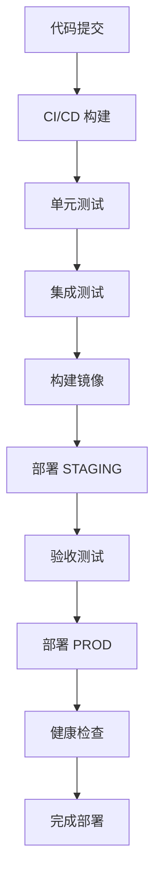

# SDD 软件设计规范模板

> SDD (Specification-Driven Development) 规范驱动开发模板
> 专为 AI 代码生成优化的设计规范模板

## 模板说明

本模板用于编写软件设计规范，作为 AI 生成代码的输入源。编写清晰的规范是获得高质量 AI 代码的关键。

## 基于 @rules/ 目录规范的设计模式集成

### 设计模式选择指南

在设计阶段明确指定要应用的设计模式，有助于 AI 生成符合架构规范的代码。以下是基于 @rules/02-design/patterns.mdc 的常用模式应用指南：

#### 创建型模式

**Builder 模式**
- **应用场景**：复杂对象构建、配置对象、请求对象
- **使用时机**：当对象有多个可选参数，或构建过程复杂时
- **AI 提示**："使用 Builder 模式构建 {对象名}，支持链式调用和参数验证"

**Factory 模式**
- **应用场景**：Service工厂、Validator工厂、Processor工厂
- **使用时机**：需要统一管理对象创建，隐藏创建逻辑时
- **AI 提示**："创建 {对象类型}Factory，提供统一的创建接口"

**Singleton 模式**
- **应用场景**：配置管理、缓存管理、连接池管理
- **使用时机**：需要确保全局只有一个实例时
- **AI 提示**："使用线程安全的 Singleton 模式实现 {类名}"

#### 结构型模式

**Adapter 模式**
- **应用场景**：第三方API适配、数据格式转换
- **使用时机**：需要兼容不同接口或数据格式时
- **AI 提示**："创建 {外部服务}Adapter，适配 {目标接口}"

**Decorator 模式**
- **应用场景**：AOP切面、日志增强、缓存增强
- **使用时机**：需要动态添加功能，而不修改原有代码时
- **AI 提示**："使用 Decorator 模式为 {类名} 添加 {功能} 功能"

**Facade 模式**
- **应用场景**：复杂子系统封装、API网关
- **使用时机**：需要简化复杂系统的使用接口时
- **AI 提示**："创建 {子系统}Facade，提供简化的操作接口"

#### 行为型模式

**Strategy 模式**
- **应用场景**：支付策略、验证策略、处理策略
- **使用时机**：需要在运行时选择不同算法时
- **AI 提示**："实现 {业务}Strategy 接口，支持 {策略列表} 等策略"

**Observer 模式**
- **应用场景**：事件驱动、状态变更通知
- **使用时机**：需要解耦事件发布者和订阅者时
- **AI 提示**："使用 Observer 模式实现 {事件} 的发布订阅机制"

**Chain of Responsibility 模式**
- **应用场景**：权限验证链、数据校验链、异常处理链
- **使用时机**：需要按顺序处理请求，且处理者不确定时
- **AI 提示**："创建 {处理}Chain，支持动态添加处理节点"

### 设计模式在 SDD 中的描述方式

在编写功能需求时，明确指定要应用的设计模式：

```markdown
### 2.1.1 用户认证功能

**设计模式**: Strategy + Factory
- 认证策略接口：`AuthenticationStrategy`
- 具体策略：`PasswordAuthStrategy`, `SmsAuthStrategy`, `OauthAuthStrategy`
- 策略工厂：`AuthenticationStrategyFactory`

**处理逻辑**:
1. 客户端传入认证类型（password/sms/oauth）
2. Factory 根据类型创建对应的 Strategy
3. 执行 Strategy 的 authenticate() 方法
4. 返回统一的认证结果

**实现要求**:
- 策略类必须实现 `AuthenticationStrategy` 接口
- 使用 `@Component` 注解让 Spring 管理策略实现
- 工厂类使用策略列表注入，支持动态扩展
```

### 与架构规范的集成

**分层架构中的模式应用**:
- **表示层**: Facade 模式（API网关）、Decorator 模式（日志、权限）
- **应用层**: Strategy 模式（业务策略）、Observer 模式（事件通知）
- **领域层**: Factory 模式（实体创建）、Builder 模式（值对象）
- **基础设施层**: Adapter 模式（外部服务适配）、Singleton 模式（连接管理）

**Spring Boot 集成规范**:
- 使用 `@Component`, `@Service`, `@Repository` 等注解声明模式组件
- 利用 Spring 的依赖注入实现松耦合
- 使用 `@EventListener` 实现 Observer 模式
- 使用 `@Cacheable` 等注解实现 Decorator 模式的缓存功能

## 文档头部

### 基本信息

| 项目 | 说明 |
|------|------|
| **功能名称** | [简短的功能名称] |
| **功能编号** | [如: FEAT-001] |
| **作者** | [编写人] |
| **创建日期** | [YYYY-MM-DD] |
| **最后更新** | [YYYY-MM-DD] |
| **状态** | [设计中/评审中/已实现/已废弃] |
| **相关用户故事** | [用户故事链接] |

---

## 1. 概述 (Overview)

### 1.1 目标 (Goal)

**一句话描述功能的核心目标**

示例: 实现用户注册功能，允许新用户通过邮箱创建账户。

### 1.2 背景 (Background)

**为什么要做这个功能？**

- 解决了什么问题？
- 带来了什么价值？
- 相关的产品或业务决策

### 1.3 范围 (Scope)

**包含**:
- [功能点 1]
- [功能点 2]

**不包含**:
- [明确不在本功能范围内的内容]

---

## 2. 需求详细说明 (Detailed Requirements)

### 2.1 功能需求 (Functional Requirements)

#### 2.1.1 [功能点 1]

**设计模式**: [选择的设计模式]

**描述**: [详细的功能描述]

**输入**:
- [输入参数 1]: 类型, 是否必填, 说明
- [输入参数 2]: 类型, 是否必填, 说明

**处理逻辑**: [详细的业务逻辑]

**输出**:
- [输出字段 1]: 类型, 说明
- [输出字段 2]: 类型, 说明

**边界条件**:
- [条件 1]: [预期行为]
- [条件 2]: [预期行为]

**错误处理**:
- [错误 1]: [HTTP 状态码, 错误码, 错误消息]
- [错误 2]: [HTTP 状态码, 错误码, 错误消息]

**设计模式实现**:
```java
// 策略接口示例
public interface PaymentStrategy {
    PaymentResult pay(PaymentRequest request);
}

// 具体策略实现
@Component
public class CreditCardPaymentStrategy implements PaymentStrategy {
    @Override
    public PaymentResult pay(PaymentRequest request) {
        // 信用卡支付逻辑
    }
}
```

#### 2.1.2 [功能点 2]

... (继续添加功能点)

### 2.2 非功能需求 (Non-Functional Requirements)

#### 2.2.1 性能要求

- **响应时间**:
  - 90% 的请求 < 100ms
  - 99% 的请求 < 500ms
- **并发量**: 支持 1000+ 并发
- **数据处理量**: [数据量说明]

#### 2.2.2 安全要求

- **认证**: [认证方式]
- **授权**: [授权方式]
- **数据加密**: [加密要求]
- **审计**: [审计要求]

#### 2.2.3 可用性要求

- **系统可用性**: ≥ 99.9%
- **故障恢复时间**: RTO ≤ 30分钟
- **数据恢复点**: RPO ≤ 5分钟

---

## 3. 技术设计 (Technical Design)

### 3.1 架构设计

**整体架构**: [架构图或描述]

**模块划分**:
- 模块 A: [职责]
- 模块 B: [职责]

**技术选型**:
- 后端: Spring Boot + MyBatis（注解模式）
- 前端: React/Next.js
- 数据库: MySQL 8.0
- 缓存: Redis

### 3.2 数据库设计

**表结构**:
```sql
-- 用户表
CREATE TABLE users (
    id BIGINT PRIMARY KEY AUTO_INCREMENT,
    email VARCHAR(255) UNIQUE NOT NULL,
    password_hash VARCHAR(255) NOT NULL,
    status VARCHAR(50) NOT NULL,
    created_at TIMESTAMP DEFAULT CURRENT_TIMESTAMP,
    updated_at TIMESTAMP DEFAULT CURRENT_TIMESTAMP ON UPDATE CURRENT_TIMESTAMP
);
```

**索引设计**:
- idx_users_email: 邮箱查询索引
- idx_users_status: 状态查询索引

### 3.3 接口设计

**RESTful API**:
```
POST /api/v1/users/register
Content-Type: application/json

{
  "email": "user@example.com",
  "password": "password123",
  "confirmPassword": "password123"
}

Response:
{
  "code": 200,
  "message": "success",
  "data": {
    "userId": 12345,
    "email": "user@example.com",
    "status": "PENDING"
  }
}
```

### 3.4 算法设计

**核心算法**: [算法描述]

**复杂度分析**:
- 时间复杂度: O(n)
- 空间复杂度: O(1)

---

## 4. 测试策略 (Testing Strategy)

### 4.1 单元测试

**测试范围**:
- Service 层业务逻辑
- Repository 层数据访问
- Util 工具类

**测试工具**:
- JUnit 5
- Mockito
- AssertJ

**覆盖率要求**: ≥ 80%

### 4.2 集成测试

**测试范围**:
- API 接口测试
- 数据库集成测试
- 外部服务集成测试

**测试工具**:
- Spring Boot Test
- TestRestTemplate
- @SpringBootTest

### 4.3 性能测试

**测试场景**:
- 并发用户测试
- 大数据量测试
- 长时间运行测试

**测试工具**:
- JMeter
- Gatling

---

## 5. 安全考虑 (Security Considerations)

### 5.1 认证授权

**JWT Token**:
```java
@Component
public class JwtTokenProvider {

    public String generateToken(User user) {
        Date expiryDate = new Date(System.currentTimeMillis() + JWT_EXPIRATION);

        return Jwts.builder()
                .setSubject(user.getId().toString())
                .setIssuedAt(new Date())
                .setExpiration(expiryDate)
                .signWith(SignatureAlgorithm.HS512, JWT_SECRET)
                .compact();
    }
}
```

### 5.2 数据加密

**敏感数据加密**:
- 密码: BCrypt 加密
- 个人信息: AES 加密
- 传输: HTTPS

### 5.3 输入验证

**参数校验**:
```java
public class CreateUserRequest {
    @NotBlank(message = "邮箱不能为空")
    @Email(message = "邮箱格式不正确")
    private String email;

    @NotBlank(message = "密码不能为空")
    @Size(min = 8, max = 20, message = "密码长度必须在8-20位之间")
    @Pattern(regexp = "^(?=.*[a-z])(?=.*[A-Z])(?=.*\\d).*$",
             message = "密码必须包含大小写字母和数字")
    private String password;
}
```

---

## 6. 性能优化 (Performance Optimization)

### 6.1 缓存策略

**多级缓存**:
- L1: 本地缓存（Caffeine）
- L2: 分布式缓存（Redis）
- L3: 数据库缓存

**缓存更新策略**:
```java
@Service
public class UserService {

    @Cacheable(value = "users", key = "#id")
    public User getUserById(Long id) {
        return userRepository.findById(id);
    }

    @CacheEvict(value = "users", key = "#user.id")
    public void updateUser(User user) {
        userRepository.update(user);
    }
}
```

### 6.2 数据库优化

**索引优化**:
- 在查询频繁的字段上建立索引
- 避免过多索引影响写入性能
- 定期分析和优化索引

**查询优化**:
- 使用 MyBatis 的 `@SelectProvider` 构建动态 SQL
- 避免 N+1 查询问题
- 使用分页查询减少数据传输

### 6.3 异步处理

**@Async 异步方法**:
```java
@Service
public class EmailService {

    @Async
    public CompletableFuture<Void> sendEmailAsync(String to, String subject, String content) {
        // 异步发送邮件
        return CompletableFuture.completedFuture(null);
    }
}
```

---

## 7. 部署方案 (Deployment Plan)

### 7.1 环境规划

| 环境 | 用途 | 配置 |
|------|------|------|
| DEV | 开发环境 | 1C2G, 单实例 |
| TEST | 测试环境 | 2C4G, 单实例 |
| STAGING | 预发布环境 | 4C8G, 双实例 |
| PROD | 生产环境 | 8C16G, 多实例 |

### 7.2 部署流程



### 7.3 回滚策略

**蓝绿部署**:
- 保留旧版本运行
- 新版本验证通过后切换流量
- 发现问题快速回滚

**数据库回滚**:
- 使用 Flyway 进行版本管理
- 每个版本都有对应的回滚脚本

---

## 8. 风险评估 (Risk Assessment)

### 8.1 技术风险

| 风险 | 影响 | 可能性 | 缓解措施 |
|------|------|--------|----------|
| 第三方服务不可用 | 高 | 中 | 增加熔断机制，提供降级方案 |
| 数据库性能瓶颈 | 高 | 低 | 增加缓存，优化查询，读写分离 |
| 内存泄漏 | 中 | 低 | 代码审查，监控告警，定期重启 |

### 8.2 业务风险

| 风险 | 影响 | 可能性 | 缓解措施 |
|------|------|--------|----------|
| 用户注册转化率低 | 高 | 中 | 优化注册流程，减少必填字段 |
| 恶意注册攻击 | 中 | 高 | 增加验证码，限制IP频率 |

---

## 9. 附录

### 9.1 术语表

| 术语 | 说明 |
|------|------|
| SDD | Specification-Driven Development，规范驱动开发 |
| TDD | Test-Driven Development，测试驱动开发 |
| API | Application Programming Interface，应用程序接口 |
| JWT | JSON Web Token，一种认证令牌格式 |

### 9.2 参考资料

- [Spring Boot 官方文档](https://spring.io/projects/spring-boot)
- [MyBatis 官方文档](https://mybatis.org/mybatis-3/)
- [Springdoc OpenAPI 文档](https://springdoc.org/)
- [架构设计原则](../../02.1-架构文档/architecture-design-principles.md)

### 9.3 相关文档

- [API 设计规范](./api-design-guidelines.md)
- [数据库设计规范](./database-design-guidelines.md)
- [异常处理规范](./exception-handling-guidelines.md)

---

## 版本历史

| 版本 | 日期 | 更新内容 | 更新人 |
|------|------|----------|--------|
| 2.0 | 2024-11-30 | 新增设计模式集成指南和 @rules/ 规范参考 | 架构团队 |
| 1.0 | 2024-01-01 | 初始版本创建 | 架构团队 |

**维护者**: 架构团队
**审核周期**: 每季度
**状态**: 持续更新中

---

> **提示**: 本模板基于 @rules/ 目录规范制定，所有设计必须遵循相关强制要求。完整规范请参考项目根目录下的 @rules/ 目录。`