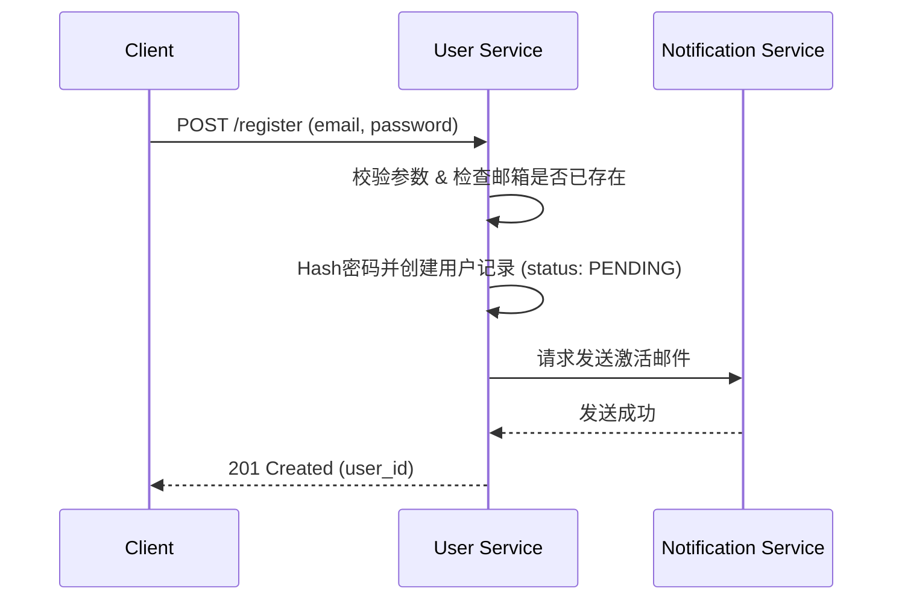
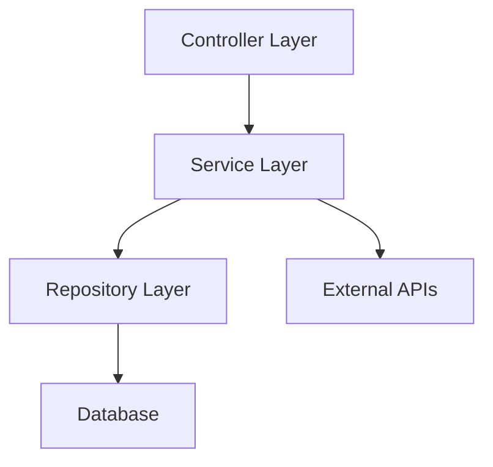

本文件集提供了一套标准化的模板，用于构建一个分层的、对 AI 友好的知识库。这些模板旨在将隐性知识显性化、结构化，为 AI 编码助手、RAG 系统和自动化工具提供高质量的上下文“燃料”。

## L0：企业级通用知识层模板

L0 层定义了适用于整个组织的技术宪法和通用准则。

### 1. 架构原则 (architecture/principles.md)

**目的**：确立高级架构设计的基本原则，指导所有项目的技术选型和设计决策。

**与 AI 协作**：AI 可以基于这些原则审查架构设计、生成符合规范的初始项目结构，并解释某个设计决策为何违反或遵守了特定原则。

```markdown
# 架构原则

**最后更新**: 2025-11-30
**负责人**: @架构委员会

本文档定义了我们在构建所有软件系统时必须遵循的核心架构原则。这些原则是我们的技术宪法，旨在确保系统的一致性、可维护性和可扩展性。

---

### 原则一：12要素应用 (12-Factor App)

- **描述**: 严格遵循 [12-Factor](https://12factor.net/) 方法论，构建适应云原生环境的SaaS应用。
- **关键实践**:
  - **I. 基准代码**: 一份基准代码，多份部署。
  - **III. 配置**: 在环境中存储配置。
  - **VI. 进程**: 应用程序以一个或多个无状态进程运行。
  - **IX. 可任意处置**: 快速启动和优雅关闭可最大化鲁棒性。
- **示例**: 所有数据库连接字符串、API密钥必须通过环境变量注入，禁止硬编码在代码或配置文件中。

### 原则二：领域驱动设计 (Domain-Driven Design)

- **描述**: 以业务领域为核心，构建反映业务复杂性的软件模型。
- **关键实践**:
  - **限界上下文 (Bounded Context)**: 清晰划分不同业务领域的边界。
  - **通用语言 (Ubiquitous Language)**: 开发人员和业务专家使用相同的术语。
  - **聚合根 (Aggregate Root)**: 保证领域对象的一致性。
- **示例**: 在“订单服务”中，`Order`是聚合根，所有对订单的操作都必须通过`Order`对象进行。

### 原则三：API 优先 (API-First)

- **描述**: 在编写任何实现代码之前，首先设计和约定 API 契约。
- **关键实践**:
  - 使用 OpenAPI 3.0 或其他契约格式定义 API。
  - API 设计需经过评审。
  - 使用 Mock Server 进行前后端并行开发。
- **示例**: 新功能开发流程：`OpenAPI Spec -> Mock Server -> API Gateway -> 后端实现`。

### 原则四：可观测性设计 (Design for Observability)

- **描述**: 系统应天生具备从外部理解其内部状态的能力，而无需修改代码。
- **关键实践**:
  - **日志 (Logging)**: 所有服务必须输出结构化的 JSON 日志。
  - **指标 (Metrics)**: 核心业务和系统性能指标必须通过 Prometheus / OpenTelemetry 暴露。
  - **追踪 (Tracing)**: 所有跨服务的调用必须包含分布式追踪头。
- **示例**: 一次用户请求的完整生命周期（从网关到数据库）应可在 Jaeger/Zipkin 中被完整追踪。

---
<!-- 在此添加更多原则, 例如 SOLID, DRY, KISS 等 -->
```

### 2. 编码规范 (standards/coding-standards.md)

**目的**：统一团队的编码风格，提升代码的可读性和可维护性。

**与 AI 协作**：AI 编码助手可以直接学习这些规范，生成符合团队风格的代码。Linter 和静态分析工具可以基于此配置，实现自动化检查。

```markdown
# 编码规范

**最后更新**: 2025-11-30
**语言**: Java / Python / TypeScript (请为每种语言创建单独文档或分段)

---

### 命名约定 (Naming Conventions)

- **类 (Classes)**: `UpperCamelCase`。例如: `OrderService`, `UserController`。
- **函数/方法 (Functions/Methods)**: `lowerCamelCase`。例如: `calculateTotalPrice()`, `getUserById()`。
- **变量 (Variables)**: `lowerCamelCase`。
- **常量 (Constants)**: `UPPER_SNAKE_CASE`。例如: `MAX_RETRIES`, `DEFAULT_TIMEOUT`。
- **布尔值变量/函数**: 使用 `is`, `has`, `can` 开头。例如: `isEnabled`, `hasPermission()`。

### 注释 (Comments)

- **目标**: 注释应该解释“为什么”，而不是“做什么”。代码本身应该清晰地说明“做什么”。
- **Good ✅**: `// 由于第三方API的速率限制,这里需要增加指数退避重试`
- **Bad ❌**: `// 循环遍历用户列表`
- **公共API**: 所有公共类和方法必须有完整的 Javadoc / Docstring 注释，解释其功能、参数和返回值。

### 错误处理 (Error Handling)

- **原则**: 尽早失败 (Fail Fast)，向上抛出受检异常，除非在当前层可以完全处理。
- **禁止**: 禁止吞掉异常 (`catch (Exception e) {}`)。如果确实需要忽略，必须添加注释说明原因。
- **日志**: 在捕获异常时，必须记录包含完整堆栈信息的 `ERROR` 级别日志。

---
<!-- 可以在此集成团队的 Checkstyle, ESLint, Prettier 等配置文件链接 -->
```

### 3. API 设计指南 (standards/api-design-guide.md)

**目的**：确保所有对内和对外的 API 设计都保持一致、可预测和易于使用。

**与 AI 协作**：AI 可以基于此指南生成 OpenAPI/Swagger 规范，或者在审查 API 设计时提出改进建议。

```markdown
# API 设计指南

本文档是我们设计 RESTful API 的黄金标准。

---

### 1. 资源命名

- **原则**: 使用复数名词表示资源集合。
- **示例**:
  - `GET /users`: 获取用户列表
  - `GET /users/{userId}`: 获取单个用户
  - `POST /users`: 创建一个新用户

### 2. HTTP 动词

- `GET`: 读取资源 (幂等)
- `POST`: 创建子资源 (非幂等)
- `PUT`: 完整替换资源 (幂等)
- `PATCH`: 部分更新资源 (非幂等)
- `DELETE`: 删除资源 (幂等)

### 3. 状态码

- `200 OK`: 请求成功 (GET, PUT, PATCH)
- `201 Created`: 资源创建成功 (POST)
- `204 No Content`: 请求成功，但没有返回内容 (DELETE)
- `400 Bad Request`: 客户端请求错误 (如参数校验失败)
- `401 Unauthorized`: 未认证
- `403 Forbidden`: 已认证但无权限
- `404 Not Found`: 资源不存在
- `500 Internal Server Error`: 服务器内部错误

### 4. 数据格式

- 所有请求体和响应体必须是 `application/json`。
- 字段命名使用 `camelCase`。

### 5. 分页、排序和过滤

- **分页**: 使用 `offset` 和 `limit` 参数。
  - `GET /users?offset=0&limit=20`
- **排序**: 使用 `sort` 参数，`-` 表示降序。
  - `GET /users?sort=-createdAt,username` (按创建时间降序，用户名升序)
- **过滤**: 直接使用查询参数。
  - `GET /users?status=active`

### 6. 版本控制

- **策略**: 在 URL 中使用版本号。
- **示例**: `/api/v1/users`, `/api/v2/users`

---
```

## L1：跨仓库领域知识层模板

L1 层关注于打破仓库边界，描述业务领域和共享资产。

### 1. 领域模型模板 (business-domains/domain-template.md)

**目的**：描述一个独立的业务领域（限界上下文），帮助开发者和 AI 理解该领域的核心概念、流程和边界。

```markdown
# 领域模板: [领域名称]

**负责人**: @领域专家

## 1. 领域概述 (Domain Overview)

<!-- 一段话简要描述这个领域是做什么的，核心价值是什么。 -->
**示例**: 用户域负责管理我们平台所有用户的身份、认证、授权和基本信息。

## 2. 核心概念/通用语言 (Core Concepts / Ubiquitous Language)

| 术语 | 英文 | 定义 | 示例 |
| :--- | :--- | :--- | :--- |
| **用户** | User | 平台中的独立个体 | 一个注册的账号 |
| **角色** | Role | 定义一组权限的集合 | "管理员", "编辑" |
| **权限** | Permission | 执行某个操作的权力 | "create_post", "delete_user" |

## 3. 限界上下文 (Bounded Context)

- **本领域职责**:
  - [ ] 用户注册与登录
  - [ ] 密码管理
  - [ ] 角色与权限分配
- **非本领域职责 (依赖外部领域)**:
  - 订单历史 (依赖 `订单域`)
  - 支付信息 (依赖 `支付域`)

## 4. 核心业务流程 (Core Business Workflows)

<!-- 使用 Mermaid 或文字描述核心流程 -->
**用户注册流程**:


## 5. 对外暴露的 API

- `POST /users`: 创建用户
- `GET /users/{id}`: 获取用户信息

```plaintext

### 2. 服务目录模板 (service-mesh/service-catalog-template.md)

**目的**：为每个微服务创建一个档案，便于服务发现、依赖管理和故障排查。

```markdown
# 服务目录: [服务名称]

**负责人**: @团队名称
**代码仓库**: `https://github.com/your-org/[repo-name]`
**语言/框架**: `Java 17 / Spring Boot 3.0`

## 1. 服务简介

<!-- 描述该服务的核心职责。 -->
**示例**: 订单服务，负责处理所有与订单相关的生命周期管理，包括创建、支付、履约和退款。

## 2. 依赖关系 (Dependencies)

### 2.1 同步依赖 (调用其他服务)
- `user-service`: 获取用户信息
- `inventory-service`: 锁定库存

### 2.2 异步依赖 (订阅消息)
- **Topic**: `payment.success`
- **说明**: 支付成功后更新订单状态。

### 2.3 基础设施依赖
- PostgreSQL 14
- Redis 7
- Kafka

## 3. API 契约

- **OpenAPI Spec**: [/docs/openapi.yaml](link-to-spec)
- **API 文档**: [Swagger UI Link](link-to-swagger-ui)

## 4. 可观测性

- **Metrics Dashboard**: [Grafana Link](link-to-dashboard)
- **Logs Query**: [Kibana/Loki Link](link-to-logs)
```

## L2：项目/仓库级知识层模板

L2 层是 AI 理解单个项目最核心的上下文来源。

### 1. 代码分层总结 (architecture/layer-summary.md)

**目的**：清晰定义项目内部各层职责，指导开发者和 AI 将代码放置在正确的位置。

```markdown
# 代码分层架构总结

## 1. 整体架构图

<!-- 建议使用 Mermaid 描述 -->


## 2. 各层职责详解

### Layer: Controller / API 层

- **路径**: `src/main/java/com/your-app/controller`
- **职责**:

  1. 接收和解析 HTTP 请求。
  2. 调用 Service 层处理业务逻辑。
  3. 参数校验（DTO Validation）。
  4. 将 Service 返回结果封装成 HTTP 响应。
- **禁止**:

  - **严禁**包含任何业务逻辑。
  - **严禁**直接调用 Repository 层。
  - **严禁**处理事务。
- **示例**: `OrderController.java`

### Layer: Service / Business Logic 层

- **路径**: `src/main/java/com/your-app/service`
- **职责**:

  1. 编排核心业务逻辑。
  2. 管理数据库事务 (`@Transactional`)。
  3. 聚合来自不同 Repository 或外部 API 的数据。
  4. 处理权限校验。
- **禁止**:

  - **严禁**处理 HTTP 相关的任何对象（如 `HttpServletRequest`）。
  - **严禁**进行 DTO 和领域模型之外的转换。
- **示例**: `OrderServiceImpl.java`

### Layer: Repository / Data Access 层

- **路径**: `src/main/java/com/your-app/repository`
- **职责**:

  1. 与数据持久化层（数据库、缓存）交互。
  2. 提供原子化的数据读写接口。
  3. 封装 ORM 查询或原生 SQL。
- **禁止**:

  - **严禁**包含业务逻辑。
  - **严禁**管理事务（应由 Service 层管理）。
- **示例**: `OrderRepository.java` (Spring Data JPA Interface)

### Layer: Domain / Model 层

- **路径**: `srcsrc/main/java/com/your-app/domain`
- **职责**:

  1. 定义核心领域对象（Entities, Value Objects）。
  2. 包含对象自身的业务规则和状态转换。
- **禁止**:

  - **严禁**依赖任何其他层。它是项目中最独立的一层。
- **示例**: `Order.java`, `OrderStatus.java` (Enum)

```plaintext

### 2. 业务术语词典 (business/glossary.md)

**目的**：建立“通用语言”，消除业务和技术之间的沟通歧义，让 AI 能听懂业务术语。

```markdown
# 业务术语词典

| 术语 | 英文 | 定义 | 业务上下文 | 关联代码 |
| :--- | :--- | :--- | :--- | :--- |
| **GMV** | Gross Merchandise Volume | 商品交易总额，衡量电商平台成交规模的核心指标。 | 用于计算平台流水、商家销售额统计。 | `DashboardService.calculateGmv()` |
| **SKU** | Stock Keeping Unit | 库存量单位，商品的最小可销售单元。同一商品的不同颜色、尺寸是不同的SKU。 | 用于库存管理、商品上架。 | `ProductSku.java` |
| **AOV** | Average Order Value | 平均客单价，`GMV / 订单总数`。 | 用于分析用户购买力。 | `AnalyticsService.getAov()` |
| **履约** | Fulfillment | 指订单从确认到送达消费者手中的全过程，包括仓储、打包、物流等。 | 订单状态流转中的一个重要阶段。 | `FulfillmentService.java` |
```

### 3. 架构决策记录 (architecture/adr-template.md)

**目的**：记录重要的架构决策及其背后的原因和权衡，避免重复讨论，让 AI 理解“为什么”这么设计。

```markdown
# ADR-XXX: [决策标题]

- **状态**: [提议中 | 已接受 | 已被取代]
- **日期**: YYYY-MM-DD

## Context (背景)

<!--
描述我们遇到的问题或需要做的决定。
解释这个决策的背景和驱动因素。
例如：“用户服务在流量高峰期响应缓慢，数据库CPU达到瓶颈。”
-->

## Decision (决策)

<!--
清晰地描述我们最终做出的决定。
应具体、明确、无歧义。
例如：“我们决定引入 Redis 作为缓存层，缓存用户信息，缓存有效期为5分钟。”
-->

## Consequences (后果)

<!--
描述这个决策带来的影响，包括正面和负面。

#### 正面影响:
- 用户信息查询的平均响应时间预计从 200ms 降低到 10ms。
- 数据库的读压力将显著降低。

#### 负面影响:
- 引入了新的技术栈（Redis），增加了系统复杂度和运维成本。
- 存在5分钟的数据不一致窗口期。
- 需要修改所有查询用户信息的代码。
-->
```

### 4. 部署手册 (runbooks/deployment-template.md)

**目的**：提供清晰、可重复的部署步骤，便于自动化和应急响应。

```markdown
# 部署手册: [服务名称]

## 1. 先决条件
- [ ] Kubernetes 集群 v1.25+
- [ ] Helm v3.8+
- [ ] 数据库迁移已由DBA执行完毕。

## 2. 部署步骤
1.  **配置更新**:
    - 拉取最新的 `config-repo`。
    - 修改 `values.yaml` 中的 `image.tag` 为要部署的新版本号。
2.  **执行部署**:
    ```bash
    helm upgrade --install [release-name] ./charts/your-app -f values.yaml --namespace [your-namespace]
    ```
3.  **验证部署**:
    - `kubectl get pods -n [your-namespace]`: 检查 Pod 是否 `Running`。
    - `kubectl logs -f [pod-name] -n [your-namespace]`: 检查启动日志无错误。
    - 访问健康检查端点: `curl http://[service-url]/actuator/health`，应返回 `{"status":"UP"}`。

## 3. 回滚步骤
1.  **找到上一个成功版本的 Chart Version**:
    ```bash
    helm history [release-name] -n [your-namespace]
    ```
2.  **执行回滚**:
    ```bash
    helm rollback [release-name] [previous-revision-number] -n [your-namespace]
    ```
```

## L3：模块/包级知识层模板

L3 层通过代码内的文档，提供最细粒度的上下文。

### 1. 模块 README 模板 ([module-readme-template.md](http://module-readme-template.md))

**目的**：在每个重要的模块或目录下放置一个 README，解释其功能和用法。

```markdown
# 模块: [模块名称]

<!-- 例如: 支付网关模块 -->

## 概述

本模块负责统一处理与所有第三方支付渠道的交互，对外提供统一的支付、退款和查询接口。

## 主要功能

- [x] 支付宝支付/退款
- [x] 微信支付/退款
- [ ] (TODO) 银行卡支付

## 如何使用

### 1. 注入主服务
```java
@Autowired
private PaymentGatewayService paymentGatewayService;
```

### 2. 发起支付

```java
PaymentRequest request = new PaymentRequest();
request.setChannel(PaymentChannel.ALIPAY);
request.setOrderId("YOUR_ORDER_ID");
request.setAmount(new BigDecimal("99.99"));

PaymentResponse response = paymentGatewayService.pay(request);
```

## 依赖

- `common-utils`: 用于签名和加密。

```plaintext

### 2. Java 包文档模板 (package-info-template.java)

**目的**：利用 `package-info.java` 为整个 Java 包提供高级别的文档，IDE 和 AI 工具可以轻松解析。

```java
/**
 * 本包包含了与第三方支付渠道（如支付宝、微信支付）交互的所有实现。
 *
 * <h2>核心设计</h2>
 * <p>
 * 采用了<b>策略模式</b>（Strategy Pattern）来支持动态选择不同的支付渠道。
 * {@link com.your.app.payment.gateway.PaymentGatewayService} 是统一的入口，
 * {@link com.your.app.payment.gateway.strategy.PaymentStrategy} 是渠道策略接口。
 * </p>
 *
 * <h2>主要流程</h2>
 * <ol>
 *   <li>客户端调用 {@code PaymentGatewayService}。</li>
 *   <li>Service 根据请求参数从 {@code PaymentStrategyFactory} 获取对应的策略实现。</li>
 *   <li>执行策略完成支付交互。</li>
 * </ol>
 *
 * @author Your Name
 * @since 1.0.0
 */
package com.your.app.payment.gateway;

// 注意: package-info.java 文件中除了 package 声明和注释外,不应有其他代码。
```
